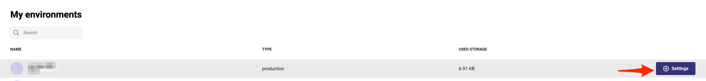
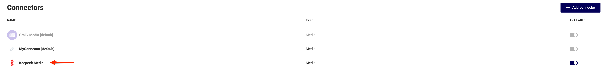
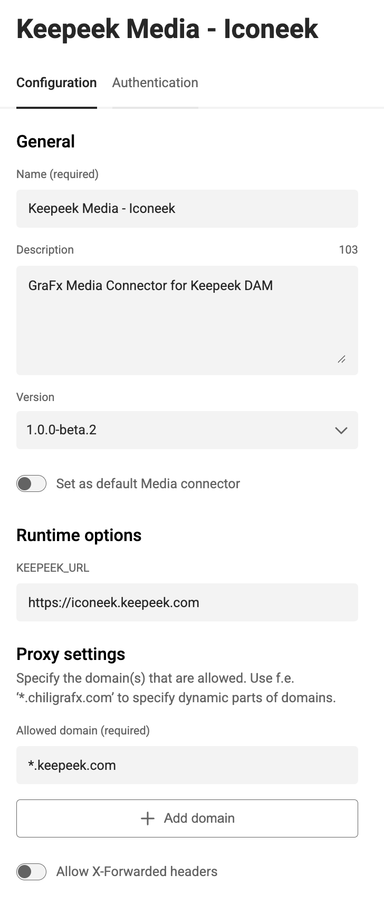
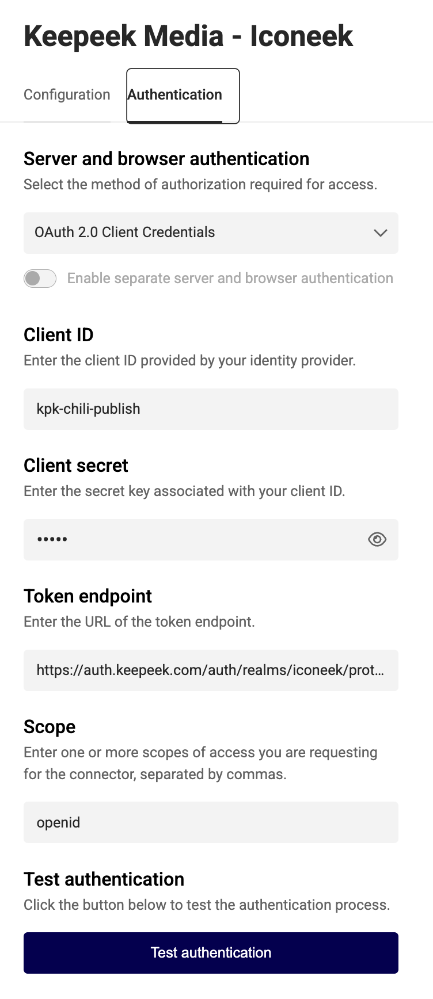
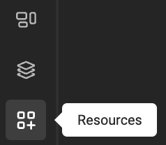
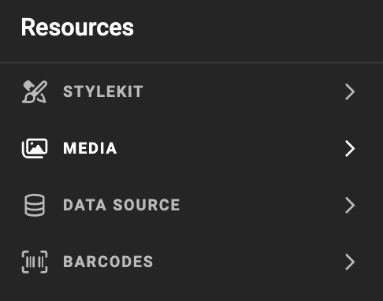
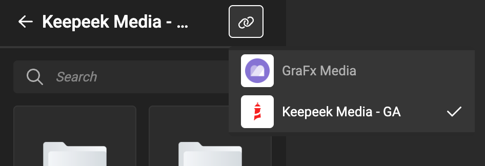
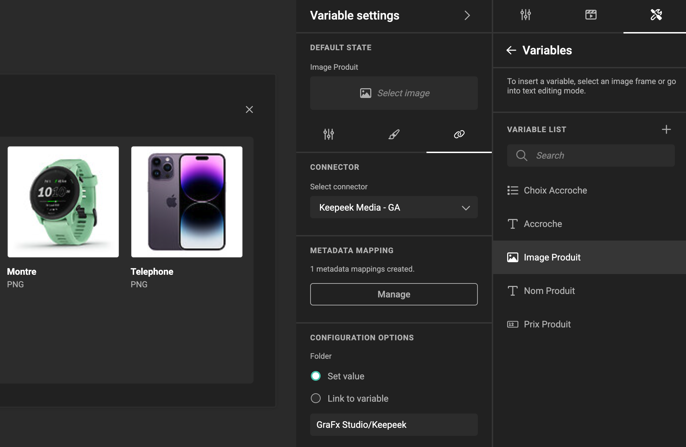
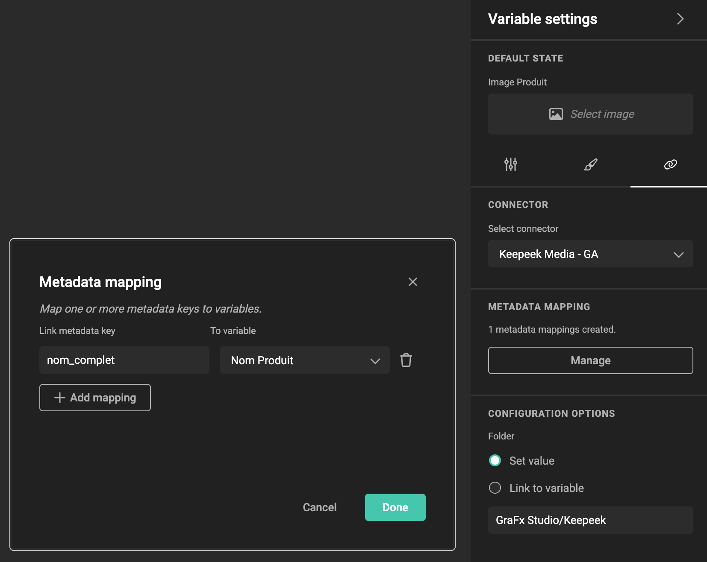
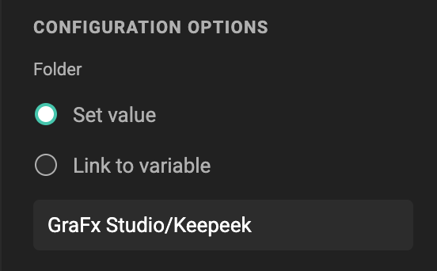

# Media Connector for Keepeek

:fontawesome-regular-square: Built-in  
:fontawesome-regular-square: Built by CHILI publish  
:fontawesome-regular-square-check: Third Party

[See Connector Types](/GraFx-Studio/concepts/connectors/#types-of-connectors)

## Solution vendor website

See [Keepeek's website](https://www.keepeek.com/en/solutions/digital-asset-management)

## Installation

The installation is done by enabling the Keepeek connector on the environment.

[See Installation Through Connector Hub](/GraFx-Studio/guides/connector-hub/)

## Keepeek Configuration 

Consult your [Keepeek documentation](https://www.keepeek.com/en-integrations/chili-publish-web-to-print) or Keepeek System Admin to obtain the correct values for the fields.

## CHILI GraFx Connector Configuration 

From the overview of Environments, click on "Settings" on the right to your environment, where you want to install or configure the Connector.



Then click the installed Connector to access the configuration.



### Configuration

Your instance of the Connector needs to know which Keepeek instance it should communicate with and how to authenticate.



**baseURL**

Your Keepeek System Administrator will provide you with this information.

For example

```html
https://[your-domain].keepeek.global
```

**Proxy settings**

CHILI GraFx needs to know what domains are allowed to process

For example

```html
*.keepeek.global
```

### Authentication



Select your type of authentication:

**Server and Browser:** OAuth 2.0 Client Credentials

- **Client ID** and **Client Secret**: These are [customer-specific credentials](https://support.keepeek.com/hc/en-us/articles/23002535539601-Generating-API-Keys#How-to-generate-API-keys) provided by the Keepeek Admin.
- **Token Endpoint**:  
```html
https://oauth.keepeek.global/oauth/api/oauth2/compatible/token
```

- **Scope**: Consult your Keepeek Admin to determine the appropriate scope.

Consult your Keepeek System Admin for assistance in configuring these fields.

## Using Assets from Your Keepeek Dam

### Place Assets in Your Template

- Select the Keepeek Connector.







### Image Variables

When using [image variables](/GraFx-Studio/guides/template-variables/assign/#assign-template-variable-to-image-frame), you will see the same grid of assets when selecting an image, except is you have set configuration options (see below).



### Metadata mapping

See [Concept of metadata mapping](/GraFx-Studio/concepts/connectors-media/#concept-2-making-assets-available-and-exposing-metadata) for more details



### Configuration Options



To filter the assets suggested to template users, you can use several methods.

#### Folder

When set, the user will be offered asset from this folder only.

The value van be fixed, or can be guided through another variable.