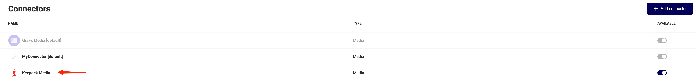
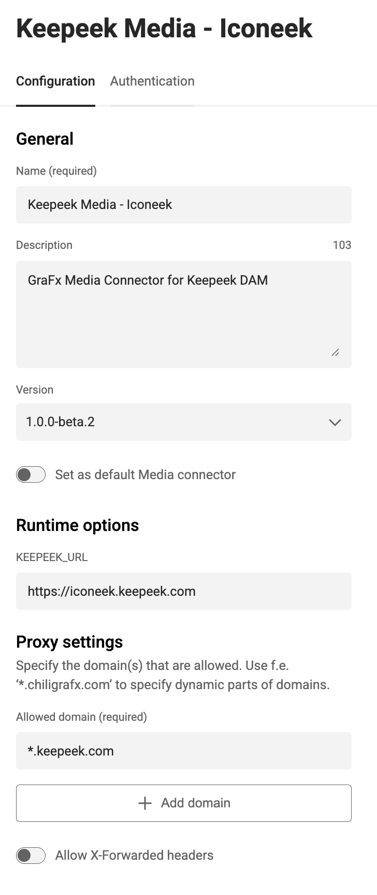
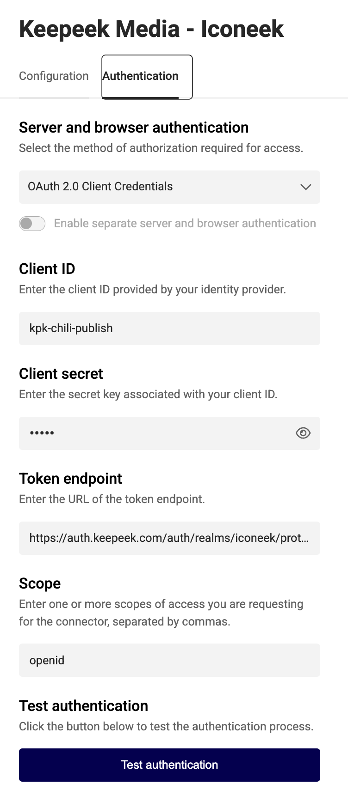
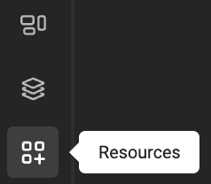
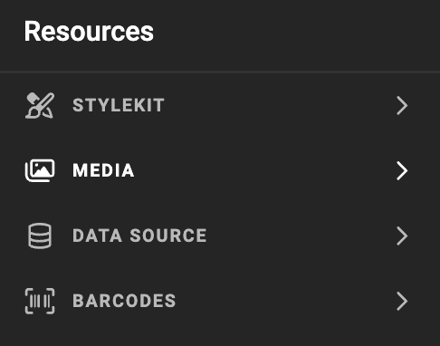
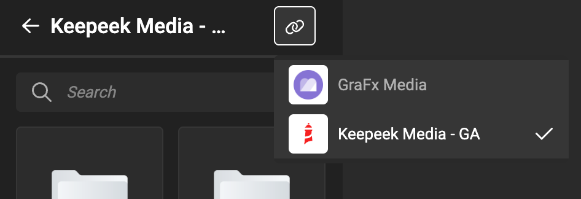
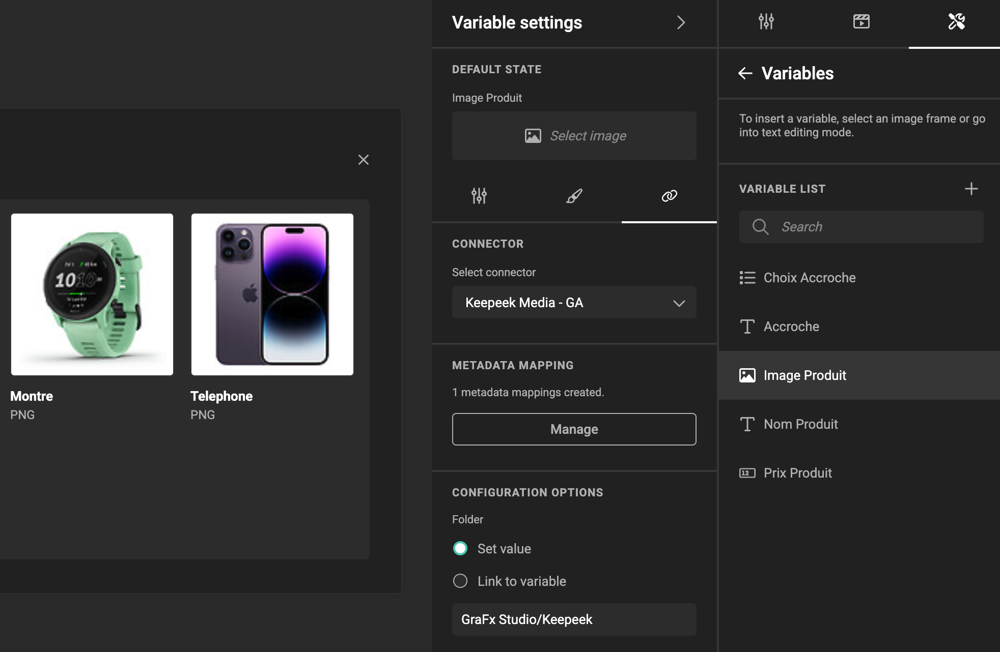
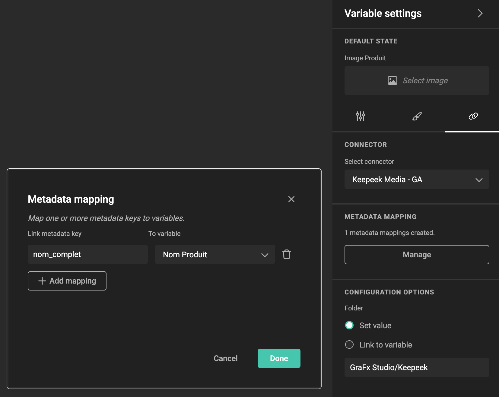
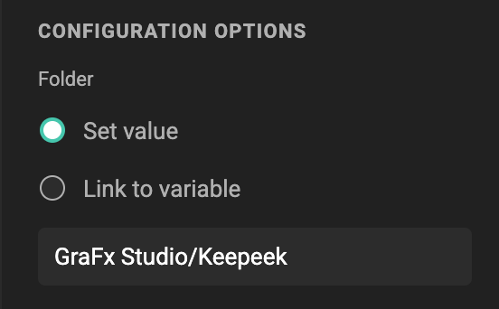

# Media Connector for Keepeek

:fontawesome-regular-square: Built-in  
:fontawesome-regular-square: Built by CHILI publish  
:fontawesome-regular-square-check: Third Party

[See Connector Types](/GraFx-Studio/concepts/connectors/#types-of-connectors)

## Solution vendor website

See [Graphique Alliance's website](https://graphique-alliance.com/)

## Installation

The installation is done by enabling the Keepeek Connector in your environment.

[See Installation Through Connector Hub](/GraFx-Studio/guides/connector-hub/)

## Keepeek Configuration 

Contact [Graphique Alliance](https://graphique-alliance.com/contact/) to obtain the correct values for the fields.

## CHILI GraFx Connector Configuration 

From the Environments overview, click on "Settings" on the right in the environment where you want to install or configure the Connector.

{.screenshot-full}

Then click the installed Connector to access the configuration.

{.screenshot-full}

### Configuration

Your instance of the Connector needs to know which Keepeek instance it should communicate with and how to authenticate.

{.screenshot-full}

**baseURL**

Your Keepeek System Administrator will provide you with this information.

For example:

```html
https://[your-domain].keepeek.global
```

**Proxy settings**

CHILI GraFx needs to know what domains are allowed.

For example:

```html
*.keepeek.global
```

### Authentication

{.screenshot-full}

Select your type of authentication:

**Server and Browser:** OAuth 2.0 Client Credentials

- **Client ID** and **Client Secret**: These are customer-specific credentials provided by the [Keepeek Admin](#keepeek-configuration).
- **Token Endpoint**:  
```html
https://oauth.keepeek.global/oauth/api/oauth2/compatible/token
```

- **Scope**: Consult your Keepeek Admin to determine the appropriate scope.

Consult your Keepeek System Admin for assistance in configuring these fields.

## Using Assets from Your Keepeek Dam

### Place Assets in Your Template

- Select the Keepeek Connector.

{.screenshot-full}

{.screenshot-full}

{.screenshot-full}

### Image Variables

When using [image variables](/GraFx-Studio/guides/template-variables/assign/#assign-template-variable-to-image-frame), you will see the familiar grid of assets used when selecting an image, but also the Connector configuration options (see below).

{.screenshot-full}

### Metadata mapping

See [Concept of metadata mapping](/GraFx-Studio/concepts/connectors-media/#concept-2-making-assets-available-and-exposing-metadata) for more details.

{.screenshot-full}

### Configuration Options

{.screenshot}

To filter the assets suggested to template users, you can use several methods, including:

#### Folder

When set, the user will be offered assets from this folder only.

The value can be fixed, or can be guided through another variable.
