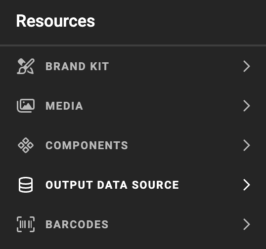
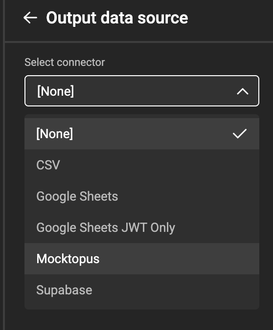
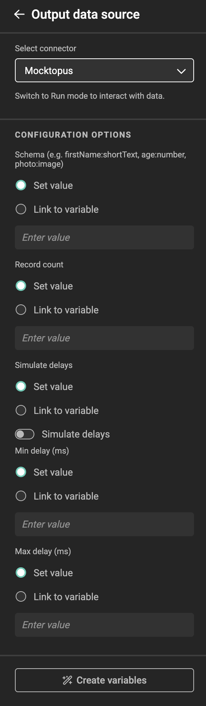
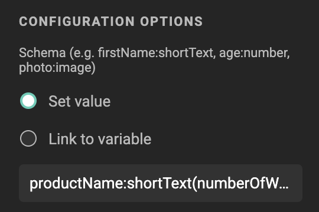
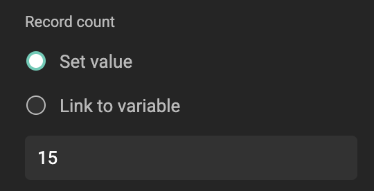
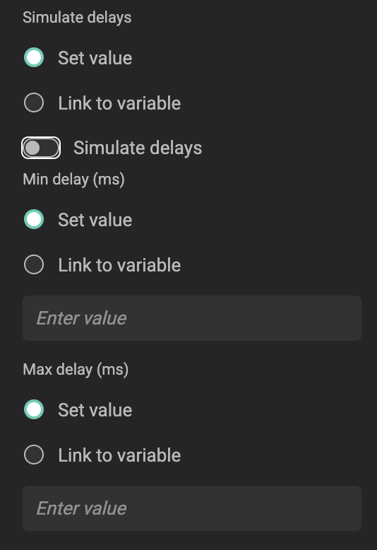
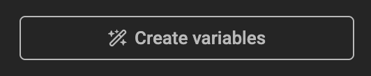
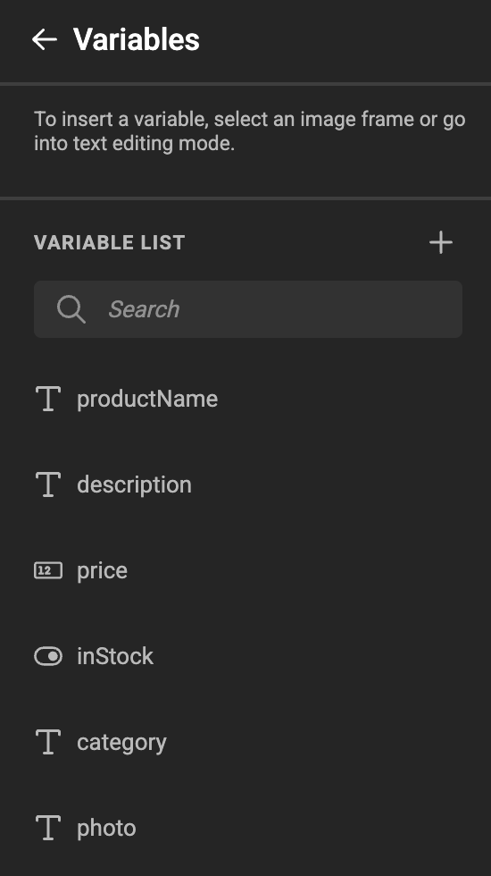
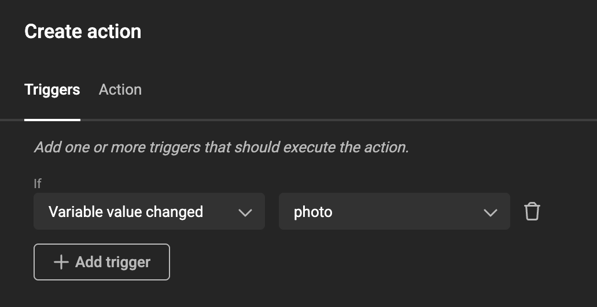
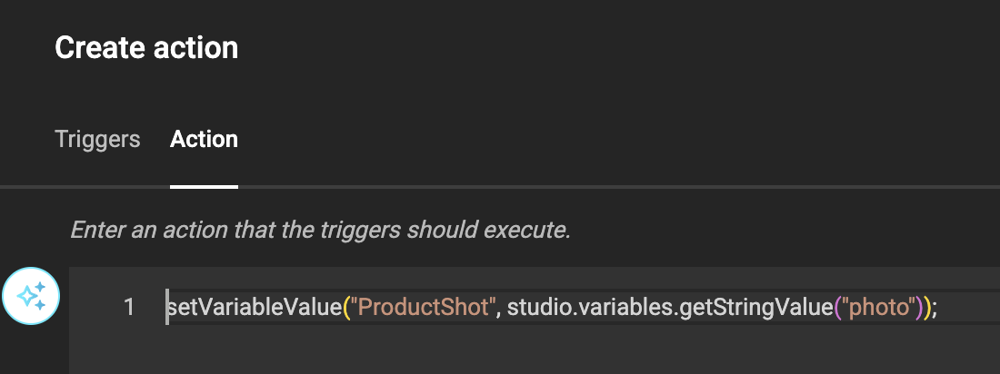

# Mocktopus Data Connector

!!! info "Mocktopus"

	{.connector_icon}
	A many-tentacled connector that pretends to connect to everything but actually connects to nothing.

:fontawesome-regular-square: Built-in  
:fontawesome-regular-square: Built by CHILI publish  
:fontawesome-regular-square-check: Third Party

[See Connector types](/GraFx-Studio/concepts/connectors/#types-of-connectors)

Mocktopus is a data connector that generates realistic-looking fake data from a declarative schema. No external service, no credentials, no network required. It is designed for testing and prototyping GraFx Studio templates before a real data source is available.

## Installation

Mocktopus is installed through the Connector Hub. Once installed, make sure to **enable it** using the toggle on the right of the connector row — without this, the connector will not be available to templates.

{.screenshot-full}

[See installation through Connector Hub](/GraFx-Studio/guides/connector-hub/)

## Setting up Mocktopus in a template

Each template can have its own schema and settings, so a single Mocktopus instance is enough — there is no need to deploy multiple connector instances.

### 1. Open the Output data source panel

In your GraFx Studio template, open the **Resources** panel and select **Output data source**.

{.screenshot}

### 2. Select Mocktopus as the connector

In the **Select connector** dropdown, choose **Mocktopus**.

{.screenshot}

### 3. Configure Mocktopus

Once Mocktopus is selected, the panel reveals the full set of configuration options.

{.screenshot-full}

Each option can be set directly via **Set value**, or bound to a template variable via **Link to variable**.

#### Schema (required)

Defines the fields and types Mocktopus should generate, using a comma-separated DSL. Paste an existing schema string into the field, or build your own — see [Schema reference](#schema-reference) below.

{.screenshot}

A ready-made example schema for a product card template:

```
productName:shortText(numberOfWords=3), description:longText(numberOfParagraphs=1), price:number(min=5,max=500), inStock:boolean, category:list(values=Electronics|Clothing|Food|Sports), photo:image
```

#### Record count

The number of records Mocktopus should generate. Defaults to `10`. You can set your value.

{.screenshot}

#### Simulate delays

To imitate a slow real-world data source, enable **Simulate delays** and set **Min delay (ms)** and **Max delay (ms)**. When enabled, the connector waits a random duration between these two values before returning each response — useful for testing how a template behaves while data is loading. Defaults are `100` ms and `1000` ms.

{.screenshot}

### 4. Create variables from the schema

If the template does not yet have variables matching the schema fields, click **Create variables** at the bottom of the panel.

{.screenshot}

Each schema field becomes a corresponding template variable, with the right type icon (text, number, boolean, image), ready to be mapped onto the design.

{.screenshot}

### 5. Preview the data

Switch to **Run mode** to preview the template with the generated mock data. Variables update on each run, giving you realistic content to design against without waiting on a real data source.

## Working with image fields

The `image` field type does not return an actual image — it returns a **seeded image ID**. To display a real picture in your template, the value needs to flow through an image variable that has its own media connector configured.

The setup is:

1. Create an image variable in the template (for example `ProductShot`).
2. Add an action that copies the value of the Mocktopus `photo` field into that image variable. The action has two parts:

    **Trigger** — fire the action whenever the `photo` variable changes, so the image updates every time Mocktopus produces a new record:

    {.screenshot}

    **Action** — a one-line JavaScript snippet that copies the seeded ID from `photo` into the image variable:

    {.screenshot}

    ```js
    setVariableValue("ProductShot", studio.variables.getStringValue("photo"));
    ```

3. The image variable then resolves the actual asset using its own media connector, with the seeded ID as the lookup key.

This separation means Mocktopus can stand in for any media source — point the image variable's connector at whichever asset library you would use in production, and Mocktopus will supply the IDs.

## Schema reference

### Supported field types

| Type | Description |
|---|---|
| `shortText` | Short mock text (1–2 words by default) |
| `longText` | Multiple sentences and paragraphs |
| `number` | Random number within a configurable range |
| `boolean` | Random `true` or `false` |
| `date` | Random date between 2020-01-01 and 2030-01-01 |
| `list` | A single value picked from a pipe-delimited list |
| `image` | A seeded image ID (for use with an image variable) |

### Field format

Each field follows the format `fieldName:type` or `fieldName:type(param1=value1,param2=value2)`. Multiple fields are separated by commas:

```
firstName:shortText, age:number(min=18,max=65), active:boolean, joinDate:date, status:list(values=active|inactive|pending)
```

### Field type parameters

- `shortText` — `numberOfWords` (default: `2`)
- `longText` — `numberOfParagraphs` (default: `2`)
- `number` — `min` (default: `0`), `max` (default: `1000`)
- `list` — `values`: pipe-delimited list, e.g. `active|inactive|pending`

Any field type also supports the `values` parameter to pick randomly from a fixed set:

```
priority:number(values=1|3|5), status:shortText(values=draft|review|published)
```

## External setup

None required. Mocktopus generates all data locally — there is no external service to configure, no API key, and no authentication.

## Generating a schema from an existing template

If you have a GraFx template with variables already defined, use the `ConvertTemplateToSchema.ps1` PowerShell script to automatically generate a ready-to-paste schema string. You can find the script in the [connector's repository](https://github.com/chili-publish/studio-connector-framework/blob/main/src/connectors/mocktopus/ConvertTemplateToSchema.ps1).

**Requirements:** PowerShell 7+ (`pwsh`)

```powershell
# Basic usage — prints the schema to the terminal
.\ConvertTemplateToSchema.ps1 -TemplatePath .\template.json

# Save output to a file and include read-only variables
.\ConvertTemplateToSchema.ps1 -TemplatePath .\template.json -OutputPath .\schema.txt -IncludeReadonly
```

The script maps all standard GraFx variable types (`shortText`, `longText`, `number`, `boolean`, `date`, `list`, `image`) directly to their Mocktopus DSL equivalents. Variables with unrecognised types are skipped with a warning.
