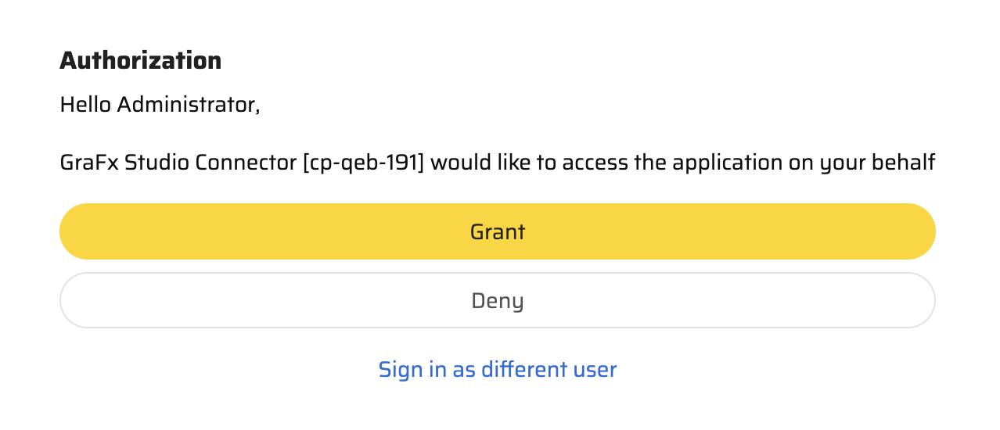

# Media Connector for Sitecore Content Hub

|  | Connector type |
| --- | --- |
|  | Built-in |
| :fontawesome-regular-square-check: | Built by CHILI publish |
|  | Third party |

[See Connector types](/GraFx-Studio/concepts/connectors/#types-of-connectors)

## Installation

[See installation through Connector Hub](/GraFx-Studio/guides/connector-hub/)

## Configuration

### Base Configuration

Your instance of the Connector needs to know which Sitecore Content HUB instance it should communicate with and how to authenticate.

Once installed, navigate to the Connector overview, and select **Sitecore Content HUB**. Start with **Configuration**.

Consult your Sitecore System Admin to get the correct values for the fields.

### Authentication

Choose your type of Authentication. At this moment, only OAuth 2.0 is supported.

You will need specific credentials from your Sitecore Content HUB installation to set up the connector:

- **Client ID** and **Client Secret**: These are customer-specific credentials provided by the Sitecore Admin when creating integrations within Sitecore.
- **Username** and **Password**.
- **Token endpoint**: These are more developer-oriented settings but can also be retrieved from Sitecore documentation. While they are publicly available, they are generic for all Sitecore clients.
- **Scope**: Check with your Sitecore Admin on what scope to use.

You can set the authentication for machine-to-machine and browser separately or use the same setup for both.

Consult your Sitecore System Admin to get the correct values for the fields.

### Server Authentication

The credentials used to set up machine-to-machine authentication will determine the governance on the assets in the automation setup.

This means if the credentials only allow access to certain assets, only those assets will be available when batch processing requests access to place assets in the output.

### Browser Authentication or Impersonation

GraFx Studio consumes assets available in the DAM. Therefore, the user impersonating access to the DAM system will dictate which assets are available in the template.

**Impersonation** refers to the process of granting a user access to an external system, such as a Digital Asset Management (DAM) platform, by using pre-configured credentials. This approach ensures seamless integration while respecting the security and governance rules of the connected system.

Imagine a marketing team using GraFx Studio connected to a DAM system. The administrator configures the connector with specific credentials:

By leveraging impersonation, GraFx Studio ensures that users see only the assets and data they are authorized to access, in compliance with the DAM system's governance.

## Using Assets from Your Sitecore Content HUB System

### Place Assets in Your Template

- Select the Sitecore Content HUB Connector.

Depending on the configuration, you will be asked to authenticate.

- From here on, your (Sitecore) assets act similar to any other asset in GraFx Studio.

### Image Variables

When using [image variables](/GraFx-Studio/guides/template-variables/assign/#assign-template-variable-to-image-frame), you will get the same list of assets when you select an image.

### Configuration options

#### Introduction

You may want to filter the assets suggested to the template user by using categories, keywords, etc.

In the Sitecore Content HUB solution, you can use a search query language.

By using the query language, you can filter down to the right selection of assets.

Please consult the [Sitecore Documentation](https://doc.sitecore.com/ch/en/developers/cloud-dev/linq-queries.html) on how to work with Queries, or consult your Sitecore Content Hub administrator to assist you.

#### How To

Queries are set at the variable level.

Set the value of the query in the connector settings.

If a fixed query is not sufficient, you can use a [variables](/GraFx-Studio/concepts/variables/) and [actions](/GraFx-Studio/concepts/actions/) (and [GraFx Genie](/GraFx-Studio/concepts/grafx-genie/)) to make your queries more dynamic.

#### Other configuration options

**Show only approved assets** will show only approved assets. The approval is part of the Sitecore Content Hub system.

**Locale** enables you to filter on Locale (region / language)