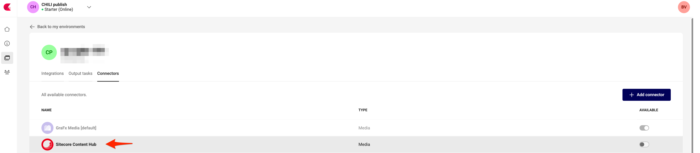
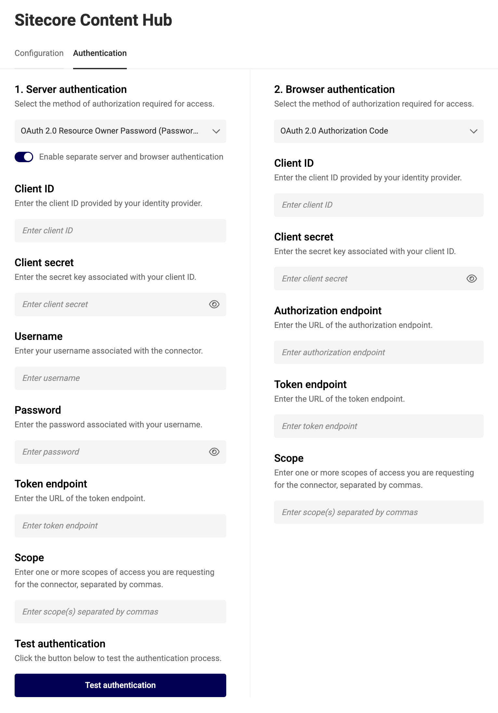
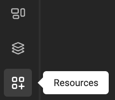
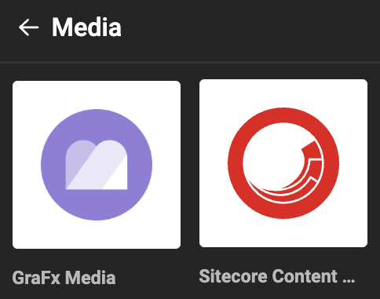

# Media Connector for Sitecore Content Hub

|  | Connector Type |
| --- | --- |
|  | Built-in |
| :fontawesome-regular-square-check: | Built by CHILI publish |
|  | Third party |

[See Connector Types](../../../GraFx-Studio/concepts/connectors/#types-of-connectors)

## Installation

As no "installation" happens, you could also talk about deployment of a connector on your environment.

[See Installation Through Connector Hub](../../../GraFx-Studio/guides/connector-hub/)

## Sitecore Configuration 

Consult your [Sitecore documentation](https://doc.sitecore.com/ch/en/users/content-hub/create-an-oauth-client.html) or Sitecore System Admin to obtain the correct values for the fields.

- **OAuth admin console**
``` html
https://<SITECORE_CONTENTHUB_PATH>/en-us/admin/oauthclients
```

- **Redirect URL** (only used if grafx config is Authorization Code):
``` html
https://<env-name>.chili-publish.online/grafx/api/v1/environment/<env-name>/connectors/<connector-id>/auth/oauth-authorization-code/redirect
```

## CHILI GraFx Connector Configuration 

From the overview of Environments, click on "Settings" on the right to your environment, where you want to install or configure the Connector.


Then click the installed Connector to access the configuration.



### Base Configuration

Your instance of the Connector needs to know which Sitecore Content Hub instance it should communicate with and how to authenticate.


### Authentication

Select your type of authentication:

**Supported on Server:** OAuth 2.0 Resource Owner Password  
This is the flow where username and password (contenthub credentials) are needed. It makes all requests as that specific user.

**Supported on Browser:** OAuth 2.0 Authorization Code (Browser only)


- **Client ID** and **Client Secret**: These are [customer-specific credentials](https://doc.sitecore.com/ch/en/users/content-hub/create-an-oauth-client.html) provided by the Sitecore Admin when creating integrations within Sitecore.
- **Username** and **Password**: User-specific credentials for authentication.
- **Token Endpoint**: Developer-oriented settings available in Sitecore documentation. These settings are generic for all Sitecore clients.
- **Scope**: Consult your Sitecore Admin to determine the appropriate scope.

You can configure separate authentication for machine-to-machine and browser use cases or use the same setup for both.



- **Authorization Endpoint** https://<SITECORE_CONTENTHUB_PATH>/oauth/authorize
- **Token Endpoint** https://{SITECORE_CONTENTHUB_PATH}/oauth/token


Consult your Sitecore System Admin for assistance in configuring these fields.

### Server Authentication

The credentials used for machine-to-machine authentication determine the governance on assets in automation workflows. 

This means that if the credentials restrict access to specific assets, only those assets will be available during batch processing.


### Browser Authentication or Impersonation

GraFx Studio accesses assets available in the DAM via impersonation, where the credentials configured for the connector determine which assets are visible to the user in the template.

**Impersonation** is the process of granting GraFx Studio users access to the DAM system using pre-configured credentials. This ensures seamless integration while respecting the DAM's security and governance rules.

For example:
- A marketing team uses GraFx Studio to connect to Sitecore Content Hub. The admin configures the connector with specific credentials.
- Based on these credentials, users can only access assets they are authorized to view according to Sitecore's governance policies.

## Using Assets from Your Sitecore Content Hub System

### Place Assets in Your Template

- Select the Sitecore Content Hub Connector.






Depending on the configuration, you may need to authenticate.


- Once authenticated, Sitecore assets behave like any other asset in GraFx Studio.

### Image Variables

When using [image variables](../../../GraFx-Studio/guides/template-variables/assign/#assign-template-variable-to-image-frame), you will see the same list of assets when selecting an image.


### Configuration Options

#### Introduction

To filter the assets suggested to template users, you can use categories, keywords, or other search parameters.

Sitecore Content Hub supports search queries through its query language. Consult the [Sitecore Documentation](https://doc.sitecore.com/ch/en/developers/cloud-dev/generic-properties.html) or your Sitecore Content Hub Administrator for guidance.

#### How To

Queries are set at the variable level.

Set the query value in the connector settings.


For more dynamic queries, you can use [variables](../../../GraFx-Studio/concepts/variables/), [actions](../../../GraFx-Studio/concepts/actions/), and [GraFx Genie](../../../GraFx-Studio/concepts/grafx-genie/) to automate and refine your queries.

#### Other Configuration Options

- **Show Only Approved Assets**: Displays only assets that have been approved in Sitecore Content Hub.
- **Locale**: Filters assets by region or language.