# GraFx Studio Exporter for Adobe® InDesign®

## Introduction

The InDesign Conversion Plugin allows you to export documents from Adobe® InDesign® and import them into **GraFx Studio**  
This process lets you automate the creation of design variants by leveraging GraFx Studio’s powerful smart template features  
While InDesign® remains a great starting point for creative design, GraFx Studio excels at automation and multi-channel output

## Elements of the conversion

- GraFx Studio Exporter (Adobe® InDesign® plugin)  
- Importer in GraFx Studio

## How to install the plugin

### Download the plugin

Get the latest plugin from the [GraFx Studio plugin downloads](/GraFx-Studio/convert/downloads/) page.

### Install the plugin

   - Locate the `GraFxStudioExporter_InDesign_x.y.z.ccx` file (x.y.z being the version)  
   - Double-click the CCX file  
   - Follow the steps to install the plugin in Adobe® InDesign®

## How to convert a document

### Prepare your InDesign® document

   - Open the Adobe® InDesign® document you want to export  
   - Make sure the pdf settings last used do not have crop marks, bleed etc.  

The plugin uses these settings when it converts images on conversion. The [High Quality Print] is used by default.

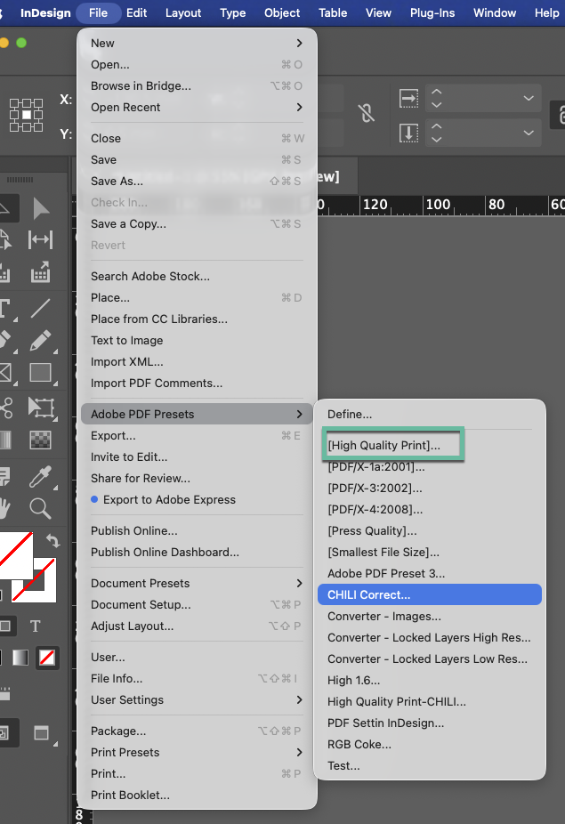{.screenshot}

If bleed (and other) marks are applied to these settings.

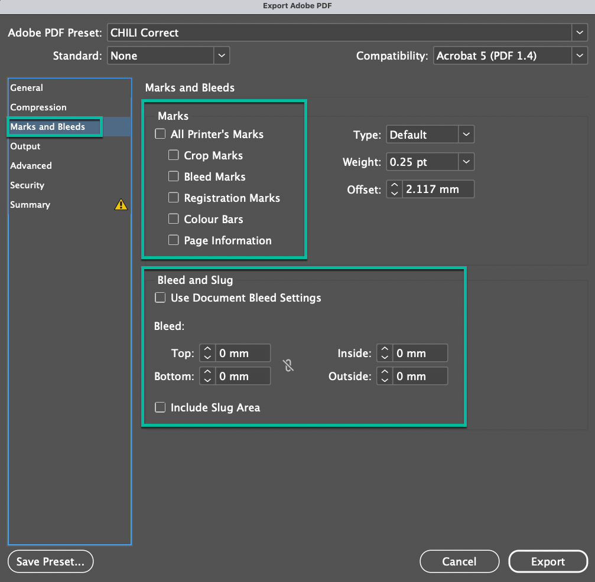{.screenshot}

The images in the conversion will have the marks on them which more than likely would not be desirable.

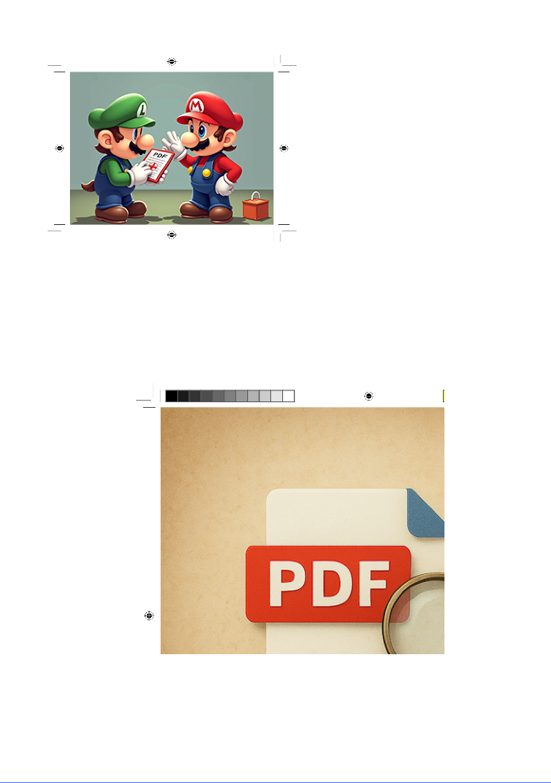{.screenshot}

   - Ensure all assets are properly linked  

Example: `Blue.png` is missing

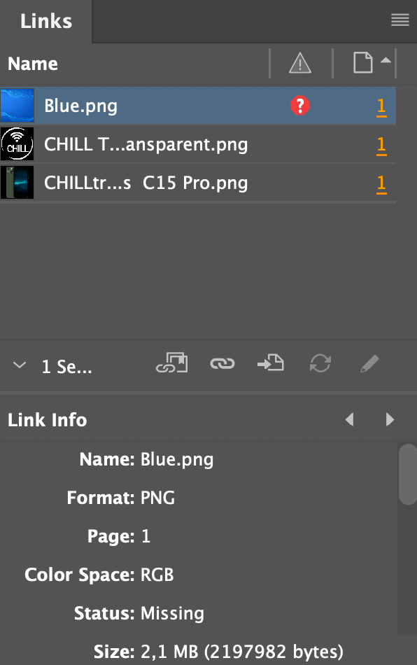{.screenshot}

All assets are linked correctly

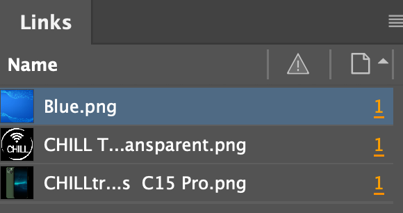{.screenshot}

### Export to GraFx Studio

   - Go to **Plugins > CHILI GraFx plugins > GraFx Studio Exporter**  
   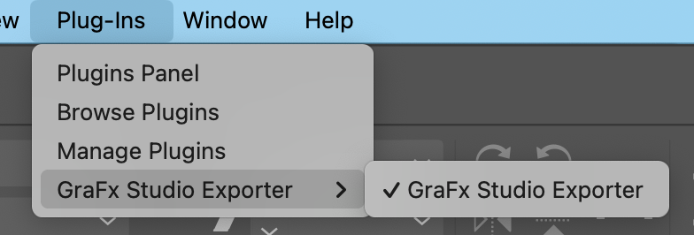{.screenshot}

   - Run preflight to avoid conversion issues  
   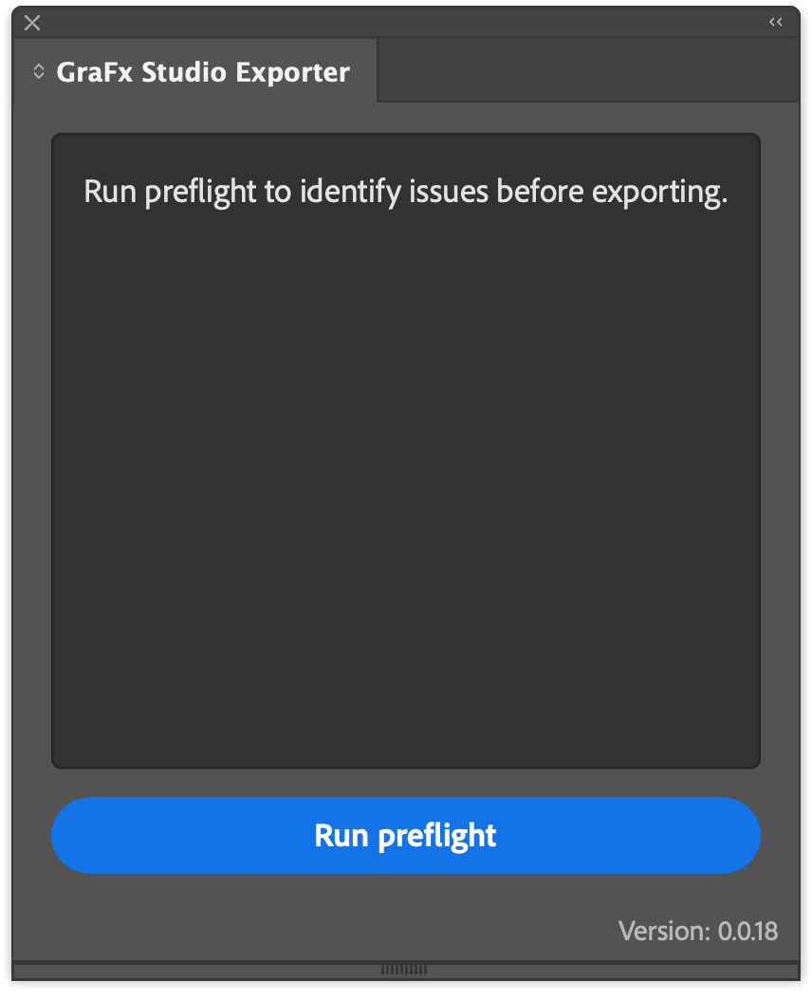{.screenshot}  
   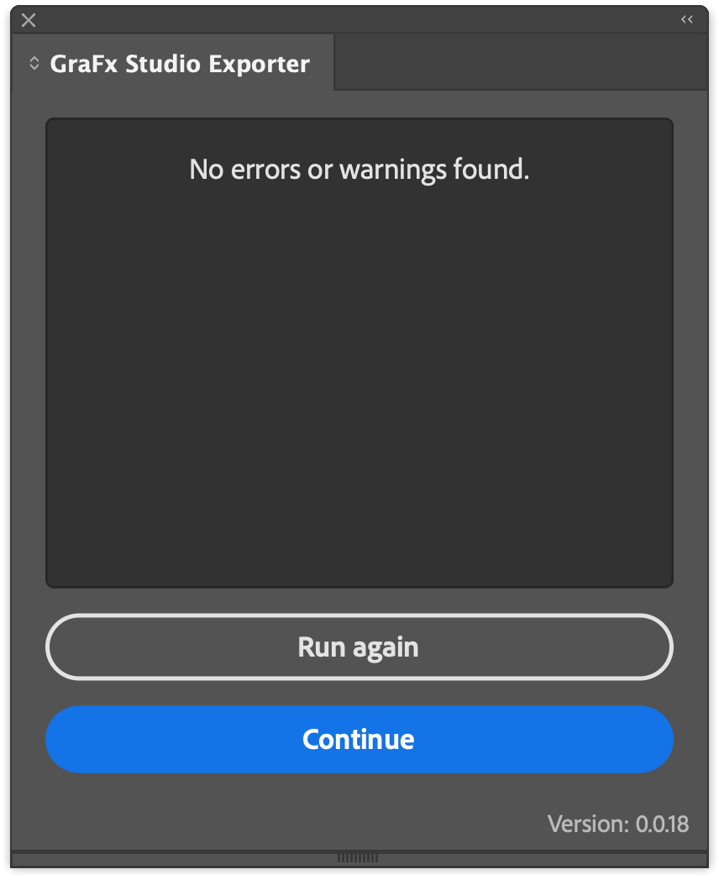{.screenshot}

Example of a potential issue: Frame stroke type not supported  
You can choose to ignore, or export the object to a PDF asset and place it as an asset

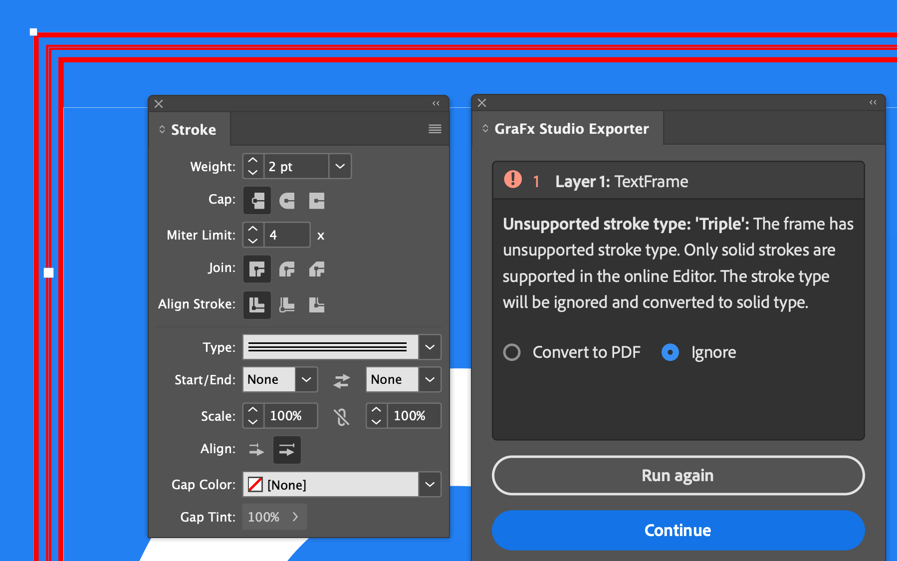{.screenshot-full}

   - Choose a destination folder and click **Export**  
     Required only once, can be changed at any moment  
   - Choose the page to be exported  
   - Choose **All pages** to export all the pages

!!! note "Limitations"
    Exported pages must have the same size
    
    Users can skip differently sized pages or convert them to match the first page
    
    A maximum of 50 pages can be exported, with any additional pages excluded

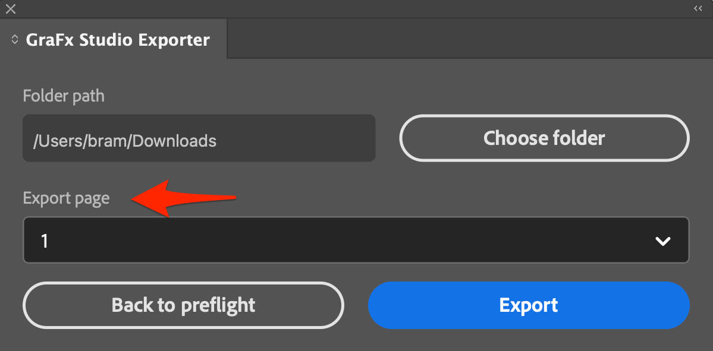{.screenshot}

   - Choose your layout   

Adobe® InDesign® supports alternate layouts (per page)  
The GraFx Studio exporter allows you to choose which page and alternate layout to export  

Choose your alternate layout, and this layout will be in the exporter file

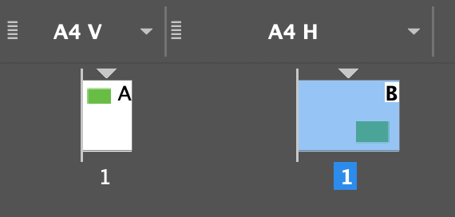{.screenshot}  
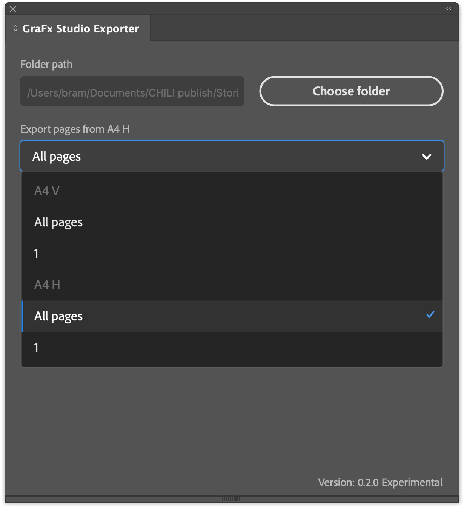{.screenshot}

   - The plugin creates a `.zip` file containing the document and all necessary assets  
   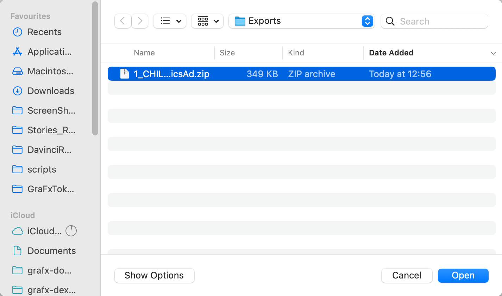{.screenshot-full}

!!! info "What's in the zip file?"
    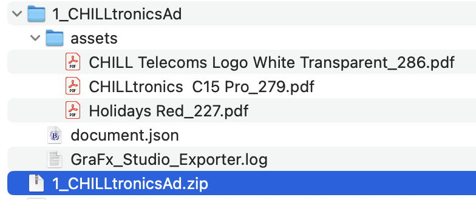{.screenshot}  
    - A log file with info about the plugin version, the Adobe app version, current date, and plugin warnings or errors caught during the document preflight or export  
    - The log file is named `GraFx_Studio_Exporter.log`  
    - The zip file name format: `<selected_page>_<document_name>(<optional_duplicate_copy_version>).zip`

### Import into GraFx Studio

   - Open **[GraFx Studio](https://chiligrafx.com/)**  
   - Go to **Templates > Import .ZIP** and select the exported `.zip` file  
   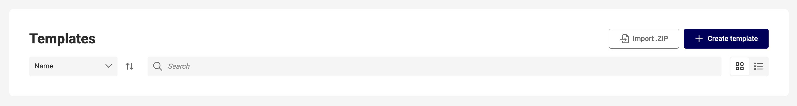{.screenshot-full}  
   {.screenshot}

   - Name the template and locate the folder for the assets  
   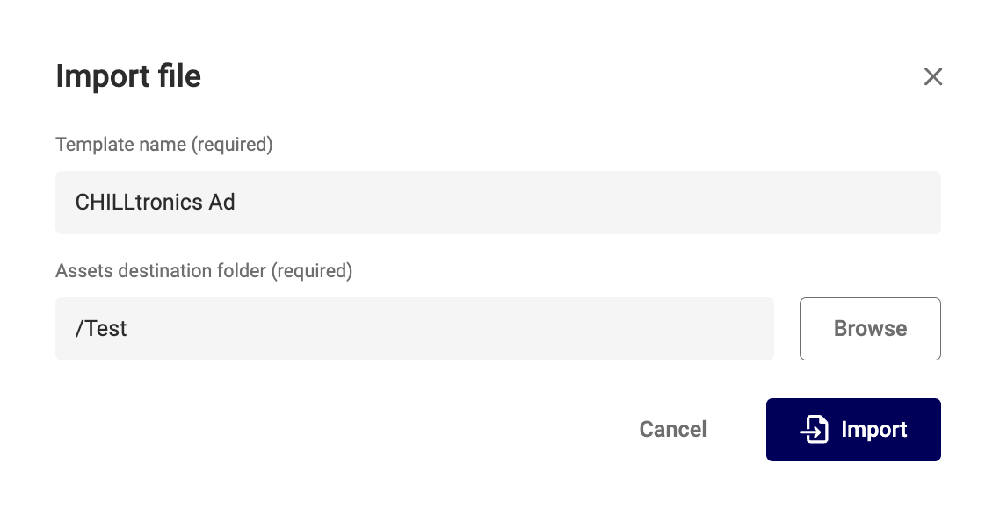{.screenshot}

   - You can follow the progress in the top right-hand corner  
   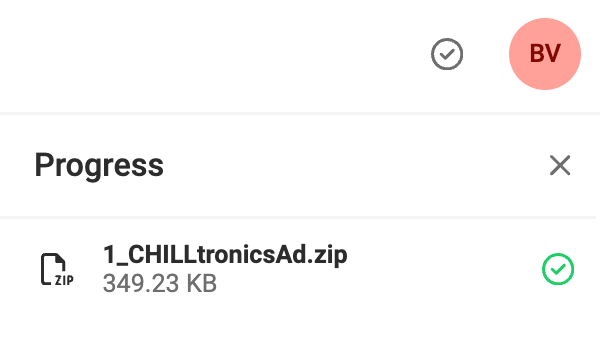{.screenshot}

   - Your InDesign® document is now ready for automation in GraFx Studio  
   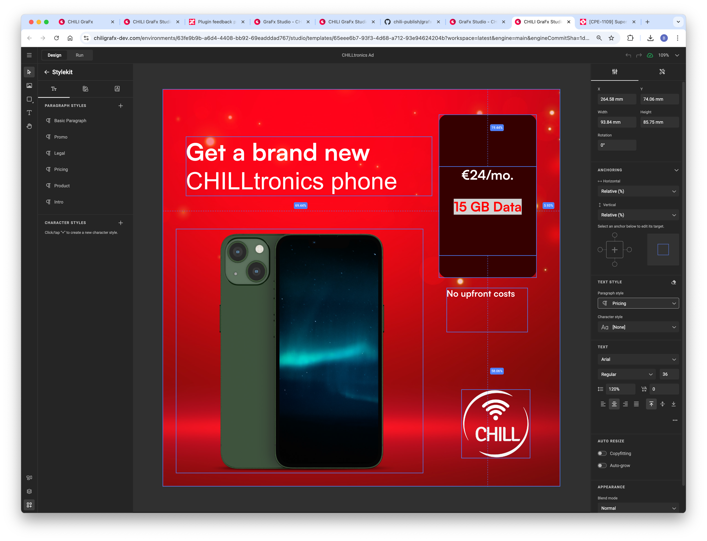{.screenshot}

## Preflight

**Preflight** is the essential first step in the conversion process  
During preflight, the engine checks your document for compatibility with GraFx Studio  
This ensures that the content you are converting can be adapted efficiently for automation and variations

### How preflight works

When you initiate a conversion, the preflight engine scans the document for features that may not be fully compatible with GraFx Studio  
If any incompatible elements are found, preflight offers three options:

1. **Save as PDF asset** – The element can be saved as a PDF asset and placed into the converted document, preserving its visual integrity  
2. **Ignore** – The preflight engine changes the missing feature to a supported version (e.g., stroke type in the example)  
3. **Fix the issue** – You can adjust the feature in Adobe® InDesign® and re-run the preflight

{.screenshot-full}

!!! info "Placed assets: pros and cons"

    **Benefits**  
    - **Preserves quality** – Original appearance is retained  
    - **Simplifies conversion** – Avoids the need for manual adjustments for complex elements  
    
    **Limitations**  
    - **Not editable** – Static elements cannot be edited within GraFx Studio  
      For example, if text is saved as a PDF asset, you cannot create a text variable to dynamically alter the text content

## Drop Shadow support

Drop shadows applied at the **object level** in Adobe® InDesign® are supported and converted into GraFx Studio with defined constraints.

### Supported objects

- Shapes
- Image frames
- Text frames

### Supported parameters

- Opacity
- Distance
- Angle
- Size (mapped to **Blur** in GraFx Studio)
- Global Light
- X / Y offset

### Not supported

- Spread
- Blend mode
- Noise
- Shadows applied to Stroke, Fill, Text, or Graphic separately

### Preflight behavior

- A **warning is always shown** when a drop shadow is detected
- Unsupported parameters are ignored
- Visual appearance is preserved where possible

## Clipping mask support

A clipping mask is a shape that crops an image frame so only the part inside the shape shows through. The exporter translates InDesign® clipping setups into Studio-native clipping masks on image frames:

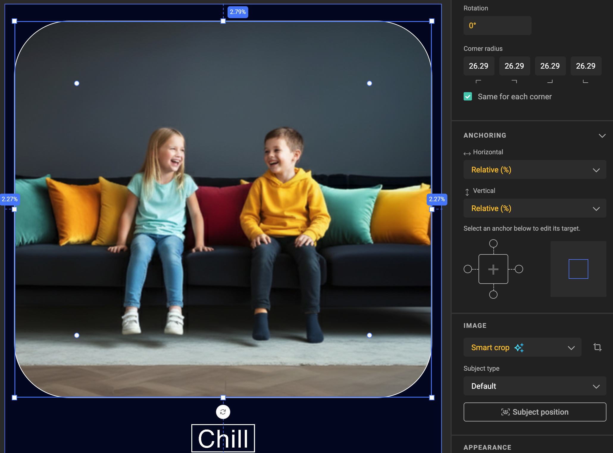{.screenshot-full}

!!! info "How the exporter detects a clipping mask"
    Clipping mask handling kicks in when a shape **contains an image**. Shapes without an image inside are exported to Studio as standalone shape assets — they keep their geometry, fill, and stroke, but don't act as a clipping mask. Place an image inside the shape in InDesign® if you want it converted to a clipping mask.

- **Built-in shapes** as clipping mask — rectangle, ellipse — with stroke and corner-radius properties preserved
- **Custom paths** as clipping mask — converted to a path-based clipping mask in Studio, with the path's stroke preserved
- **Nested shapes containing images** — when an image frame is pasted inside a shape, the **immediate parent shape** is exported as the clipping path, and the image's own clipping is applied on top. If that parent shape is itself nested inside further shapes, those additional parent frames are **ignored** and not exported.

Unsupported clipping setups are flagged by preflight before export.

## Compatibility

The plugin has been tested and is compatible with Adobe InDesign 2025, 2026.

## Supported features

The table below describes how Adobe® InDesign® features are converted, including where preflight intervention or fallback rendering is applied.

### Feature support table

Features marked with a green checkmark ✅ are fully supported.  
If a feature isn’t mentioned, it’s not supported — for now.  
Some unsupported features are listed for clarity where it matters most.

| **Category**           | **Feature**                              | **Support Level** | **Notes**                                           |
|------------------------|------------------------------------------|-------------------|----------------------------------------------------|
| **Plugin UI**          | Selecting a folder for export            | ✅                |                                                    |
|                        | Selecting a page of the document to export | ✅              |                                                    |
|                        | Logging                                   | ✅                |                                                    |
|                        | Appearance color scheme                  | ✅                |                                                    |
| **Document**           | Page size                                | ✅                |                                                    |
|                        | Choose the page to import                | ✅                |                                                    |
|                        | All pages                                | ✅                | See [Export](#export-to-grafx-studio) for limitations |
|                        | Layouts                                  | ✅                | [Choose the layout](#alt-layouts) you want to export |
|                        | Bleeds                                   | ✅                | Exported from document settings                    |
| **Frames**             | Rotation                                 | ✅                | Includes text, image, ellipse, polygon             |
|                        | Blend modes                              | ⚠️                | Object-level only; stroke/fill/text may convert    |
|                        | Mirror / Shear                           | ⚠️                | Shear triggers preflight                           |
|                        | Z-index / stacking order                 | ✅                |                                                    |
|                        | Nested text frames                       | ✅                | Preflight warning shown — convert to PDF or ignore |
|                        | Nested frames in shapes                  | ✅                | Detected and included in preflight report          |
| **Text Frames**        | Font (name and style)                    | ✅                |                                                    |
|                        | Font size                                | ✅                |                                                    |
|                        | Tracking                                 | ✅                |                                                    |
|                        | Baseline shift                           | ✅                |                                                    |
|                        | Underline                                | ✅                |                                                    |
|                        | Strikethrough                            | ✅                |                                                    |
|                        | Superscript                              | ✅                |                                                    |
|                        | Subscript                                | ✅                |                                                    |
|                        | All caps                                 | ✅                |                                                    |
|                        | Text color                               | ✅                |                                                    |
|                        | Soft return, discretionary line break    | ✅                | Exported as expected                               |
|                        | Text columns                             | ✅                | Multi-column frames exported with column structure intact |
|                        | Bullet lists                             | ⚠️                | Exported; indentation may differ slightly          |
|                        | Numbered lists                           | ⚠️                | Exported; exact numbered markers may not be preserved |
| **Alignment**          | Left                                     | ✅                |                                                    |
|                        | Center                                   | ✅                |                                                    |
|                        | Right                                    | ✅                |                                                    |
|                        | Top                                      | ✅                |                                                    |
|                        | Center (vertical)                        | ✅                |                                                    |
|                        | Bottom                                   | ✅                |                                                    |
| **Styles**             | Paragraph style                          | ✅                | Font must exist on platform                        |
|                        | Character style                          | ✅                | Font must exist on platform                        |
| **Image Frames**       | Arbitrary position                       | ✅                |                                                    |
|                        | Rotated content                          | ✅                |                                                    |
|                        | Stretched content                        | ✅                |                                                    |
|                        | Fill / Fit mappings                      | ✅                | Preflight converts fit modes accordingly           |
|                        | Horizontal / vertical flip               | ✅                |                                                    |
|                        | Shear                                    | ⚠️                | Preflight warning                                  |
|                        | High-resolution image support            | ✅                | Tested with 6000×6000 px                           |
|                        | Clipping mask — built-in shape           | ✅                | Rectangle, ellipse; stroke and corner radius preserved |
|                        | Clipping mask — custom path              | ✅                | Path stroke preserved; complex paths trigger preflight |
|                        | Clipping mask — nested shape with image  | ✅                | Immediate parent shape used as clipping path; deeper parent frames are ignored |
| **Primitives**         | Rectangle, ellipse, triangle             | ✅                |                                                    |
|                        | Polygon                                  | ⚠️                | Stroke weight/size partially supported             |
|                        | Stroke weight                            | ✅                |                                                    |
|                        | Stroke color                             | ✅                | Predefined & custom                                |
|                        | Fill color                               | ✅                | Predefined & custom                                |
|                        | Corner radius                            | ✅                | Rectangle only                                     |
|                        | Triangle corner radius                   | ❌                |                                                    |
| **Colors**             | CMYK, RGB swatches                       | ✅                |                                                    |
|                        | Spot colors                              | ✅                |                                                    |
|                        | Custom RGB/CMYK                          | ✅                |                                                    |
|                        | LAB, HSB                                 | ⚠️                | Preflight: converts to CMYK or black               |
| **Preflight**          | Problem list                             | ✅                |                                                    |
|                        | Details view                             | ✅                |                                                    |
|                        | Centering object                         | ✅                | Clicking warning centers object                    |
|                        | No document open                         | ✅                | Does nothing                                       |
|                        | Switching documents resets preflight     | ✅                |                                                    |
|                        | Frame stroke issues                      | ✅                | Can be ignored or converted                        |
|                        | Tables not supported                     | ✅                | Converted to PDF                                   |
|                        | Text overflow                            | ✅                | Can be ignored or converted to image               |
|                        | Text variables converted                 | ✅                | Automatically mapped in Studio                     |
|                        | Unsupported gradients                    | ⚠️                | Radial gradients or unsupported color models trigger preflight |
| **Layers**             | Layer names                              | ✅                | Default names in Studio                            |
|                        | Hidden layers                            | ❌                | Not exported                                       |
|                        | Locked layers                            | ✅                | Exported as PDF                                    |
|                        | Hidden/locked objects                    | ✅                | Not exported                                       |
| **Pages**              | Export specific page                     | ✅                | Page dropdown updated in real time                 |
|                        | Export all pages                         | ✅                | Max 50 pages                                       |
|                        | Mixed page sizes                         | ✅                | Option to skip or unify sizes                      |
|                        | Page numbering in .zip name              | ✅                | Example: `3_Test.zip`                              |
|                        | Layout dropdown dynamic refresh          | ✅                |                                                    |
| **Visual Effects**     | Object opacity                           | ✅                | Applies to shapes, text, and image frames          |
|                        | Drop shadow (object-level)               | ✅                | See Drop Shadow details below                      |
|                        | Linear gradients                         | ✅                | Includes rotation and opacity                      |
|                        | Gradient opacity                         | ✅                | Combined with object opacity                       |
|                        | Blend modes (object)                     | ⚠️                | Object-level only; stroke, fill, or text convert   |
|                        | Image frame graphic opacity              | ✅                | Graphic opacity is respected                       |
|                        | Opacity with gradients                   | ✅                | Combined opacity preserved                         |
|                        | Opacity with drop shadow                 | ✅                | Effect opacity is respected                        |

### Legend

- ✅ **Supported** – Fully supported  
- ✴️ **Not yet** – Planned to be released soon  
- ❌ **Unsupported** – Not supported in current version  

## Tips for successful conversion

### Simplify your design

Ensure your design uses basic text, shapes, and images for best results

### Check for unsupported features

Use the **Preflight** option in InDesign® to identify unsupported features before exporting

### Use linked assets

Make sure all images are properly linked and included in the export

### Have fonts installed in your environment

Font files are not included in the `.zip` and are not exported  
You should have all fonts installed in the platform  
Fonts will be applied to the template upon importing, and the match will be made by the font name  
Otherwise, the default font is used  

When you install the fonts after the import, GraFx Studio will try to apply them when you re-open the template

### Plan for automation

After importing to GraFx Studio, leverage smart template features to add business logic and automate variant creation

## Things to consider

- Colors not in RGB or CMYK color space (like HSB, LAB) are converted to CMYK or black  
- Adobe® Variables (like `<document_name>` `<current_date>`) are removed from text  
- Any item frame in Adobe® InDesign® (text/image) might have properties (background color, stroke, opacity)  
  Frame options are not detected by preflight and will be missed after export  
- Line shapes are always exported as `.pdf` without a preflight warning  