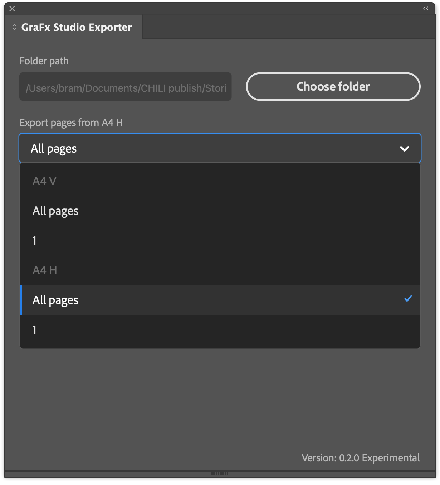

# GraFx Studio Exporter for Adobe® InDesign®

!!! example "Experimental"
	To give you early access to the latest and greatest, we are introducing some features as **"Experimental"**  
	You’re welcome to explore and use these features, but keep in mind that their functionality may evolve  
	If you’re working in production workflows, be aware that changes may still occur
	
	Please let us know through the support channels if you run into issues

## Introduction

The InDesign Conversion Plugin allows you to export documents from Adobe® InDesign® and import them into **GraFx Studio**  
This process lets you automate the creation of design variants by leveraging GraFx Studio’s powerful smart template features  
While InDesign® remains a great starting point for creative design, GraFx Studio excels at automation and multi-channel output

## Elements of the conversion

- GraFx Studio Exporter (Adobe® InDesign® plugin)  
- Importer in GraFx Studio

## How to install the plugin

### Download the plugin

Click to download [the latest version of the plugin](https://studio-cdn.chiligrafx.com/plugins/AdobeInDesign/latest/GraFxStudioExporter_InDesign_latest.ccx)

### Install the plugin

   - Locate the `GraFxStudioExporter_InDesign_x.y.z.ccx` file (x.y.z being the version)  
   - Double-click the CCX file  
   - Follow the steps to install the plugin in Adobe® InDesign®

## How to convert a document

### Prepare your InDesign® document

   - Open the Adobe® InDesign® document you want to export  
   - Ensure all assets are properly linked  

Example: `Blue.png` is missing

All assets are linked correctly

### Export to GraFx Studio

   - Go to **Plugins > CHILI GraFx plugins > GraFx Studio Exporter**  
   

   - Run preflight to avoid conversion issues  
     
   

Example of a potential issue: Frame stroke type not supported  
You can choose to ignore, or export the object to a PDF asset and place it as an asset

   - Choose a destination folder and click **Export**  
     Required only once, can be changed at any moment  
   - Choose the page to be exported  
   - Choose **All pages** to export all the pages

!!! note "Limitations"
    Exported pages must have the same size
    
    Users can skip differently sized pages or convert them to match the first page
    
    A maximum of 50 pages can be exported, with any additional pages excluded

   - Choose your layout   

Adobe® InDesign® supports alternate layouts (per page)  
The GraFx Studio exporter allows you to choose which page and alternate layout to export  

Choose your alternate layout, and this layout will be in the exporter file

  

   - The plugin creates a `.zip` file containing the document and all necessary assets  
   

!!! info "What's in the zip file?"
      
    - A log file with info about the plugin version, the Adobe app version, current date, and plugin warnings or errors caught during the document preflight or export  
    - The log file is named `GraFx_Studio_Exporter.log`  
    - The zip file name format: `<selected_page>_<document_name>(<optional_duplicate_copy_version>).zip`

### Import into GraFx Studio

   - Open **[GraFx Studio](https://chiligrafx.com/)**  
   - Go to **Templates > Import .ZIP** and select the exported `.zip` file  
     
   

   - Name the template and locate the folder for the assets  
   

   - You can follow the progress in the top right-hand corner  
   

   - Your InDesign® document is now ready for automation in GraFx Studio  
   

## Preflight

**Preflight** is the essential first step in the conversion process  
During preflight, the engine checks your document for compatibility with GraFx Studio  
This ensures that the content you are converting can be adapted efficiently for automation and variations

### How preflight works

When you initiate a conversion, the preflight engine scans the document for features that may not be fully compatible with GraFx Studio  
If any incompatible elements are found, preflight offers three options:

1. **Save as PDF asset** – The element can be saved as a PDF asset and placed into the converted document, preserving its visual integrity  
2. **Ignore** – The preflight engine changes the missing feature to a supported version (e.g., stroke type in the example)  
3. **Fix the issue** – You can adjust the feature in Adobe® InDesign® and re-run the preflight

!!! info "Placed assets: pros and cons"

    **Benefits**  
    - **Preserves quality** – Original appearance is retained  
    - **Simplifies conversion** – Avoids the need for manual adjustments for complex elements  
    
    **Limitations**  
    - **Not editable** – Static elements cannot be edited within GraFx Studio  
      For example, if text is saved as a PDF asset, you cannot create a text variable to dynamically alter the text content

## Compatibility

The plugin has been tested and is compatible with Adobe® InDesign® versions from 2024 and 2025

The latest tested version is 20.1 (January 2025)

## Supported features

As the GraFx Studio Exporter is **Experimental**, the list below will update frequently

### Feature support table

Features marked with a green checkmark ✅ are fully supported.  
If a feature isn’t mentioned, it’s not supported — for now.  
Some unsupported features are listed for clarity where it matters most.

| **Category**           | **Feature**                              | **Support Level** | **Notes**                                           |
|------------------------|------------------------------------------|-------------------|----------------------------------------------------|
| **Plugin UI**          | Selecting a folder for export            | ✅                |                                                    |
|                        | Selecting a page of the document to export | ✅              |                                                    |
|                        | Logging                                   | ✅                |                                                    |
|                        | Appearance color scheme                  | ✅                |                                                    |
| **Document**           | Page size                                | ✅                |                                                    |
|                        | Choose the page to import                | ✅                |                                                    |
|                        | All pages                                | ✅                | See [Export](#export-to-grafx-studio) for limitations |
|                        | Layouts                                  | ✅                | [Choose the layout](#alt-layouts) you want to export |
|                        | Bleeds                                   | ✅                | Exported from document settings                    |
| **Frames**             | Rotation                                 | ✅                | Includes text, image, ellipse, polygon             |
|                        | Blend modes                              | ⚠️                | Preflight: convert to PDF or ignore                |
|                        | Mirror / Shear                           | ⚠️                | Shear triggers preflight                           |
|                        | Z-index / stacking order                 | ✅                |                                                    |
| **Text Frames**        | Font (name and style)                    | ✅                |                                                    |
|                        | Font size                                | ✅                |                                                    |
|                        | Tracking                                 | ✅                |                                                    |
|                        | Baseline shift                           | ✅                |                                                    |
|                        | Underline                                | ✅                |                                                    |
|                        | Strikethrough                            | ✅                |                                                    |
|                        | Superscript                              | ✅                |                                                    |
|                        | Subscript                                | ✅                |                                                    |
|                        | All caps                                 | ✅                |                                                    |
|                        | Text color                               | ✅                |                                                    |
|                        | Soft return, discretionary line break    | ✅                | Exported as expected                               |
| **Alignment**          | Left                                     | ✅                |                                                    |
|                        | Center                                   | ✅                |                                                    |
|                        | Right                                    | ✅                |                                                    |
|                        | Top                                      | ✅                |                                                    |
|                        | Center (vertical)                        | ✅                |                                                    |
|                        | Bottom                                   | ✅                |                                                    |
| **Styles**             | Paragraph style                          | ✅                | Font must exist on platform                        |
|                        | Character style                          | ✅                | Font must exist on platform                        |
| **Image Frames**       | Arbitrary position                       | ✅                |                                                    |
|                        | Rotated content                          | ✅                |                                                    |
|                        | Stretched content                        | ✅                |                                                    |
|                        | Fill / Fit mappings                      | ✅                | Preflight converts fit modes accordingly           |
|                        | Horizontal / vertical flip               | ✅                |                                                    |
|                        | Shear                                    | ⚠️                | Preflight warning                                  |
|                        | High-resolution image support            | ✅                | Tested with 6000×6000 px                           |
| **Primitives**         | Rectangle, ellipse, triangle             | ✅                |                                                    |
|                        | Polygon                                  | ⚠️                | Stroke weight/size partially supported             |
|                        | Stroke weight                            | ✅                |                                                    |
|                        | Stroke color                             | ✅                | Predefined & custom                                |
|                        | Fill color                               | ✅                | Predefined & custom                                |
|                        | Corner radius                            | ✅                | Rectangle only                                     |
|                        | Triangle corner radius                   | ❌                |                                                    |
| **Colors**             | CMYK, RGB swatches                       | ✅                |                                                    |
|                        | Spot colors                              | ✅                |                                                    |
|                        | Custom RGB/CMYK                          | ✅                |                                                    |
|                        | LAB, HSB                                 | ⚠️                | Preflight: converts to CMYK or black               |
| **Preflight**          | Problem list                             | ✅                |                                                    |
|                        | Details view                             | ✅                |                                                    |
|                        | Centering object                         | ✅                | Clicking warning centers object                    |
|                        | No document open                         | ✅                | Does nothing                                       |
|                        | Switching documents resets preflight     | ✅                |                                                    |
|                        | Frame stroke issues                      | ✅                | Can be ignored or converted                        |
|                        | Tables not supported                     | ✅                | Converted to PDF                                   |
|                        | Text overflow                            | ✅                | Can be ignored or converted to image               |
|                        | Gradient color                           | ✅                | Preflight warning shown                            |
|                        | Text variables converted                 | ✅                | Automatically mapped in Studio                     |
| **Layers**             | Layer names                              | ✅                | Default names in Studio                            |
|                        | Hidden layers                            | ❌                | Not exported                                       |
|                        | Locked layers                            | ✅                | Not exported                                       |
|                        | Hidden/locked objects                    | ✅                | Not exported                                       |
| **Pages**              | Export specific page                     | ✅                | Page dropdown updated in real time                 |
|                        | Export all pages                         | ✅                | Max 50 pages                                       |
|                        | Mixed page sizes                         | ✅                | Option to skip or unify sizes                      |
|                        | Page numbering in .zip name              | ✅                | Example: `3_Test.zip`                              |
|                        | Layout dropdown dynamic refresh          | ✅                |                                                    |

### Legend

- ✅ **Supported** – Fully supported  
- ✴️ **Not yet** – Planned to be released soon  
- ❌ **Unsupported** – Not supported in current version  

## Tips for successful conversion

### Simplify your design

Ensure your design uses basic text, shapes, and images for best results

### Check for unsupported features

Use the **Preflight** option in InDesign® to identify unsupported features before exporting

### Use linked assets

Make sure all images are properly linked and included in the export

### Have fonts installed in your environment

Font files are not included in the `.zip` and are not exported  
You should have all fonts installed in the platform  
Fonts will be applied to the template upon importing, and the match will be made by the font name  
Otherwise, the default font is used  

When you install the fonts after the import, GraFx Studio will try to apply them when you re-open the template

### Plan for automation

After importing to GraFx Studio, leverage smart template features to add business logic and automate variant creation

## Things to consider

- Colors not in RGB or CMYK color space (like HSB, LAB) revert to black  
- Adobe® Variables (like `<document_name>` `<current_date>`) are removed from text  
- Any item frame in Adobe® InDesign® (text/image) might have properties (background color, stroke, opacity)  
  Frame options are not detected by preflight and will be missed after export  
- Line shapes are always exported as `.pdf` without a preflight warning  