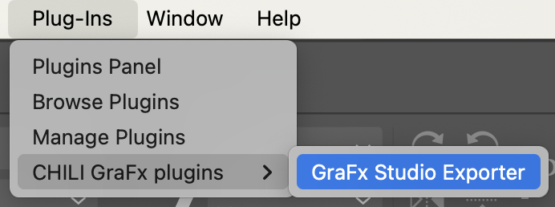
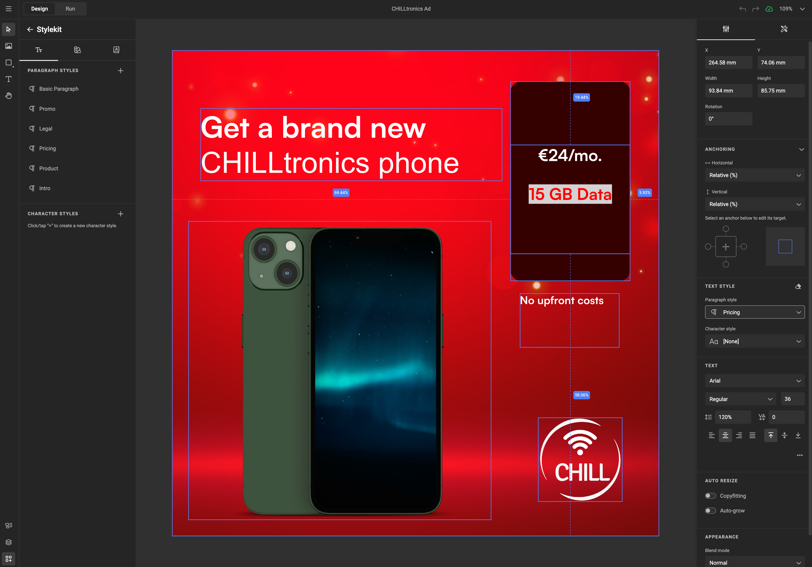

# GraFx Studio Exporter for Adobe® InDesign®

!!! example "Experimental"
	To give you early access to the latest and greatest, we are introducing some features as **"Experimental"**.  
	You’re welcome to explore and use these features, but keep in mind that their functionality may evolve.  
	If you’re working in production workflows, be aware that changes may still occur.

## Introduction

The InDesign Conversion Plugin allows you to export documents from Adobe® InDesign® and import them into **GraFx Studio**. This process lets you automate the creation of design variants by leveraging GraFx Studio’s powerful smart template features. While InDesign® remains a great starting point for creative design, GraFx Studio excels at automation and multi-channel output.

## Elements of the conversion

- GraFx Studio Exporter (Adobe® InDesign® plugin)
- Importer in GraFx Studio

## How to Install the Plugin

### Download the Plugin

Click to download [the plugin](https://studio-cdn.chiligrafx.com/plugins/AdobeInDesign/0.1.0/GraFxStudioExporter_InDesign_0.1.0.ccx)

### Install the Plugin

   - Locate the "GraFxStudioExporter_InDesign_x.y.z.ccx" (x.y.z being the version)  
   - Double click the ccx file
   - Follow the steps to install the plugin in Adobe® InDesign®

## How to Convert a Document

### Prepare Your InDesign® Document

   - Open the Adobe® InDesign® document you want to export.
   - Ensure all assets are properly linked.

Example: Blue.png is missing

All assets are linked correctly

### Export to GraFx Studio

   - Go to **Plugins > CHILI GraFx plugins > GraFx Studio Exporter**

   - Run preflight to avoid conversion issues

Example of a potential issue: Frame stroke type not supported.  
You can choose to ignore, or to export the object to a PDF asset, and place it as an asset.

   - Choose a destination folder and click **Export**.  
   Required only once, can be changed at any moment
   - Choose the Page to be exported  
   Only one page can be exported at a time. Soon you will be able to export all pages at once.

   - The plugin creates a `.zip` file containing the document and all necessary assets.
   

!!! info "What's in the zip file?"
    
    
    - A log file with info about the Plugin version, the Adobe App version, current Date and Plugin Warnings or Errors caught during the Document Preflight or Export
    - The log file is named: GraFx_Studio_Exporter.log
    - The zip file name format: <selected_page>_<document_name>(<optional_duplicate_copy_version>).zip
    
   

### Import into GraFx Studio

   - Open **[GraFx Studio](https://chiligrafx.com/)**
   - Go to **Templates > Import .ZIP** and select the exported `.zip` file.

   - Name the template and locate the folder for the assets

   - You can follow the progress in the top right-hand corner

   - Your InDesign® document is now ready for automation in GraFx Studio.

## Preflight

**Preflight** is the essential first step in the conversion process. During preflight, the engine checks your document for compatibility with GraFx Studio. This ensures that the content you are converting can be adapted efficiently for automation and variations.

### How Preflight Works

When you initiate a conversion, the preflight engine scans the document for features that may not be fully compatible with GraFx Studio. If any incompatible elements are found, preflight offers two solutions:

1. **Save as PDF Asset**: The element can be saved as a PDF asset and placed into the converted document, preserving its visual integrity.
2. **Ignore**: The preflight engine will change the missing feature to a supported version (e.g. stroke type in the example).
3. **Fix the Issue**: an obvious but not mentioned choice, is you choose to fix it by choosing a different feature in Adobe® InDesign®, and re-run the preflight.

!!! info "Placed Assets: Pros and Cons"

    **Benefits**  
    - **Preserves Quality**: When elements are saved as PDF assets, their original quality and appearance remain intact.
    - **Simplifies Conversion**: For complex designs, converting to a PDF asset can streamline the process by avoiding the need for manual adjustments.  
    
    **Limitations**  
    - **Not Editable**: Placed assets are static. You cannot edit them within GraFx Studio. For example, if text is saved as a PDF asset, you won’t be able to create a text variable to dynamically alter the text content.
  

## Supported Features

As the GraFx Studio Exporter is **Experimental**, the list below will update frequently.

### Feature Support Table

Features marked with a green checkmark ✅ are fully supported. Some unsupported features are listed for clarity where it matters most.
If a feature isn’t mentioned, it’s not supported — for now! Stay tuned, as we’re continually expanding support.

| **Category**           | **Feature**                              | **Support Level**        | **Notes**                                           |
|-------------------------|------------------------------------------|--------------------------|----------------------------------------------------|
| **Plugin UI**          | Selecting a folder for export            | ✅             |                                                    |
|                        | Selecting a page of the document to export | ✅            |                                                    |
|                        | Logging                                   | ✅             |                                                    |
|                        | Appearance color scheme                  | ✅             |                                                    |
| **Document**           | Page size                                | ✅             |                                                    |
|                        | Choose the page to import                                | ✅            | 
|                        | All pages                                | ✴️           | Coming soon!                                     |
|                        | Layouts                                  | ❌           |                                      |
| **Frames**             | Rotation                                 | ✅             |                                                    |
|                        | Blend modes                              | ❌           |                                      |
|                        | Mirror / Shear                           | ❌           |                                      |
| **Text Frames**        | Font (specified but not exported)        | ✅             |                                                    |
|                        | Font size                                | ✅             |                                                    |
|                        | Tracking (letter spacing)                | ✅             |                                                    |
|                        | Baseline shift                           | ✅             |                                                    |
|                        | Underline                                | ✅             |                                                    |
|                        | Strikethrough                            | ✅             |                                                    |
|                        | Superscript                              | ✅️ |                                    |
|                        | Subscript                                | ✅             |                                                    |
|                        | All caps                                 | ✅             |                                                    |
| **Alignment**          | Left                                     | ✅             |                                                    |
|                        | Center                                   | ✅             |                                                    |
|                        | Right                                    | ✅             |                                                    |
|                        | Top                                      | ✅             |                                                    |
|                        | Center (vertical)                        | ✅             |                                                    |
|                        | Bottom                                   | ✅             |                                                    |
| **Styles**             | Paragraph style                          | ✅             | Font specified but not exported                    |
|                        | Character style                          | ✅             | Font specified but not exported                    |
| **Image Frames**       | Image frame with arbitrary position      | ✅             |                                                    |
|                        | Image frame with rotated content         | ✅             |                                                    |
|                        | Image frame with stretched content       | ✅             |                                                    |
| **Primitives**         | Rectangle, ellipse, triangle             | ✅             |                                                    |
|                        | Stroke weight                            | ✅             |                                                    |
|                        | Stroke color (predefined and custom)     | ✅             |                                                    |
|                        | Fill color (predefined and custom)       | ✅             |                                                    |
|                        | Rectangle corner radius                  | ✅             |                                                    |
|                        | Triangle corner radius                   | ❌ |                                    |
|                        | Polygon stroke weight                    | ❌  |                                    |
| **Predefined Color Export** | CMYK swatch colors| ✅           |                                                    |
|  | RGB swatch colors| ✅           |                                                    |
|  | Spot color swatch colors| ✅           |                                                    |
| **Preflight**          | List of potential problems               | ✅             |                                                    |
|                        | Details (click on an item in the list)   | ✅             |                                                    |
|                        | Center problem object (click on warning) | ✅             |                                                    |
|                        | No document open behavior                | ✅             | Preflight does nothing if no document is open     |
|                        | Switching documents                      | ✅             | Preflight results reset when switching documents  |
| **Layers**             | Layer names                              | ✅             | InDesign® layer names converted to default names   |
|                        | Hidden layers                            | ❌           | Hidden layers are not exported                    |

### Legend (not John)

- ✅ **Supported**: Fully supported
- ✴️ **Not yet**: Planned to be released soon
- ❌ **Unsupported**: The team is working hard to add this functionality

## Tips for Successful Conversion

### Simplify Your Design

Ensure your design uses basic text, shapes, and images for best results.

### Check for Unsupported Features

Use the **Preflight** option in InDesign® to identify unsupported features before exporting.

### Use Linked Assets

Make sure all images are properly linked and included in the export.

### Have fonts installed on your environment

Font Files are not included in the .zip and are not exported.
You should have all Fonts installed to the platform.
Fonts will be applied to the template upon Importing, and the match will be made by name of the font.
Otherwise the default font is used.

### Plan for Automation
After importing to GraFx Studio, leverage smart template features to add business logic and automate variant creation.