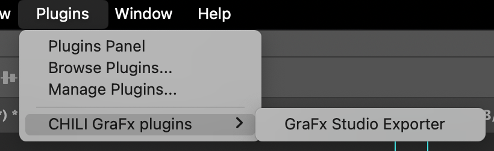
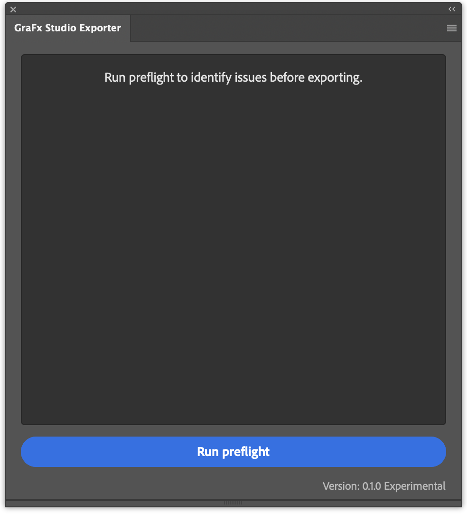
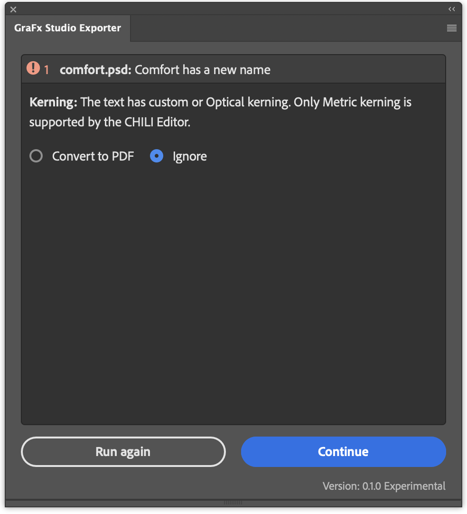
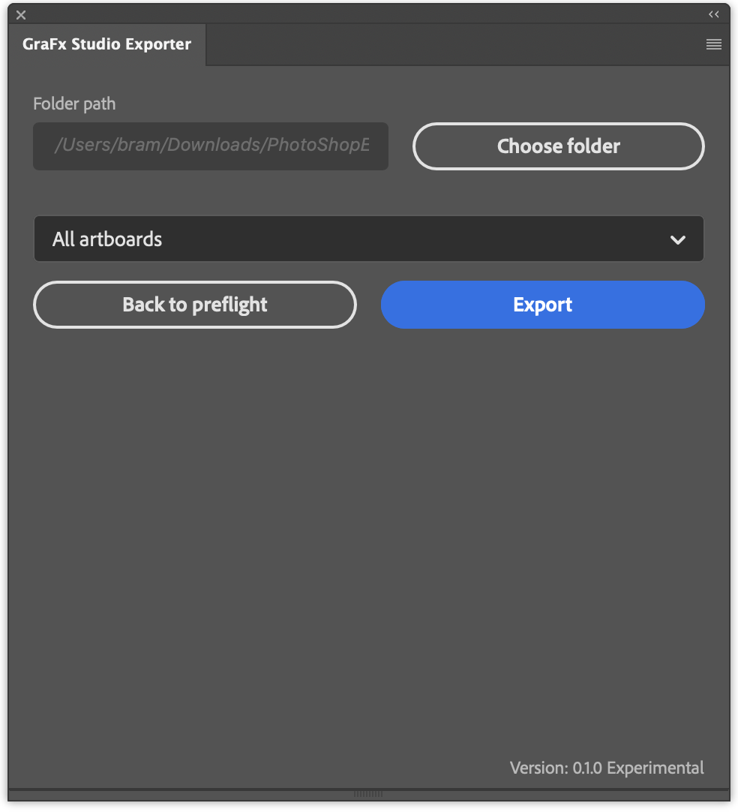
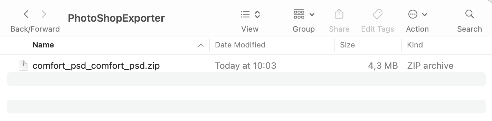
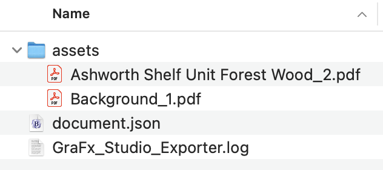
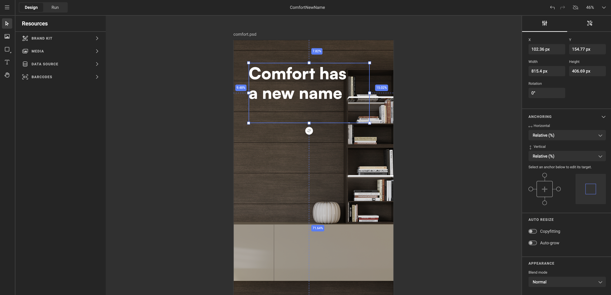

# GraFx Studio Exporter for Adobe® Photoshop®

## Introduction

The Photoshop Conversion Plugin allows you to export documents from Adobe® Photoshop® and import them into **GraFx Studio**  
This process lets you automate the creation of design variants by leveraging GraFx Studio’s powerful smart template features  
While Photoshop® remains a great starting point for creative design, GraFx Studio excels at automation and multi-channel output

## Elements of the conversion

- GraFx Studio Exporter (Adobe® Photoshop® plugin)
- Importer in GraFx Studio

## How to install the plugin

### Download the plugin

Get the latest plugin from the [GraFx Studio plugin downloads](/GraFx-Studio/convert/downloads/) page.

### Install the plugin

   - Locate the `GraFxStudioExporter_Photoshop_x.y.z.ccx` file (x.y.z being the version)  
   - Double-click the CCX file  
   - Follow the steps to install the plugin in Adobe® Photoshop®

## How to convert a document

### Prepare your Photoshop® document

   - Open the Adobe® Photoshop® document you want to export  
   - Ensure all layers and assets are correctly set up

### Export to GraFx Studio

   - Go to **Plugins > CHILI GraFx plugins > GraFx Studio Exporter**  
   

   - Run preflight to avoid conversion issues  
   

Example of a potential issue: Optical Kerning is not supported  
You can choose to ignore, and the kerning will default to Metric in GraFx Studio, or export the object to a PDF asset and place it as an asset

  

   - Choose a destination folder and click **Export**  
     Required only once, can be changed at any moment  
     

   - Choose the artboard(s) to be exported  
   - Choose **All artboards** to export all the artboards

!!! note "Limitations"
    Exported artboards must have the same size
    
    Users can skip differently sized artboards or convert them to match the first artboard

   - The plugin creates a `.zip` file containing the document and all necessary assets  
   
   
!!! info "What's in the zip file?"

      
    - A log file with info about the plugin version, the Adobe app version, current date, and plugin warnings or errors caught during the document preflight or export  
    - The log file is named `GraFx_Studio_Exporter.log`  
    - The zip file name format: `<selected_artboard>_<document_name>(<optional_duplicate_copy_version>).zip`

### Import into GraFx Studio

   - Open **[GraFx Studio](https://chiligrafx.com/)**  
   - Go to **Templates > Import .ZIP** and select the exported `.zip` file  
   - Name the template and locate the folder for the assets  
   - Your Photoshop® document is now ready for automation in GraFx Studio  
   

## Preflight

**Preflight** is the essential first step in the conversion process  
During preflight, the engine checks your document for compatibility with GraFx Studio  
This ensures that the content you are converting can be adapted efficiently for automation and variations

### How preflight works

When you initiate a conversion, the preflight engine scans the document for features that may not be fully compatible with GraFx Studio  
If any incompatible elements are found, preflight offers three options:

1. **Convert to PDF** – The element is saved as a PDF asset and placed into the converted document, preserving its visual integrity  
2. **Ignore** – The preflight engine changes the missing feature to a supported version  
3. **Fix the issue** – You can adjust the element in Photoshop® and re-run the preflight

!!! info "Placed assets: pros and cons"

    **Benefits**  
    - **Preserves quality** – Original appearance is retained  
    - **Simplifies conversion** – Avoids the need for manual adjustments for complex elements  
    
    **Limitations**  
    - **Not editable** – Static elements cannot be edited within GraFx Studio

## Drop Shadow support

Drop shadows authored in Adobe® Photoshop® are supported and converted into GraFx Studio with defined constraints.

### Supported objects

- Shapes
- Image frames
- Text frames

### Supported parameters

- Opacity
- Distance
- Angle
- Size (mapped to **Blur** in GraFx Studio)
- Global Light

### Not supported

- Spread
- Blend Mode
- Noise

### Preflight behavior

- A warning is always displayed when a drop shadow is present
- Unsupported parameters are ignored

## Clipping mask support

A clipping mask is a shape that crops an image so only the part inside the shape shows through. The exporter translates Photoshop® clipping setups into Studio-native clipping masks on image frames:

- **Built-in shapes** as clipping mask — Rectangle, Ellipse, Polygon — with stroke and corner properties preserved
- **Custom paths** as clipping mask — converted to a path-based clipping mask in Studio

Stroke color and width on clipping masks are preserved, as are corner properties.

!!! info "A preflight warning is shown for every document containing clipping masks"
    A clipping mask in Photoshop® is effectively an object with a fill, which is normally invisible. If the mask extends outside the clipped image, Photoshop® shows that overflowing fill — GraFx Studio does not. The plugin doesn't check whether a mask actually extends outside its frame, so one global warning is shown whenever the document contains at least one clipping mask. If your masks stay within their frames, you can safely ignore it.

Unsupported clipping setups — such as merged or combined shapes, masks on a group of layers, or complex paths — are flagged by preflight.

## Compatibility

The plugin has been tested and is compatible with Adobe Photoshop 2025, 2026.

## Supported features

### Feature support table

| **Category**           | **Feature**                              | **Support Level** | **Notes**                                           |
|------------------------|------------------------------------------|-------------------|----------------------------------------------------|
| **Plugin UI**          | Selecting a folder for export            | ✅                |                                                    |
|                        | Selecting an artboard to export          | ✅                |                                                    |
|                        | Logging                                   | ✅                |                                                    |
| **Document**           | Artboard size                            | ✅                | All artboards must be same size                    |
|                        | Multiple artboards                       | ✅                | Exported as multiple pages in GraFx Studio         |
|                        | Hidden layers                            | ❌                | Not exported                                       |
| **Text Objects**       | Font (name and style)                     | ✅                |                                                    |
|                        | Small Caps                               | ❌                | Converted to lowercase; preflight warning shown    |
|                        | Text styles (character/inline mix)       | ⚠️                | May miss styles; avoid using both in same object   |
|                        | Text columns                             | ✅                | Column layout text layers now supported            |
|                        | Bullet lists                             | ⚠️                | Exported; indentation may differ slightly          |
|                        | Numbered lists                           | ⚠️                | Exported; exact numbered markers may not be preserved |
| **Paragraph/Character Styles** | Automatic generation of styles   | ✅                | Generated for each text object                     |
|                        | Preserve original style names            | ❌                | Default names like 'Paragraph Style 1'             |
| **Shapes**             | Basic shape export                       | ✅                |                                                    |
|                        | Line shapes                              | ❌                | Exported as vector graphics; preflight warning     |
|                        | Merged shapes on one layer               | ❌                | Exported as vector graphics; preflight warning     |
|                        | Clipping mask — built-in shape           | ✅                | Rectangle, Ellipse, Polygon; stroke and corner properties preserved |
|                        | Clipping mask — custom path              | ✅                | Stroke color and width preserved; complex paths trigger preflight |
| **Blending**           | Most blend modes                         | ✅                | Unsupported modes trigger preflight                |
|                        | Blend modes on vector export             | ⚠️                | Added later in Studio as image property            |
| **Colors**             | RGB and CMYK modes                       | ✅                |                                                    |
|                        | Export all unique colors as resources    | ✅                | Names not preserved (Color 1, Color 2…)            |
| **Gradients**          | Linear gradients                         | ✅                | Rectangles, triangles, and ovals only               |
|                        | Gradient rotation (angle)                | ✅                |                                                    |
|                        | Gradient scale                           | ✅                | Photoshop-specific                                 |
|                        | Align with Layer                         | ✅                | Photoshop-specific                                 |
|                        | Reverse gradient                         | ✅                |                                                    |
|                        | Non-linear gradient types                | ❌                | Converted to PDF for visual consistency             |
|                        | Non-classic gradient modes               | ❌                | Converted to PDF for visual consistency             |
| **Visual Effects**     | Drop shadow (object-level)               | ✅                | Warning always shown                                |

!!! note
    Some effect names in preflight warnings differ from Photoshop's UI. For example, **Satin** appears as *chromeFX* in the preflight output.

!!! note
    Only **Linear** gradient types and **Classic** gradient mode are supported.  
    Radial, Reflected, Smooth, and other gradient types or methods are converted to PDF for visual consistency.
    
!!! warning
    When a Drop Shadow is present, a warning message is always displayed.

### Legend

- ✅ **Supported** – Fully supported  
- ⚠️ **Partially supported** – Some limitations apply  
- ❌ **Unsupported** – Not supported in current version  

## Tips for successful conversion

- Avoid mixing character and inline styles in the same text object  
- Make hidden layers visible before export if you want them included  
- Use preflight to identify unsupported features before exporting  
- Ensure all fonts used are installed in GraFx Studio’s environment  

## Things to consider

- Color names are not preserved  
- Unsupported shape types are converted to vector graphics with a preflight warning  
- Small Caps text is converted to lowercase  
- Blend modes on vector-exported items are applied later in Studio, not in the exported PDF  