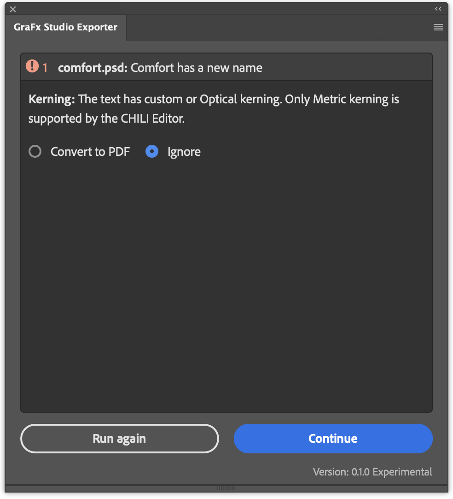

# GraFx Studio Exporter for Adobe® Photoshop®

!!! example "Experimental"
	To give you early access to the latest and greatest, we are introducing some features as **"Experimental"**.  
	You’re welcome to explore and use these features, but keep in mind that their functionality may evolve.  
	If you’re working in production workflows, be aware that changes may still occur.
	
	Please let us know through the support channels if you run into issues.

## Introduction

The Photoshop Conversion Plugin allows you to export documents from Adobe® Photoshop® and import them into **GraFx Studio**. This process lets you automate the creation of design variants by leveraging GraFx Studio’s powerful smart template features. While Photoshop® remains a great starting point for creative design, GraFx Studio excels at automation and multi-channel output.

## Elements of the conversion

- GraFx Studio Exporter (Adobe® Photoshop® plugin)
- Importer in GraFx Studio

## How to Install the Plugin

### Download the Plugin

Click to download [the latest version of the plugin](https://studio-cdn.chiligrafx.com/plugins/AdobePhotoshop/0.1.0/GraFxStudioExporter_Photoshop_0.1.0.ccx)

### Install the Plugin

   - Locate the "GraFxStudioExporter_Photoshop_x.y.z.ccx" (x.y.z being the version)  
   - Double click the ccx file
   - Follow the steps to install the plugin in Adobe® Photoshop®

## How to Convert a Document

### Prepare Your Photoshop® Document

   - Open the Adobe® Photoshop® document you want to export.
   - Ensure all layers and assets are correctly set up.

### Export to GraFx Studio

   - Go to **Plugins > CHILI GraFx plugins > GraFx Studio Exporter**  
   

   - Run preflight to avoid conversion issues.  
   

Example of a potential issue: Optical Kerning is not supported.  
You can choose to ignore, and the Kerning will default to Metric in GraFx Studio, or to export the object to a PDF asset, and place it as an asset.

  

   - Choose a destination folder and click **Export**.  
     Required only once, can be changed at any moment.  
     

   - Choose the Artboard(s) to be exported.  
   - Choose "All artboards" to export all the artboards.

!!! note "Limitations"
    Exported artboards must have the same size.
    
    Users can skip differently sized artboards or convert them to match the first artboard.

   - The plugin creates a `.zip` file containing the document and all necessary assets.  
   
   
!!! info "What's in the zip file?"

      
    - A log file with info about the Plugin version, the Adobe App version, current Date and Plugin Warnings or Errors caught during the Document Preflight or Export  
    - The log file is named: GraFx_Studio_Exporter.log  
    - The zip file name format: <selected_artboard>_<document_name>(<optional_duplicate_copy_version>).zip

### Import into GraFx Studio

   - Open **[GraFx Studio](https://chiligrafx.com/)**
   - Go to **Templates > Import .ZIP** and select the exported `.zip` file.
   - Name the template and locate the folder for the assets.
   - Your Photoshop® document is now ready for automation in GraFx Studio.

## Preflight

**Preflight** is the essential first step in the conversion process. During preflight, the engine checks your document for compatibility with GraFx Studio. This ensures that the content you are converting can be adapted efficiently for automation and variations.

### How Preflight Works

When you initiate a conversion, the preflight engine scans the document for features that may not be fully compatible with GraFx Studio. If any incompatible elements are found, preflight offers two solutions:

1. **Save as PDF Asset**: The element can be saved as a PDF asset and placed into the converted document, preserving its visual integrity.
2. **Ignore**: The preflight engine will change the missing feature to a supported version.
3. **Fix the Issue**: You can fix the element in Photoshop® and re-run the preflight.

!!! info "Placed Assets: Pros and Cons"

    **Benefits**  
    - **Preserves Quality**: When elements are saved as PDF assets, their original quality and appearance remain intact.
    - **Simplifies Conversion**: For complex designs, converting to a PDF asset can streamline the process by avoiding the need for manual adjustments.  
    
    **Limitations**  
    - **Not Editable**: Placed assets are static. You cannot edit them within GraFx Studio.

## Compatibility

The plugin has been tested and is compatible with Adobe® Photoshop® versions from 2024 and 2025.

The latest tested version is 25.0 (January 2025).

## Supported Features

As the GraFx Studio Exporter is **Experimental**, the list below will update frequently.

### Feature Support Table

| **Category**           | **Feature**                              | **Support Level** | **Notes**                                           |
|------------------------|------------------------------------------|-------------------|----------------------------------------------------|
| **Plugin UI**          | Selecting a folder for export            | ✅                |                                                    |
|                        | Selecting an artboard to export          | ✅                |                                                    |
|                        | Logging                                   | ✅                |                                                    |
| **Document**           | Artboard size                            | ✅                | All artboards must be same size                    |
|                        | Multiple artboards                       | ✅                | Exported as multiple pages in GraFx Studio         |
|                        | Hidden layers                            | ❌                | Not exported                                       |
| **Text Objects**       | Font (name and style)                     | ✅                |                                                    |
|                        | Small Caps                               | ❌                | Converted to lowercase; preflight warning shown    |
|                        | Text styles (character/inline mix)       | ⚠️                | May miss styles; avoid using both in same object   |
| **Paragraph/Character Styles** | Automatic generation of styles   | ✅                | Generated for each text object                     |
|                        | Preserve original style names            | ❌                | Default names like 'Paragraph Style 1'             |
| **Shapes**             | Basic shape export                       | ✅                |                                                    |
|                        | Line shapes                              | ❌                | Exported as vector graphics; preflight warning     |
|                        | Merged shapes on one layer                | ❌                | Exported as vector graphics; preflight warning     |
| **Blending**           | Most blend modes                         | ✅                | Unsupported modes trigger preflight                |
|                        | Blend modes on vector export             | ⚠️                | Added later in Studio as image property            |
| **Colors**             | RGB and CMYK modes                       | ✅                |                                                    |
|                        | Export all unique colors as resources    | ✅                | Names not preserved (Color 1, Color 2…)            |

### Legend

- ✅ **Supported**: Fully supported
- ⚠️ **Partially Supported**: Some limitations apply
- ❌ **Unsupported**: Not supported in current version

## Tips for Successful Conversion

- Avoid mixing character and inline styles in the same text object.
- Make hidden layers visible before export if you want them included.
- Use preflight to identify unsupported features before exporting.
- Ensure all fonts used are installed in GraFx Studio’s environment.

## Things to Consider

- Color names are not preserved.
- Unsupported shape types are converted to vector graphics with a preflight warning.
- Small Caps text is converted to lowercase.
- Blend modes on vector-exported items are applied later in Studio, not in the exported PDF.