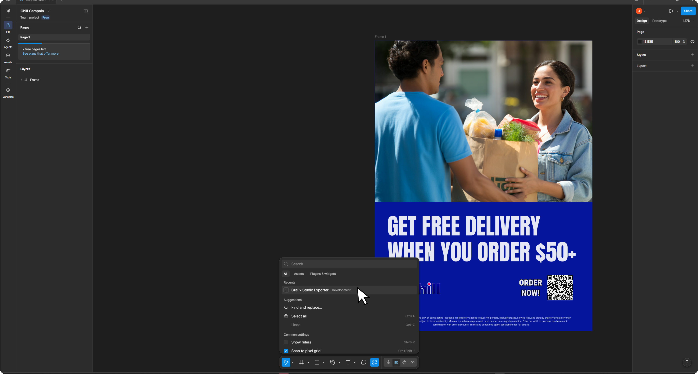
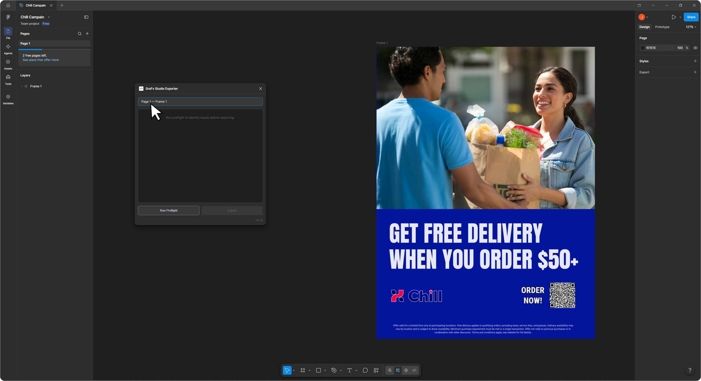
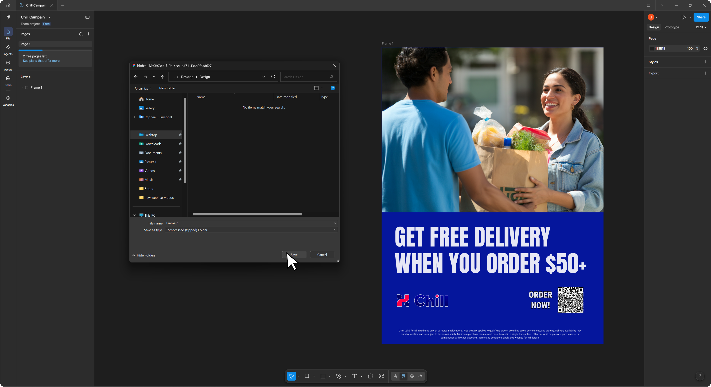
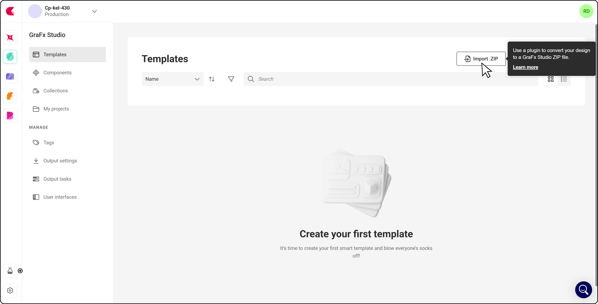
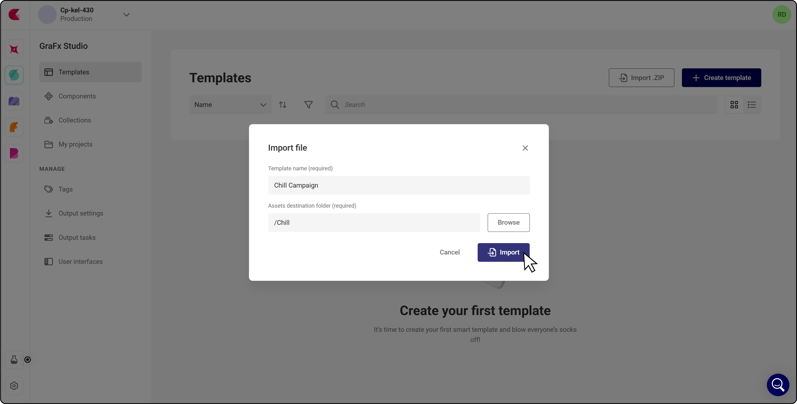
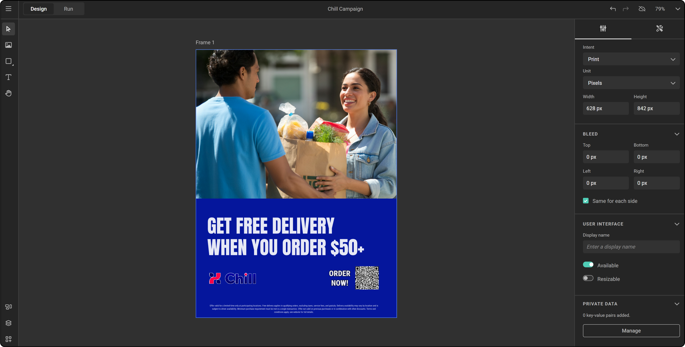

# GraFx Studio Exporter for Figma

## Introduction

The Figma plugin lets you export a frame from Figma and import it into **GraFx Studio** as a template.
Figma is a great place to design, but it isn't built to produce hundreds of variants across formats and channels — that is what GraFx Studio does. The plugin turns finished Figma design work into a starting point for automation instead of something you rebuild by hand.

!!! example "Experimental"
    The Figma plugin is released as [experimental](/release-notes/experimental/). It is not yet available from the Figma Community or from the [plugin downloads](/GraFx-Studio/convert/downloads/) page, and it is installed manually. Behavior and supported features can still change between versions — contact your CHILI publish contact if you want early access.

**Current version:** 0.8.0 Experimental
**Supported operating systems:** Windows and macOS

## Elements of the conversion

- GraFx Studio Exporter (Figma plugin)
- Importer in GraFx Studio

## How to convert a document

### Prepare your Figma file

- Open the Figma file you want to export
- Make sure the design you want to convert sits inside a single frame — the frame's size becomes the template size in GraFx Studio

### Export to GraFx Studio

- Run **GraFx Studio Exporter** from Figma's quick actions or plugin menu

{.screenshot-full}

- Select the page and frame to export at the top of the panel

{.screenshot-full}

!!! note "One frame per export"
    Only a single frame can be exported at a time. Everything inside that frame is included.

- Run **Preflight** to identify issues before exporting
- Review the warnings, then click **Export** — which stays disabled until preflight has run

{.screenshot-full}

- Choose a destination folder — you are asked for this on every export
- The plugin creates a `.zip` file containing the document and all necessary assets

{.screenshot-full}

### Import into GraFx Studio

- Open **[GraFx Studio](https://chiligrafx.com/)** and go to **Templates > Import .ZIP**

{.screenshot-full}

- Select the exported `.zip` file, then name the template and choose the folder for the assets

{.screenshot-full}

- Your Figma design is now ready for automation in GraFx Studio

{.screenshot-full}

## Preflight

**Preflight** is the first step in the conversion process. It scans the selected frame for anything that GraFx Studio cannot reproduce exactly, and reports it before you export — so you decide what happens instead of discovering it afterwards in Studio.

Preflight in the Figma plugin works the same way as preflight in the Adobe plugins: you get a list of warnings for the selected frame, and you can expand any warning to choose what to do with that item. When nothing needs attention, the panel shows **No errors or warnings found**.

!!! warning "Known limitations in this version"
    - Clicking a preflight warning does not select or center the corresponding frame in Figma
    - The export destination dialog shows `blob:null…` as its title on Windows
    - The destination folder has to be chosen on every export

## Text

The export supports the following text properties:

- **Typography** — font, style, and size
- **Alignment** — left, center, right, justified (horizontal); top, center, bottom (vertical)
- **Spacing** — line height (in % and pixels), letter spacing (in % and pixels)
- **Decorations** — underline, strikethrough, superscript, subscript
- **Color** — text color
- **Case handling** — upper and lower case transformations are preserved
- **Lists** — numbered and bullet lists, including multilevel nested lists, with left/center/right and top/middle/bottom alignment

!!! info "Underline used as a text background color"
    If an underline uses a negative offset and a thickness of 50% or more, GraFx Studio treats it as a text background color rather than an underline. This is intentional — it is how a highlight behind text is expressed in Studio.

!!! note "Text wrapping"
    In Figma, text can wrap to a new line where GraFx Studio does not, which can lead to text overflow in the converted template. Check text frames after import.

## Text styles

Figma text styles are exported and recreated in GraFx Studio, covering:

- Font, style, and size
- Line height (% and pixels)
- Letter spacing (%)
- Underline, strikethrough, superscript, subscript
- Background text color (applied when underline + negative offset + thickness ≥ 50%)

!!! info "Line height set to Auto"
    Text using the default **Line height** value `Auto` converts with a line height of 120%, applied silently — no preflight warning is shown. Set an explicit line height in Figma if you want a different value in the template.

!!! warning "Known limitations in this version"
    - Figma text styles are currently mapped to a mix of paragraph and character styles in GraFx Studio. The visual appearance of styled text is preserved in the template, but the style structure does not yet line up one-to-one with Figma
    - The default **Vertical trim** value `Standard` triggers a preflight warning

## Color styles

Figma color styles with solid colors are exported and created as color styles in GraFx Studio. Colors coming from libraries — for example `Accents/Brown` — are exported and created as a unique color style in Studio.

!!! note "Gradient and image fills"
    Color styles that use a gradient or an image fill are not recreated as color styles in GraFx Studio. The gradient or fill is still applied to the frame itself, so the template looks the same — you just won't find it back as a reusable color style.

## Shapes and vector paths

The following shapes are supported:

- Rectangles
- Ellipses
- Triangles
- Polygons
- Lines — exported as PDF
- Custom shapes — exported as PDF

Along with:

- Fill color
- Stroke color
- Stroke weight
- Different corner radius per corner
- Image as a fill, with fill / fit / crop

!!! warning "Known limitations in this version"
    - Only the **center** stroke position is supported
    - An image used as a fill in a shape acts as a clipping mask. Figma's native **Use as a mask** clipping is not yet supported

## Drop shadows

Drop shadows can be applied to shapes and to text. The following parameters are converted:

- Position (X, Y)
- Blur
- Color, including opacity

**Not supported:** Spread.

## Gradients

- Linear gradients on shapes
- Linear gradients with stops
- Rotated linear gradients

## Opacity and blend modes

- Appearance opacity for shapes, text, and images
- Fill opacity for shapes and text
- Blend modes

!!! warning "Known limitations in this version"
    - Image fill opacity is not supported
    - The **Plus darker** and **Plus lighter** blend modes are not supported. In preflight warnings they appear under their equivalent names, *linear burn* and *linear dodge*

## Tips for a successful conversion

- Put the design you want to convert in a single frame, sized as the template should be
- Run preflight and read the warnings before exporting — it is faster than fixing things in GraFx Studio afterwards
- Upload the fonts your design uses to GraFx Fonts, so GraFx Studio can resolve them. See [Supported font types](/GraFx-Fonts/overview/supported-font-types/)
- Check text frames after import for overflow caused by the wrapping difference between Figma and GraFx Studio
