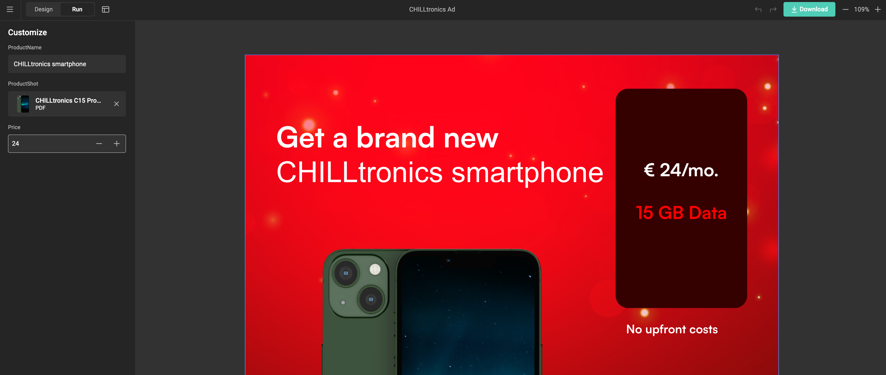
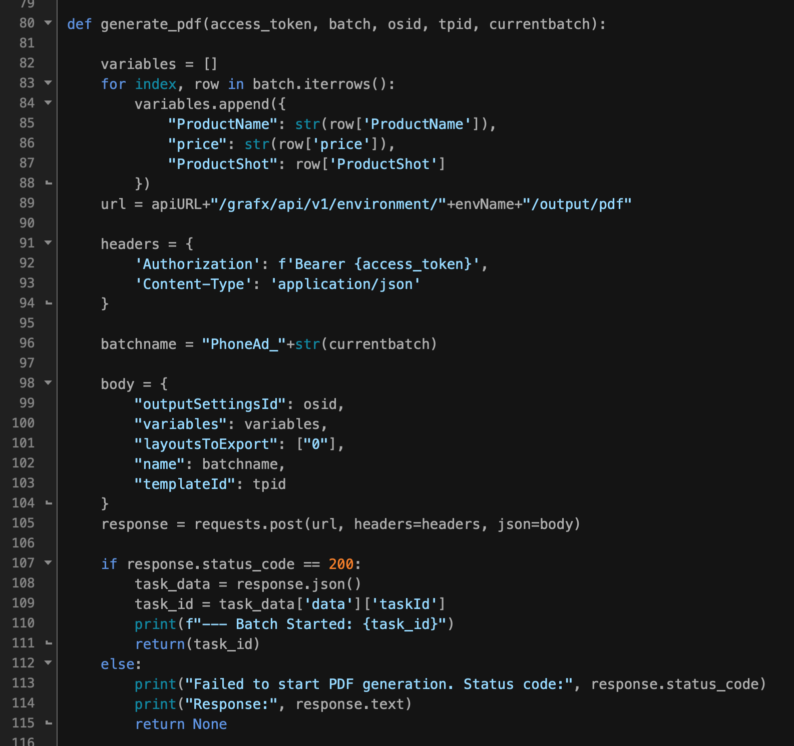

# Converting Documents to GraFx Studio

In creative workflows, **desktop design tools** like Adobe InDesign, Photoshop, or Illustrator are often used to create high-quality, custom designs. While these tools excel at creating static, one-off designs, they aren't built to efficiently handle the **automation of design variants**. This is where **GraFx Studio** comes in.

GraFx Studio allows you to **convert your existing designs** from desktop tools into Smart Templates. These templates form the foundation for automating the creation of multichannel content—whether it's print, digital static, or animated digital output. The conversion process ensures that the creative work you’ve already done doesn’t go to waste but becomes a **starting point for automation**.

## The Conversion Process

Below is the abstract process of conversion. For specific conversions see:

- [how to convert an Adobe® InDesign® document](../../../GraFx-Studio/convert/Adobe-InDesign/).

### Export from Desktop Tools

Using a plugin, you can export your document into a CHILI GraFx zip format that contains all the necessary assets, document structure, and settings.

### Import into GraFx Studio

This zip file can be imported into GraFx Studio, where the document is converted into a Smart Template.

### Add Business Logic

In GraFx Studio, you can enhance the template by adding business logic, variables, and automation rules. This enables the template to dynamically generate variations, adapting to different content, channels, and user inputs.

### Automate Variant Creation

Once the business logic is set, GraFx Studio can quickly produce multiple variants of your design—saving time and ensuring consistency across all outputs.

Offer self-service to end users.

Lights-out automation using the API.

