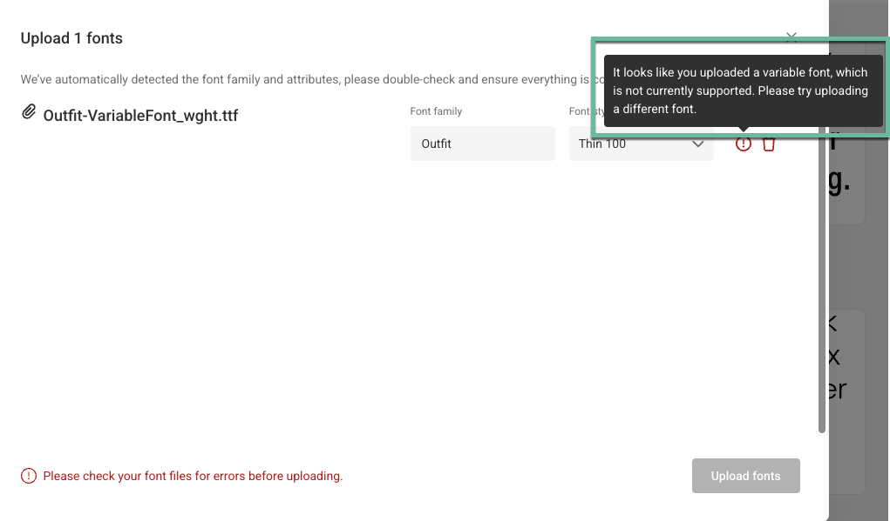
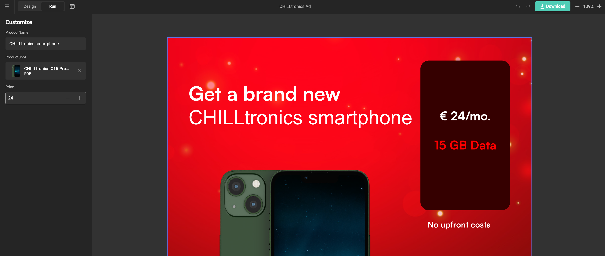
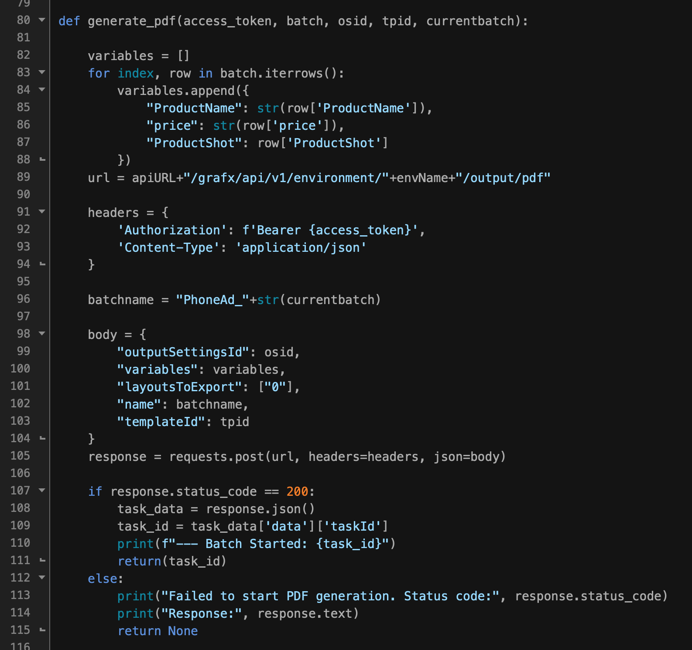

# Converting Documents to GraFx Studio

In creative workflows, **desktop design tools** like Adobe® InDesign®, Adobe® Photoshop®, or Adobe® Illustrator® are often used to create high-quality, custom designs  
While these tools excel at creating static, one-off designs, they aren't built to efficiently handle the **automation of design variants**  
This is where **GraFx Studio** comes in

GraFx Studio allows you to **convert your existing designs** from desktop tools into Smart Templates  
These templates form the foundation for automating the creation of multichannel content—whether it's print, digital static, or animated digital output  
The conversion process ensures that the creative work you’ve already done doesn’t go to waste but becomes a **starting point for automation**

## A note on fonts

Variable fonts display correctly in Adobe® Photoshop® and InDesign®, and your document will convert to a Studio document — but GraFx Fonts does not support variable fonts, so they cannot be uploaded.

{.screenshot-full}

To resolve this, upload a TrueType or OpenType version of each font weight your design uses. For example, if your document uses Bold and Regular, upload those two weights as separate static font files.

See [Supported font types](/GraFx-Fonts/overview/supported-font-types/) for the full list of supported font formats.

## The conversion process

Below is the abstract process of conversion. For specific conversions see:

- [How to convert an Adobe® InDesign® document](/GraFx-Studio/convert/Adobe-InDesign/)  
- [How to convert an Adobe® Photoshop® document](/GraFx-Studio/convert/Adobe-Photoshop/)

### Export from desktop tools

Using a GraFx Studio Exporter plugin, you can export your document into a CHILI GraFx `.zip` format that contains all the necessary assets, document structure, and settings  
Currently, GraFx Studio Exporter plugins are available for:

- Adobe® InDesign® (multiple pages, alternate layouts)  
- Adobe® Photoshop® (multiple artboards)

### Import into GraFx Studio

This `.zip` file can be imported into GraFx Studio, where the document is converted into a Smart Template

### Add business logic

In GraFx Studio, you can enhance the template by adding business logic, variables, and automation rules  
This enables the template to dynamically generate variations, adapting to different content, channels, and user inputs

### Automate variant creation

Once the business logic is set, GraFx Studio can quickly produce multiple variants of your design—saving time and ensuring consistency across all outputs

Offer self-service to end users

Lights-out automation using the API

