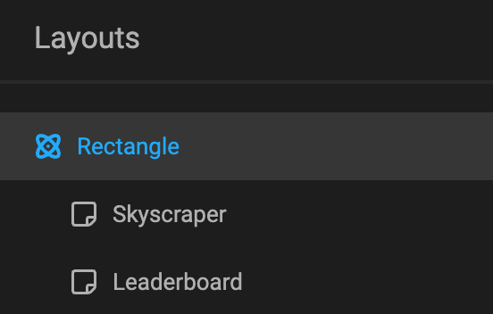
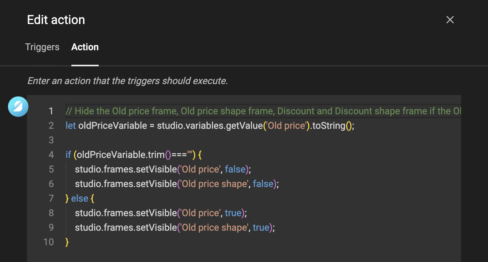

# How to create an Action

!!! example "Experimental"
	Actions is released as Experimental
	This means that you can use it to test out future functionality, but the actual implementation is not final yet.

## Add Action

Open the [Automation panel](GraFx-Studio/overview/properties/#automation-properties).

By default, a new document will not have Actions.

You can add an Action with the "+" sign. Or edit existing ones with the pencil icon.

## Define Triggers for the Action

In the Action, first select a Trigger. An event that will kick-off the Action.

If applicable, select the scope for the Trigger.

The scope is the object (frame, variable, ...) that will be watched. You can also choose to watch "Any variable" or "Any frame".

What Triggers are available?

### Select Layout changed

The chosen layout is changed.

### Frame moved

When the location (or size) of a frame changes. 

This trigger is detected, when the X, Y, width, height or rotation changes.

### Page size changed

This trigger is detected only in the Studio UI. In Studio UI, and end-user can set the page size. This page size will dictate the choice of layout, according the the closest fit in the layouts.

This trigger will detect the page size change, and start execution actions.

### Document loaded

Triggered when the document is loaded on the canvas.

### Variable value changed

Triggered when a value of a variable is changed.

Imagine a change of name, or price. This change can be triggered by an end-user, or through the population of the variable data through datasources.

## Write JavaScript to be executed

Click on the tab "Action" to start writing your script.

Example below reads the value of the variable "reduction", and translates that is to a string of characters.

If the value is "promo", then the position of the frame (shape: "prompPop") behind the price will be offset outside the page, or returned to the actual position.

