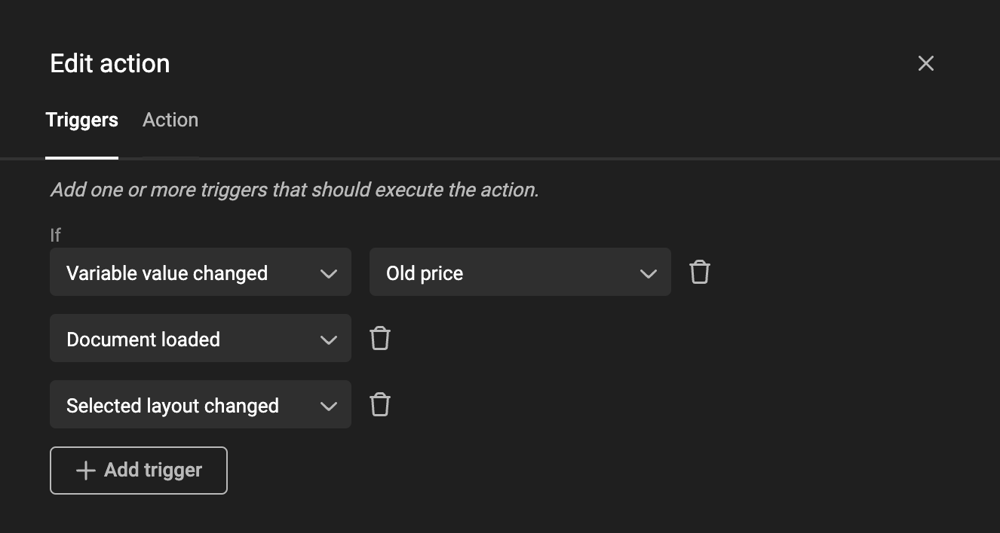

# How to create an Action

## Add Action

Open the [Automation panel](/GraFx-Studio/overview/properties/#automation-properties).

By default, a new document will not have any Actions.

You can add an Action using the "+" sign or edit existing ones with the pencil icon.

## Define Triggers for the Action

In the Action, first select a Trigger - an event that will kick off the Action.

If applicable, select the scope for the Trigger.

The scope is the object (frame, variable, etc.) that will be monitored. You can also choose to monitor "Any variable" or "Any frame".

!!! info "Template Variables"
	When referring to **variables** in this context we mean **[Template variables](/GraFx-Studio/concepts/variables/#template-variables)**.

What Triggers are available?

### Select Layout changed

The chosen layout is changed.

### Frame moved

When the position (or size) of a frame changes.

This Trigger is detected when the X, Y, width, height, or rotation changes.

### Page size changed

This Trigger is detected only in the Studio UI. In the Studio UI, an end-user can set the page size. This page size will determine the closest fitting layout.

This Trigger will detect the page size change and execute the Actions.

### Document loaded

Triggered when the document is loaded on the canvas.

### Variable value changed

Triggered when the value of a variable is changed.

Imagine a change in name or price. This change can be triggered by an end-user or through the population of variable data via data sources.

## Write JavaScript to be executed

Click on the "Action" tab to start writing your script.

The example below reads the value of the variable "reduction" and translates it into a string of characters.

If the value is "promo", then the position of the frame (shape: "promoPop") behind the price will be offset outside the page or returned to the actual position.

## Order of execution

When creating a new action the default name “Action 1” is given. Every new action is automatically added to the bottom of the list.

The order of the actions in the list defines the order of execution. This means that if an event triggers multiple actions, the first one in the list will be executed first. The order can be changed by drag and drop.

It is possible that an action causes another event to fire, which can trigger another action. If this happens, all actions triggered by the first event will be executed first. When they are all processed, the actions triggered by the new event will be executed. As an example, we have this list of actions:

Action A is triggered by event 1 and causes event 2 to be fired

Action B is triggered by event 2

Action C is triggered by event 1

When event 1 is fired, the order of execution will be A → C → B.
