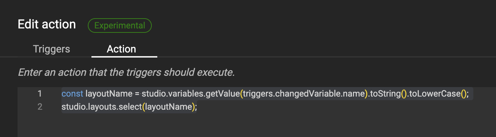

# Actions: Change to another layout

!!! example "Experimental"
    Actions are released as Experimental.
    This means that you can use them to test out future functionality, but the actual implementation is not final yet.

For basic intro into Actions, look at the [concept](/GraFx-Studio/concepts/actions/) page.

## Intro

A trigger is set to act upon a variable value change.

This variable is a List variable, containing the names of the possible output sizes.

The action will execute the change, based on the change of the List variable.


### The variable

A list variable "Ad size" is defined.

The items in the list contain the names of the output you'll need.


### The trigger

An action is defined (See [Create Actions](/GraFx-Studio/guides/actions/create/) on how to do this)


Step 1 is to define the trigger, that will initiate the action.

PS: You can have 1 or more triggers, to initiate the action.

In this case, the trigger is initiated when the "Variable value changed", specified by the "Ad size" variable.


### Action

The script (action) executed upon the trigger



``` js
	const layoutName = studio.variables.getValue(triggers.changedVariable.name).toString().toLowerCase();
	studio.layouts.select(layoutName);
```

A constant is defined "layoutName" as the lowercase value of the selected item in the list variable.

This [constant](https://www.w3schools.com/js/js_const.asp) (value of) is used to select the active layout in GraFx Studio

### The result

When the end-user changes the value of the list variable, the GraFx Studio layout will change to the chosen name.

Output will be based on the chosen layout.