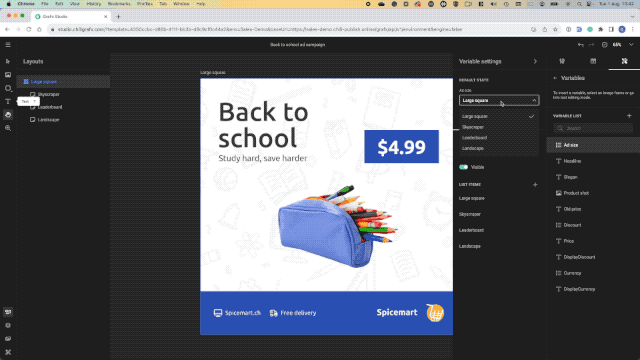
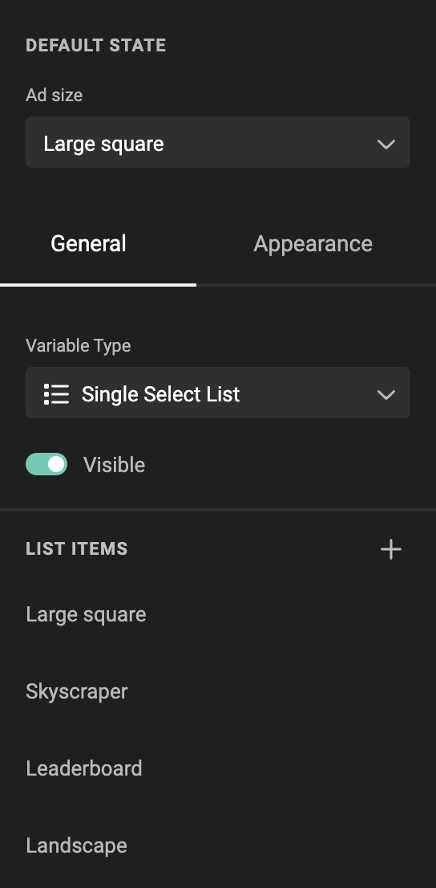
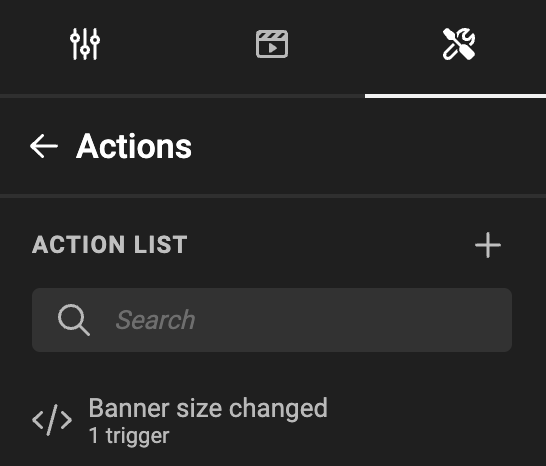
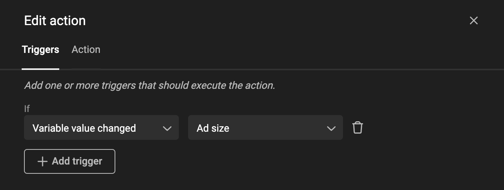

# Actions: Change to another layout

For basic intro into Actions, look at the [concept](/GraFx-Studio/concepts/actions/) page.

!!! info "Template Variables"
	When referring to **variables** on this page we refer to **[Template variables](/GraFx-Studio/concepts/variables/#template-variables)** unless stated differently.

## Intro

A trigger is set to act upon a variable value change.

This variable is a List variable, containing the names of the possible output sizes.

The action will execute the change, based on the change of the List variable.



### The variable

A list variable "Ad size" is defined.

The items in the list contain the names of the output you'll need.



### The trigger

An action is defined (See [Create Actions](/GraFx-Studio/guides/actions/create/) on how to do this)



Step 1 is to define the trigger, that will initiate the action.

PS: You can have 1 or more triggers, to initiate the action.

In this case, the trigger is initiated when the "Variable value changed", specified by the "Ad size" variable.



### Action

The script (action) executed upon the trigger

``` js
let layoutName = studio.variables.getStringValue(triggers.variableValueChanged);
studio.layouts.select(layoutName);
```

A Javascript variable **layoutName** is defined as the [string](https://www.w3schools.com/js/js_strings.asp) value of the Template variable that triggered the action. In this case this is the name of the selected ad size.

This JavaScript variable is then used to select the layout with the same name (the items in the "Ad size" list Template variable need to have the same name as the layouts).

### The result

When the end-user changes the value of the list variable (Template), the GraFx Studio layout will change to the chosen name.

Output will be based on the chosen layout.
