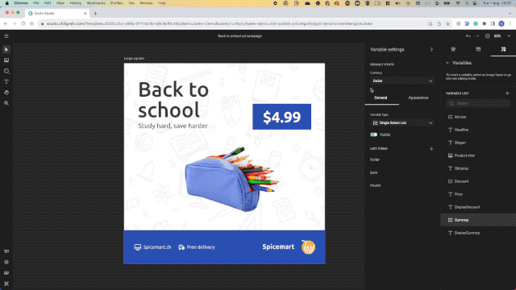
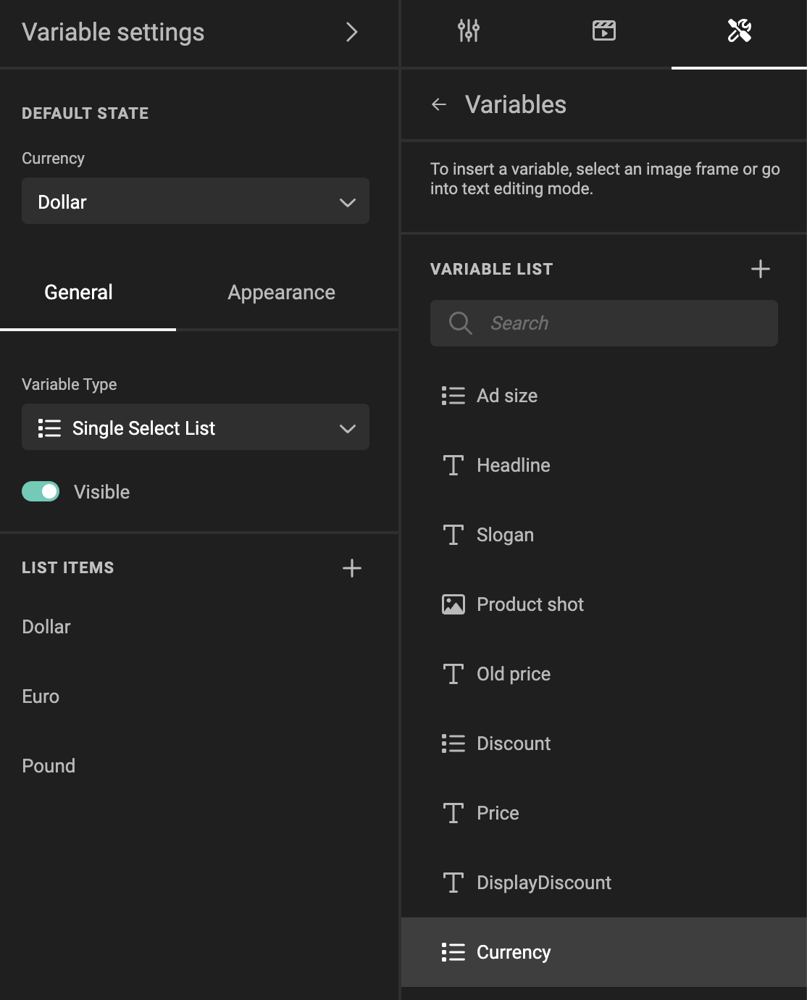
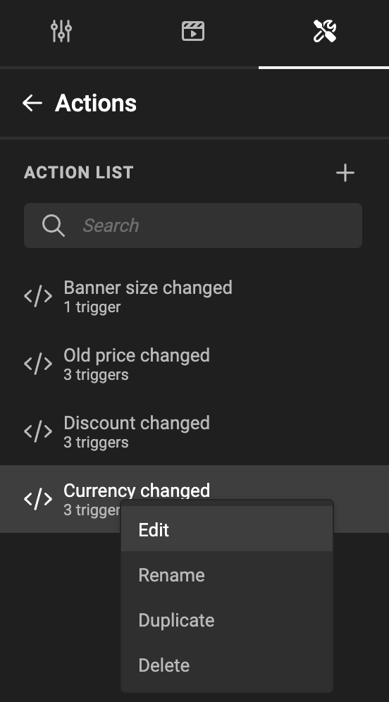
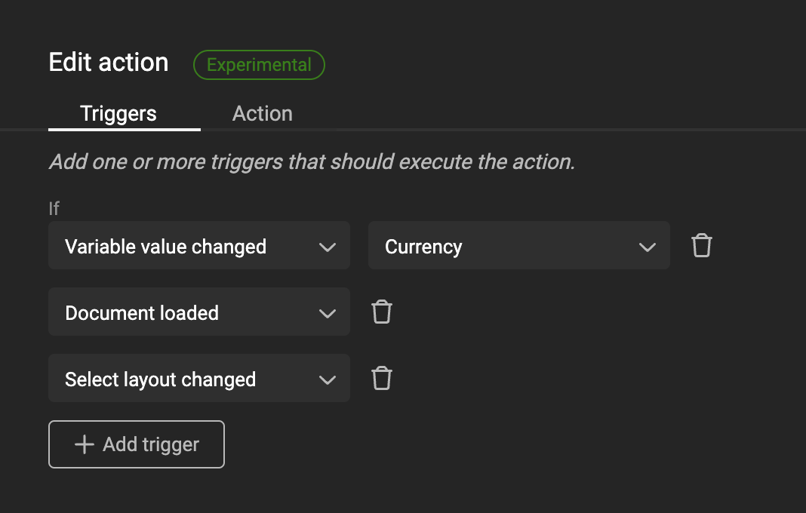

# Actions: Currency change

For basic intro into Actions, look at the [concept](/GraFx-Studio/concepts/actions/) page.

!!! info "Template Variables"
	When referring to **variables** on this page we refer to **[Template variables](/GraFx-Studio/concepts/variables/#template-variables)** unless stated differently.

## Intro

A trigger is set to act upon the currency.

The currency symbol will change with the selection.



### The variable

A list variable "Currency" is defined.

The items in the list contain the currency options.



### The trigger

An action is defined (See [Create Actions](/GraFx-Studio/guides/actions/create/) on how to do this)



First step is to define the trigger, that will initiate the action.

The trigger is initiated when

- the "Variable value changed", specified by the "Currency" variable, 
- or when the document is loaded (to be sure we check when opening the document)
- or when a layout is changed



### Action

The script (action) executed upon the trigger

``` js
let currency = studio.variables.getStringValue("Currency");

if (currency === "Dollar") studio.variables.setValue("displayCurrency", "$")
else if (currency === "Euro") studio.variables.setValue("displayCurrency", "€")
else studio.variables.setValue("displayCurrency", "£");
```

A JavaScript variable **currency** is defined to hold the [string](https://www.w3schools.com/js/js_strings.asp) value of the "Currency" variable in the template.

A series of if-then-else statements run through the possible options, and set the value of the Template variable **displayCurrency** to the relevant currency symbol.

### The result

When the end-user changes the value of the variable Currency, the currency symbol used in the Smart Template is updated.
