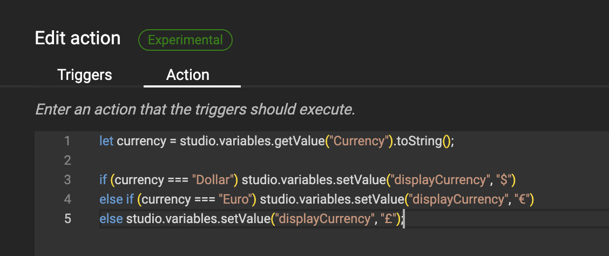

# Actions: Currency change

!!! example "Experimental"
    Actions are released as Experimental.
    This means that you can use them to test out future functionality, but the actual implementation is not final yet.

For basic intro into Actions, look at the [concept](/GraFx-Studio/concepts/actions/) page.

## Intro

A trigger is set to act upon the currency.

The currency symbol will change with the selection.


### The variable

A text List variable "Currency" is defined.


### The trigger

An action is defined (See [Create Actions](/GraFx-Studio/guides/actions/create/) on how to do this)


First step is to define the trigger, that will initiate the action.

The trigger is initiated when

- the "Variable value changed", specified by the "Currency" variable, 
- or when the document is loaded (to be sure we check when opening the document)
- or when a layout is changed


### Action

The script (action) executed upon the trigger



``` js
	let currency = studio.variables.getValue("Currency").toString();

	if (currency === "Dollar") studio.variables.setValue("displayCurrency", "$")
	else if (currency === "Euro") studio.variables.setValue("displayCurrency", "€")
	else studio.variables.setValue("displayCurrency", "£");
```

The part starting with double "//" are comments, to give info to your future self, or colleague Template Designers working on the script.

A JavaScript list variable **currency** is defined to hold the value of the Variable in the document, and is converted to a string (series of characters).

A series of if-then-else statements runs through the possible options, and sets the value of the Variable **displayCurrency** to the relevant currency symbol.

### The result

When the end-user changes the value of the variable Currency, the currency symbol used in the Smart Tempalte is updated.