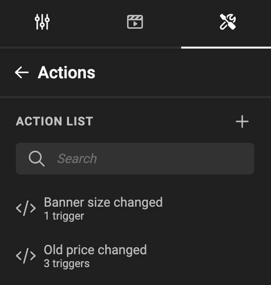

# Actions: How to hide a frame

For basic intro into Actions, look at the [concept](/GraFx-Studio/concepts/actions/) page.

!!! info "Template Variables"
	When referring to **variables** on this page we refer to **[Template variables](/GraFx-Studio/concepts/variables/#template-variables)** unless stated differently.


## Intro

A trigger is set to act upon the presence of a value in a variable.

This variable is a text variable, containing the old price for a discounted product.

The action will execute the change, based on the presence of a value in that variable.


### The variable

A text variable "Old price" is defined.


### The trigger

An action is defined (See [Create Actions](/GraFx-Studio/guides/actions/create/) on how to do this)



Step 1 is to define the trigger, that will initiate the action.

The trigger is initiated when

- the "Variable value changed", specified by the "Old price" variable, 
- or when the document is loaded (to be sure we check when opening the document)
- or when a layout is changed


### Action

The script (action) executed upon the trigger

``` js
// Hide the Old price and Old price shape frames if the Old price variable doesn't contain a value, show them if it has a value
let oldPriceVariable = studio.variables.getStringValue("Old price");

if (oldPriceVariable.trim() === "") {
    studio.frames.setVisible("Old price", false);
    studio.frames.setVisible("Old price shape", false);
} else {
    studio.frames.setVisible("Old price", true);
    studio.frames.setVisible("Old price shape", true);
}
```

The part starting with double "//" are comments, to give info to your future self, or colleague Template Designers working on the script.

A JavaScript variable **oldPriceVariable** is defined to hold the [string](https://www.w3schools.com/js/js_strings.asp) value of the "Old price" variable in the template.

Then an if-statement checks if the JavaScript variable **oldPriceVariable** contains a value.

If this is NOT the case, we use the "setVisible" method to set the visibility of the frame to "false", basically hiding the frame from sight and output.

If there is content, we set the visibility of the frame to "true".

### The result

When the end-user changes the value of the variable, the frame will be hidden or shown, depending on the value's presence.
