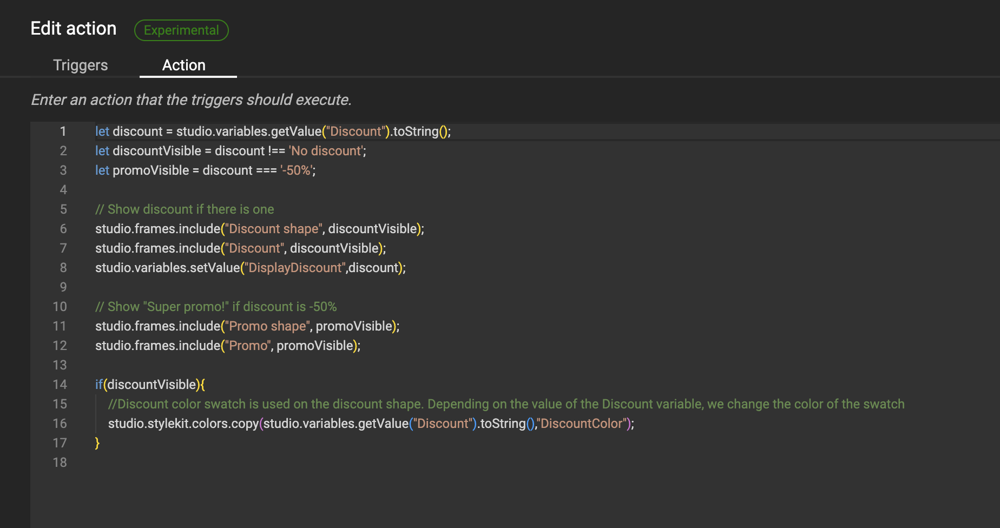

# Actions: Selective Frame visibility

!!! example "Experimental"
    Actions are released as Experimental.
    This means that you can use them to test out future functionality, but the actual implementation is not final yet.

For basic intro into Actions, look at the [concept](/GraFx-Studio/concepts/actions/) page.

## Intro

A trigger is set to act upon the value for a discount.

If no discount is entered, all frames are hidden. If a discount is selected, it will be shown. And depending of the level of discount, the frame will have a different color.

If a discount of -50% is chosen, a "Super promo!" shape and text will be shown.


### The variable

A list variable "Discount" is defined.

The items in the list contain the discount options.


### The trigger

An action is defined (See [Create Actions](/GraFx-Studio/guides/actions/create/) on how to do this)

First step is to define the trigger, that will initiate the action.

The trigger is initiated when

- the "Variable value changed", specified by the "Discount" variable, 
- or when the document is loaded (to be sure we check when opening the document)
- or when a layout is changed


### Action

The script (action) executed upon the trigger



``` js
	let discount = studio.variables.getValue("Discount").toString();
	let discountVisible = discount !== 'No discount';
	let promoVisible = discount === '-50%';

	// Show discount if there is one
	studio.frames.include("Discount shape", discountVisible);
	studio.frames.include("Discount", discountVisible);
	studio.variables.setValue("DisplayDiscount",discount);

	// Show "Super promo!" if discount is -50%
	studio.frames.include("Promo shape", promoVisible);
	studio.frames.include("Promo", promoVisible);

	if(discountVisible){
		//Discount color swatch is used on the discount shape. Depending on the value of the Discount variable, we change the color of the swatch
		studio.stylekit.colors.copy(studio.variables.getValue("Discount").toString(),"DiscountColor");
	}
```

The part starting with double "//" are comments, to give info to your future self, or colleague Template Designers working on the script.

A JavaScript variable **discount** is defined to hold the value of the Variable in the document, and is converted to a string (series of characters).

A JavaScript variable **discountVisible** is defined to hold the value of the discount, and when empty "No discount".

For the variable **promoVisible**:

The code uses a conditional check to determine if the value of the variable discount is exactly equal to '-50%'. If it is, the variable promoVisible will be set to true; otherwise, it will be set to false. In simpler terms, it's checking if there is a discount of exactly 50% and storing the result in promoVisible.

The last part of the code sets the visibility (include) of frames to true or false. The true or false statements have been defined in the top part.

### The result

When the end-user changes the value of the variable, some frames will be hidden or shown, depending on the value's presence.
