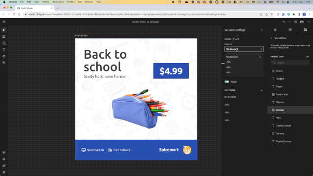
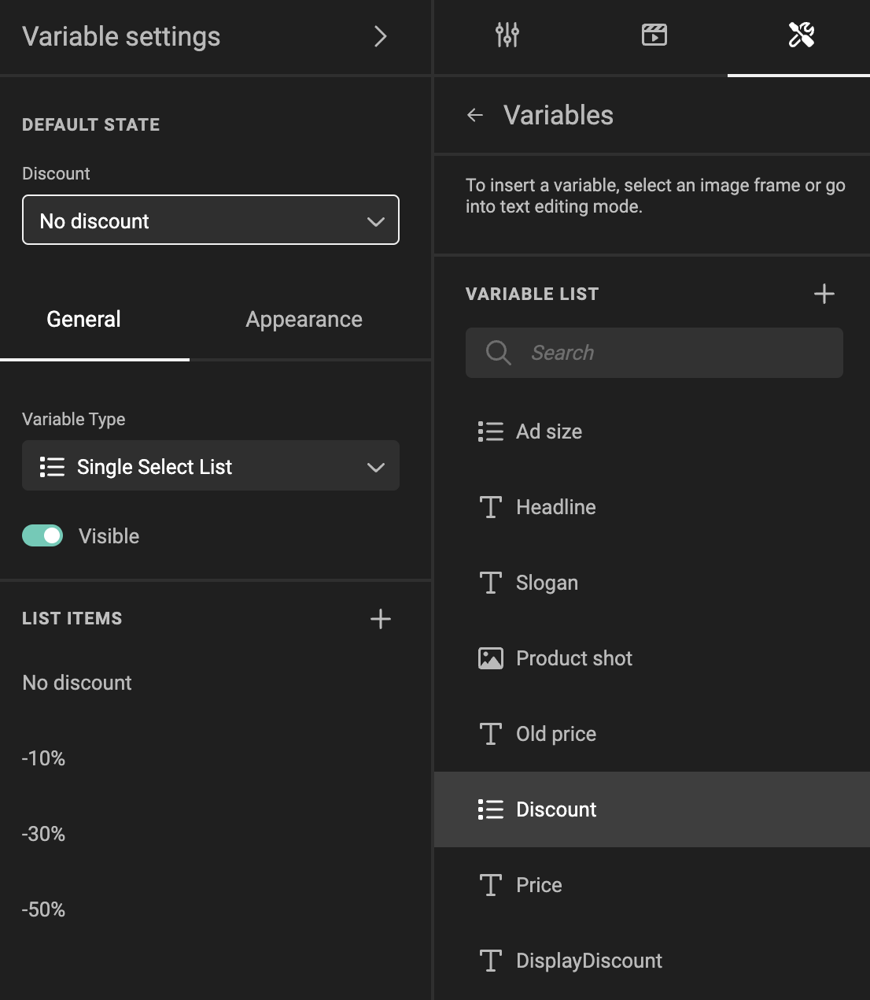
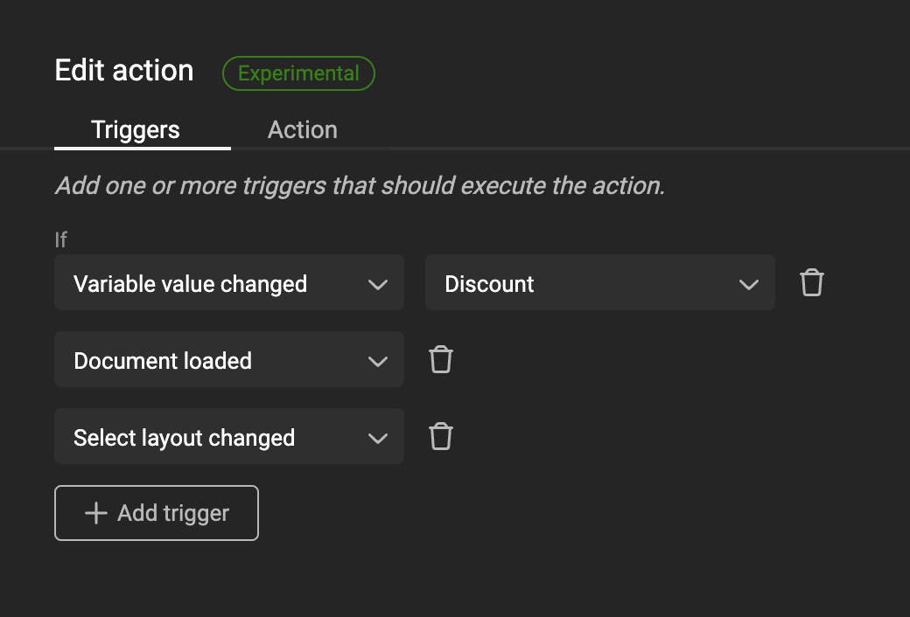

# Actions: Selective Frame visibility

For basic intro into Actions, look at the [concept](/GraFx-Studio/concepts/actions/) page.

!!! info "Template Variables"
	When referring to **variables** on this page we refer to **[Template variables](/GraFx-Studio/concepts/variables/#template-variables)** unless stated differently.

## Intro

A trigger is set to act upon the value for a discount.

If no discount is entered, all frames are hidden. If a discount is selected, it will be shown. And depending of the level of discount, the frame will have a different color.

If a discount of -50% is chosen, a "Super promo!" shape and text will be shown.



### The variable

A list variable "Discount" is defined.

The items in the list contain the discount options.



### The trigger

An action is defined (See [Create Actions](/GraFx-Studio/guides/actions/create/) on how to do this)

First step is to define the trigger, that will initiate the action.

The trigger is initiated when

- the "Variable value changed", specified by the "Discount" variable, 
- or when the document is loaded (to be sure we check when opening the document)
- or when a layout is changed



### Action

The script (action) executed upon the trigger

``` js
let discount = studio.variables.getStringValue("Discount");
let discountVisible = discount !== "No discount";
let promoVisible = discount === "-50%";

// Show discount if there is one
studio.frames.setVisible("Discount shape", discountVisible);
studio.frames.setVisible("Discount", discountVisible);
studio.variables.setValue("DisplayDiscount", discount);

// Show "Super promo!" if discount is -50%
studio.frames.setVisible("Promo shape", promoVisible);
studio.frames.setVisible("Promo", promoVisible);

if(discountVisible){
    //Discount color swatch is used on the discount shape. Depending on the value of the Discount variable, we change the color of the swatch
    studio.stylekit.colors.copy(discount, "DiscountColor");
}
```

The part starting with double "//" are comments, to give info to your future self, or colleague Template Designers working on the script.

A JavaScript variable **discount** is defined to hold the [string](https://www.w3schools.com/js/js_strings.asp) value of the "Discount" variable in the template.

The JavaScript variable **discountVisible** is either *true* or *false* and is used later to set the visibility of the frames. It uses a conditional check: it is *true* (= show the frame) if the value of **discount** is different from "No discount", and *false* (= hide the frame) if the value is "No discount".

The JavaScript variable **promoVisible** is also used to set the visibility of the frames and also uses a conditional check: it is *true* if **discount** has a value equal to "-50%", and *false* for any other value.

The last part of the code sets the visibility of the frames to *true* or *false*. The true or false statements have been defined in the top part.

### The result

When the end-user changes the value of the variable, some frames will be hidden or shown, depending on the value's presence.
