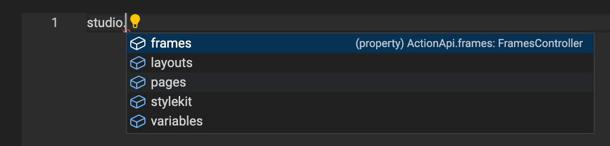
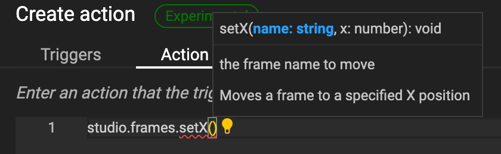
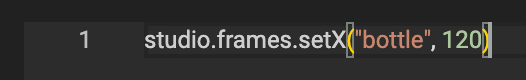
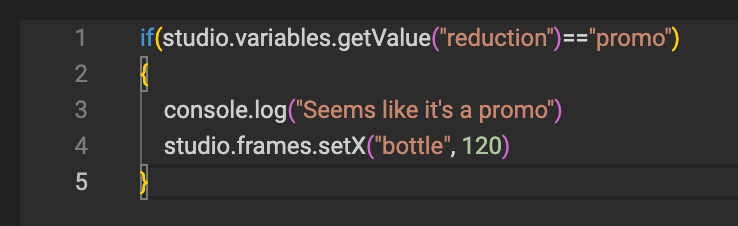
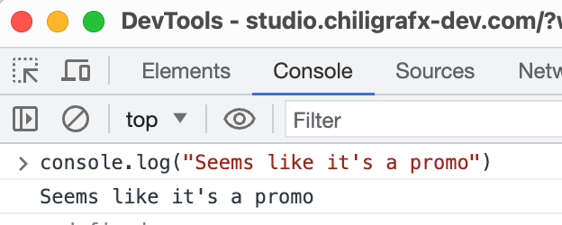

# Actions JavaScript

Initially, Actions may seem daunting. Therefore, take a look at [this example](/GraFx-Studio/guides/actions/create/) first to get started.

Once you start feeling comfortable, here is some more detailed information.

## Base for the JavaScript editor

GraFx Actions are a full implementation of the [ES2020 Standard](https://262.ecma-international.org/11.0/).

Additionally, we have created an implementation to expose the Studio object (with the document, frames, etc.) and added functions specific to GraFx Studio.

## Base object & Autocompletion

In addition to all the basic JavaScript functionality, CHILI GraFx has added the "studio" object.

### Studio

Start your action with the **studio** object.

Add a **dot** "." and the JavaScript editor (Monaco) will suggest objects that fit within the scope of what you are doing.

In this case, it will suggest using one of the available objects in the document.

By hitting the "tab" key, the editor will autocomplete with the selected suggestion.

Add another **dot** and the next suggestion will appear.

You will see the properties you can set or the functions you can call for this object.

Functions will need parentheses () and once you start with the opening parenthesis (, you will see the next suggestion.

The popup will show what the function expects. In this case, a name (of the frame) and a number for the X position of that frame.

Provide the necessary information.

Continue to add logic around your statement.

!!! Tip
    If you're not comfortable with JavaScript, the [W3Schools](https://www.w3schools.com/js/default.asp) website is a great place to start.
    
    You'll find information on using [Variables](https://www.w3schools.com/js/js_variables.asp), how to work with [Operators](https://www.w3schools.com/js/js_operators.asp), [If-then-else statements](https://www.w3schools.com/js/js_if_else.asp), [Loops](https://www.w3schools.com/js/js_loop_while.asp), and many more topics to get you started.

You can add "console.log" statements to show debug information in the browser console.

## Security

GraFx Actions run inside a contained environment.
They have their own runtime and can run on the client or server-side.

Indefinite loops and concepts that could prevent the system from responding will timeout after 10 seconds.

Circular references, where one trigger triggers another in a back-and-forth manner, will be detected and stopped.

## Functions

GraFx Studio Actions are part of the GraFx Studio [Open-source SDK](https://github.com/chili-publish/studio-sdk).

The Actions can be found [here](https://github.com/chili-publish/studio-sdk/blob/main/types/Actions.d.ts) and will be documented later.