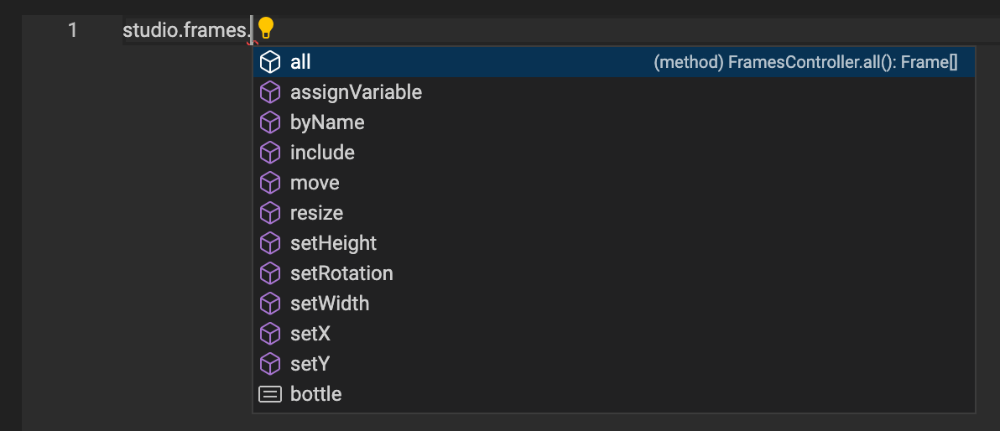
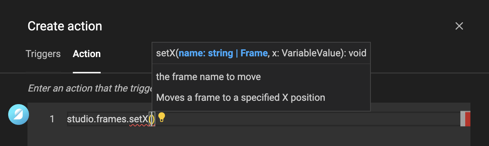

# Actions Javascript

At first, Action can could daunting. Therefore, take a look at [this example](/GraFx-Studio/guides/actions/create/) first to get you started.

If you start to get comfortable, here is some more detailed information.

## Base for the JavaScript editor

GraFx Actions are a full implementation of the [ES2020 Standard](https://262.ecma-international.org/11.0/)

On top, we created an implementation to expose the Studio object (with the document, frames, ...) and added functions specific for GraFx Studio.

## Base object & Autocompletion

Next to all basic JavaScript functionality, CHILI GraFx added the "studio" object.

### Studio

Start you action with the **studio** object.

add a **dot** "." and the JavaScript editor (Monaco) will suggest objects that fit in the scope of what you are doing.

In the case, it will suggest to use one of the available objects in the document.

By hitting the "tab" key, the editor will autocomplete with the selected suggestion.

Add another **dot** and the next suggestion will arrive.

You will see the properties you can set, or functions you can call for this object.

Functions will need parentheses () and once you start with the opening parenthesis ( you will see the next suggestion.

The popup will show what the function expects. In this case a name (of the frame) and a number for the X position of that frame.

Provide the necessary information.

Continue to add logic around your statement.

!!! Tip
	If you're not comfortable with Javascript, the [W3Schools](https://www.w3schools.com/js/default.asp) website is a great start.
	
	You'll find information on using [Variables](https://www.w3schools.com/js/js_variables.asp), how to work with [Operators](https://www.w3schools.com/js/js_operators.asp), [If, then, else statements](https://www.w3schools.com/js/js_if_else.asp), [Loops](https://www.w3schools.com/js/js_loop_while.asp) and many more to get you started.

You can add "console.log" statements, to show debug information in the browser console.

## Security

The GraFx Actions are run inside a contained environment.
They have their own runtime, and can run client- and server-side.

Indefinite loops and concepts that could stop the system from reacting will timeout after 10 seconds.

Circular references, where e.g. one trigger triggers another, and back-and-forth, will be detected and stop running.

## Functions

GraFx Studio Actions are part of the GraFx Studio [Open-source SDK](https://github.com/chili-publish/studio-sdk).

The Actions can be found [here](https://github.com/chili-publish/studio-sdk/blob/main/types/Actions.d.ts), and will be documented later.

