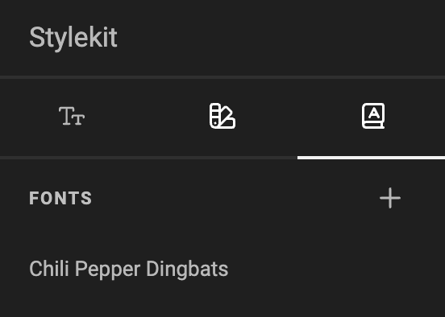
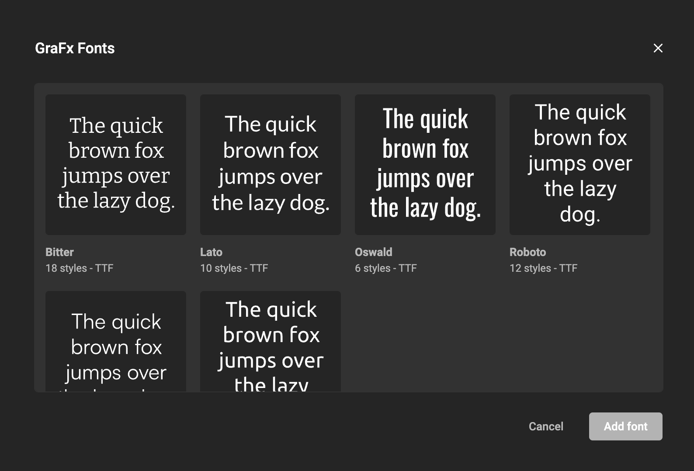
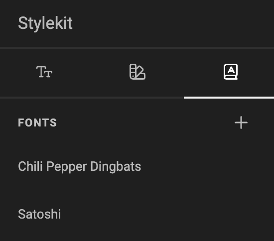
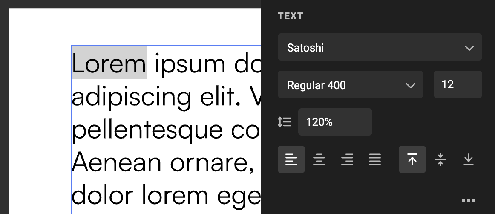

# Add Fonts to your document

<iframe width="690" height="388" src="https://www.youtube.com/embed/FM-mqUZEtW0?si=4_6tsIcL3pJqRrBW&controls=1&mute=1&showinfo=0&rel=0&autoplay=1&loop=1" title="YouTube video player" frameborder="0" allow="accelerometer; autoplay; clipboard-write; encrypted-media; gyroscope; picture-in-picture; web-share" referrerpolicy="strict-origin-when-cross-origin" allowfullscreen></iframe>

[Go to Youtube to see all feature videos](https://www.youtube.com/playlist?list=PLLHtQ1R6R-B_m7XAVySM9OjbbUscsgBOH)

## How to

Open the Stylekit panel.

Select the fonts icon to check the already available fonts in your document.

Click on the "+" sign to add a new font.

The available fonts are shown ([GraFx Fonts](/GraFx-Fonts/) application).

Select the font family you wish to add to your document.

Remark: The full family will be added to your document.

Your font family is now available to use in the document.

