# Anchoring

Anchoring can be explored by creating a blank document with at least two frames and following along with the guide below.

Select a frame to access anchoring properties in the properties panel.

## Default

When a new frame (text, image, etc.) is created, anchoring is set to Relative by default.

The default Target is set to Page.

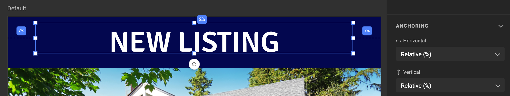

## Properties Menu

Select a frame, and you'll see the **Anchoring** section in the properties panel. Additional options may appear based on your selections.

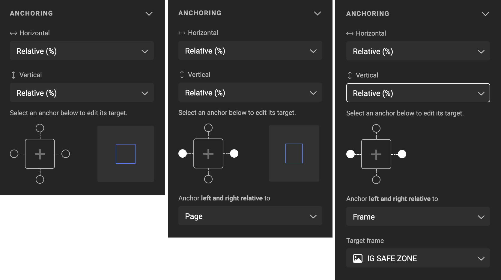

## Types of Anchors

Select a frame, then adjust the Horizontal and/or Vertical anchor.

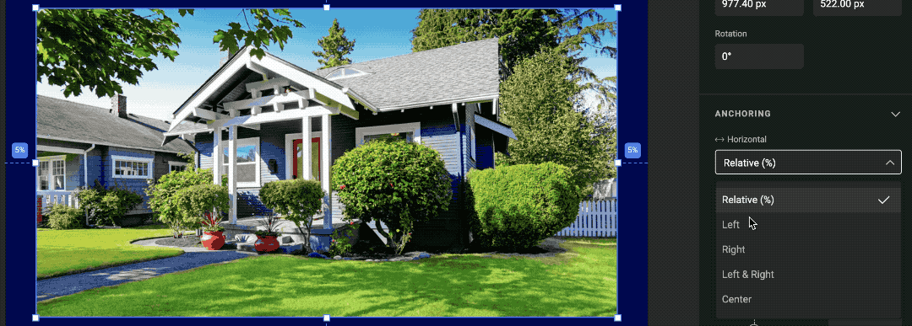

### Relative (%)

The image frame below is anchored to the page by default, with Left and Right set to 5%, Top at 14%, and Bottom at 38%.

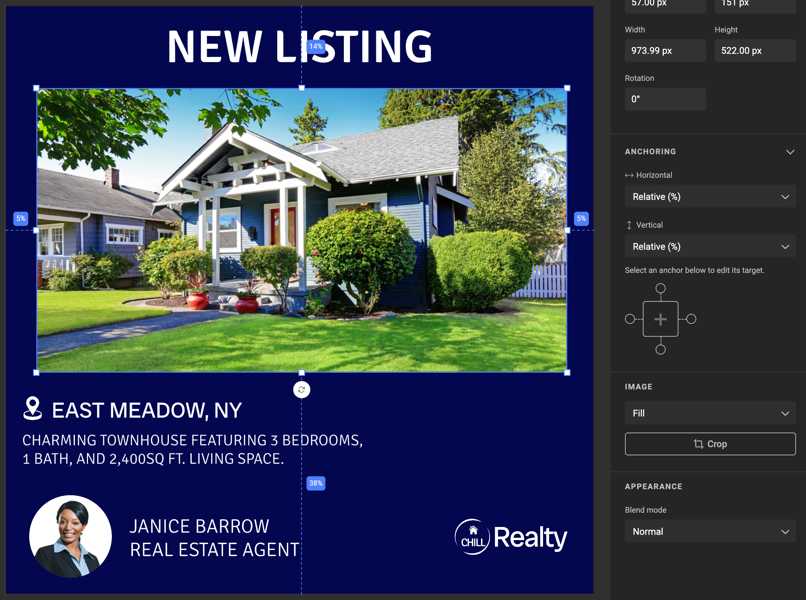

If the canvas size changes (e.g., from 1080 px to 1200 px), the frame's relative position remains the same at 5% from the left and right. However, the actual pixel distance will change:

- 5% of 1080 = 54 px
- 5% of 1200 = 60 px

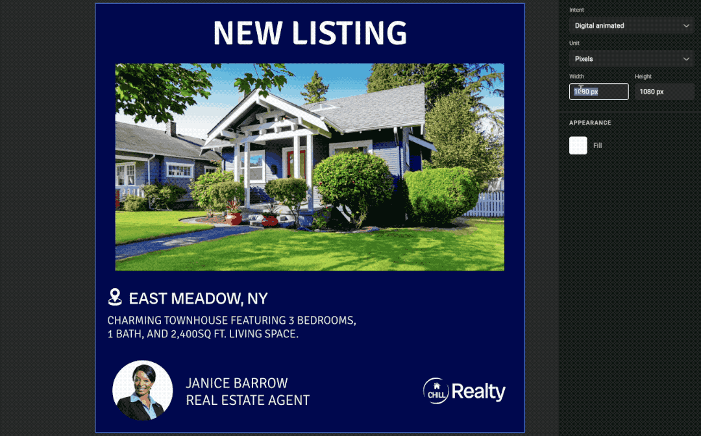

### Left, Right, Top, Bottom

Selecting these anchors sets the frame to a fixed offset from the chosen side(s).

#### Left

A fixed offset (in pixels, mm, inches, etc.) is set from the left target. If the canvas width changes, the left offset remains constant.

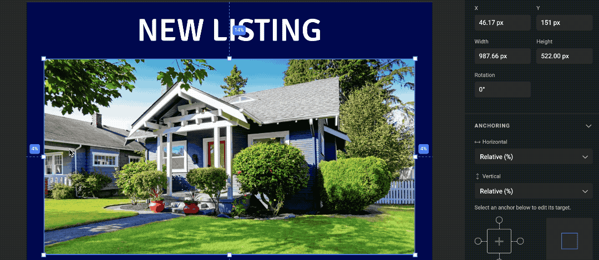

#### Right

A fixed offset is set from the right target. If the canvas width changes, the right offset remains constant.

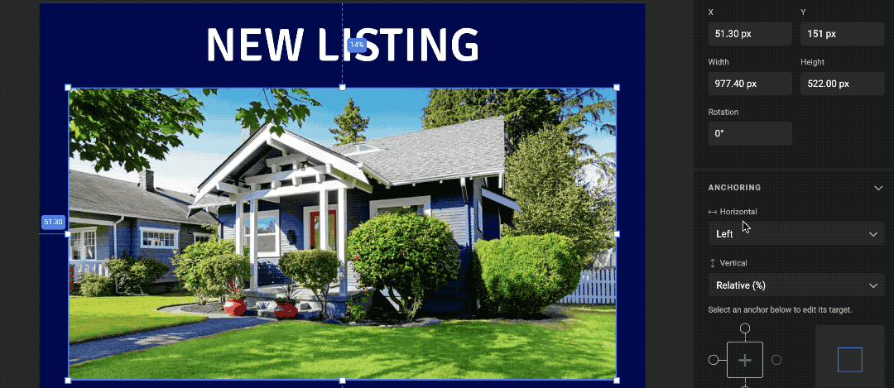

#### Left & Right

A fixed offset is maintained on both the left and right sides. If the canvas width changes, both offsets remain unchanged.

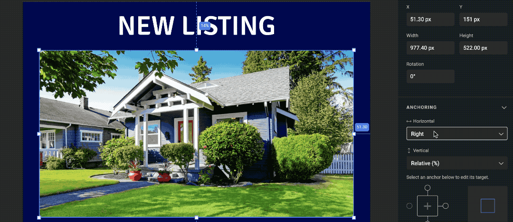

#### Top

**Note:** Top, Bottom and Top & Bottom are only available for Vertical anchoring, but work similar.

A fixed offset (in pixels, mm, inches, etc.) is set from the top target. If the canvas height changes, the top offset remains constant.

#### Bottom

A fixed offset is set from the bottom target. If the canvas height changes, the bottom offset remains constant.

#### Top & Bottom

A fixed offset is maintained on both the top and bottom sides. If the canvas height changes, both offsets remain unchanged.

### Center

The selected frame stays centered **relative** to the canvas, and its size does not change if the canvas dimensions change.

## Anchor Targets

By default the anchor target is the page, meaning any chosen anchor option (relative, left, etc.) applies to the page.

You can modify the target by selecting a new option below the Horizontal and Vertical anchor settings.

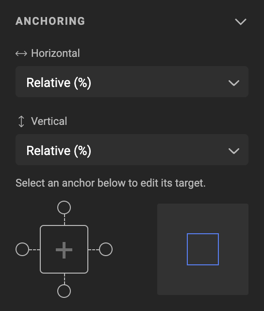

The box with four circles around it represents your frame. The animation next to it shows the effect of your anchor settings. In the animation, the blue box represents your frame, and the gray area represents your canvas.

Click the circles (left, top, right, bottom) or the center cross to adjust the anchor settings. Depending on the settings, some anchor targets may be restricted (e.g., if the left side is anchored, the right anchor cannot be set).

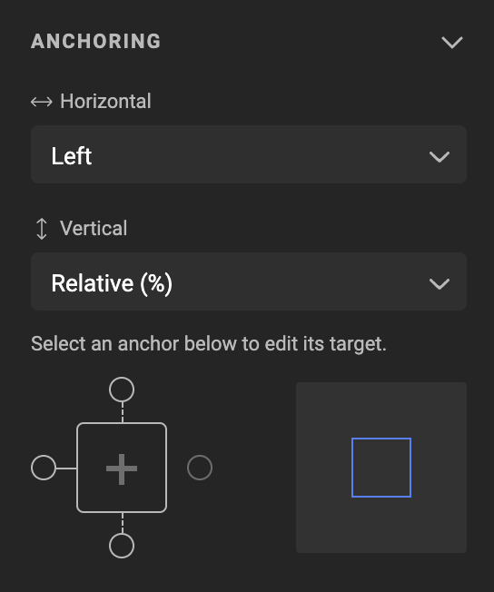

## Anchoring effect on a frame

See the effect of changing the canvas or page size, when a frame is anchored with these settings.

Horizontal setting is mentioned first.

The blue box represents your frame, and the gray area your canvas (or page).

| Anchor settings effect      | | |
| -- | -- | -- |
| Center-Bottom              | Center-Center             | Center-Relative             |
|<dotlottie-player src="animations/Center-Bottom.json" background="transparent" speed="1" style="width: 200px; height: 200px" direction="1" playMode="normal" loop autoplay></dotlottie-player>|<dotlottie-player src="animations/Center-Center.json" background="transparent" speed="1" style="width: 200px; height: 200px" direction="1" playMode="normal" loop autoplay></dotlottie-player>|<dotlottie-player src="animations/Center-Relative.json" background="transparent" speed="1" style="width: 200px; height: 200px" direction="1" playMode="normal" loop autoplay></dotlottie-player>|
| Center-Top              | Center-Top&Bottom             | Left-Bottom             |
|<dotlottie-player src="animations/Center-Top.json" background="transparent" speed="1" style="width: 200px; height: 200px" direction="1" playMode="normal" loop autoplay></dotlottie-player>|<dotlottie-player src="animations/Center-Top&Bottom.json" background="transparent" speed="1" style="width: 200px; height: 200px" direction="1" playMode="normal" loop autoplay></dotlottie-player>|<dotlottie-player src="animations/Left-Bottom.json" background="transparent" speed="1" style="width: 200px; height: 200px" direction="1" playMode="normal" loop autoplay></dotlottie-player>|
| Left-Center       | Left-Relative     | Left-Top      |
|<dotlottie-player src="animations/Left-Center.json" background="transparent" speed="1" style="width: 200px; height: 200px" direction="1" playMode="normal" loop autoplay></dotlottie-player> | <dotlottie-player src="animations/Left-Relative.json" background="transparent" speed="1" style="width: 200px; height: 200px" direction="1" playMode="normal" loop autoplay></dotlottie-player> | <dotlottie-player src="animations/Left-Top.json" background="transparent" speed="1" style="width: 200px; height: 200px" direction="1" playMode="normal" loop autoplay></dotlottie-player>|
| Left-Top & Bottom       | Left & Right - Bottom | Left & Right - Center      |
| <dotlottie-player src="animations/Left-Top&Bottom.json" background="transparent" speed="1" style="width: 200px; height: 200px" direction="1" playMode="normal" loop autoplay></dotlottie-player> | <dotlottie-player src="animations/Left&Right-Bottom.json" background="transparent" speed="1" style="width: 200px; height: 200px" direction="1" playMode="normal" loop autoplay></dotlottie-player> | <dotlottie-player src="animations/Left&Right-Center.json" background="transparent" speed="1" style="width: 200px; height: 200px" direction="1" playMode="normal" loop autoplay></dotlottie-player> |
| Left-Right & Relative       | Left & Right - Top | Left & Right - Top & Bottom      |
| <dotlottie-player src="animations/Left&Right-Relative.json" background="transparent" speed="1" style="width: 200px; height: 200px" direction="1" playMode="normal" loop autoplay></dotlottie-player> | <dotlottie-player src="animations/Left&Right-Top.json" background="transparent" speed="1" style="width: 200px; height: 200px" direction="1" playMode="normal" loop autoplay></dotlottie-player> | <dotlottie-player src="animations/Left&Right-Top&Bottom.json" background="transparent" speed="1" style="width: 200px; height: 200px" direction="1" playMode="normal" loop autoplay></dotlottie-player> |
| Relative - Bottom       | Relative - Center | Relative - Relative      |
| <dotlottie-player src="animations/Relative-Bottom.json" background="transparent" speed="1" style="width: 200px; height: 200px" direction="1" playMode="normal" loop autoplay></dotlottie-player> | <dotlottie-player src="animations/Relative-Center.json" background="transparent" speed="1" style="width: 200px; height: 200px" direction="1" playMode="normal" loop autoplay></dotlottie-player> | <dotlottie-player src="animations/Relative-Relative.json" background="transparent" speed="1" style="width: 200px; height: 200px" direction="1" playMode="normal" loop autoplay></dotlottie-player> |
| Relative - Top | Relative - Top & Bottom| Right - Bottom |
| <dotlottie-player src="animations/Relative-Top.json" background="transparent" speed="1" style="width: 200px; height: 200px" direction="1" playMode="normal" loop autoplay></dotlottie-player> | <dotlottie-player src="animations/Relative-Top&Bottom.json" background="transparent" speed="1" style="width: 200px; height: 200px" direction="1" playMode="normal" loop autoplay></dotlottie-player> | <dotlottie-player src="animations/Right-Bottom.json" background="transparent" speed="1" style="width: 200px; height: 200px" direction="1" playMode="normal" loop autoplay></dotlottie-player> |
| Right - Center | Right - Relative | Right - Top |
| <dotlottie-player src="animations/Right-Center.json" background="transparent" speed="1" style="width: 200px; height: 200px" direction="1" playMode="normal" loop autoplay></dotlottie-player> | <dotlottie-player src="animations/Right-Relative.json" background="transparent" speed="1" style="width: 200px; height: 200px" direction="1" playMode="normal" loop autoplay></dotlottie-player> | <dotlottie-player src="animations/Right-Top.json" background="transparent" speed="1" style="width: 200px; height: 200px" direction="1" playMode="normal" loop autoplay></dotlottie-player> |
| Right - Top & Bottom |  |  |
<dotlottie-player src="animations/Right-Top&Bottom.json" background="transparent" speed="1" style="width: 200px; height: 200px" direction="1" playMode="normal" loop autoplay></dotlottie-player>| | |

## Anchor to Page

By default, your frame is anchored (relative) to the page.

## Anchor to Frame

Choose an anchor target (one of the four circles around the box) and set a new anchor point.

Example:

- Selected frame: Image frame of the house
- Horizontal anchoring: Set to "Left," meaning a fixed amount of pixels will remain on the left
- Left anchor target: Specifies the frame to anchor to
- Anchor left: Set to "Frame" (not page)
- Target Frame: Set to "Realtor" (the frame’s name)
- Target Anchor Point: Left

This setup anchors the left side of the house image to the left side of the "Realtor" frame.

The interface shows the offset in pixels (e.g., 79.50).

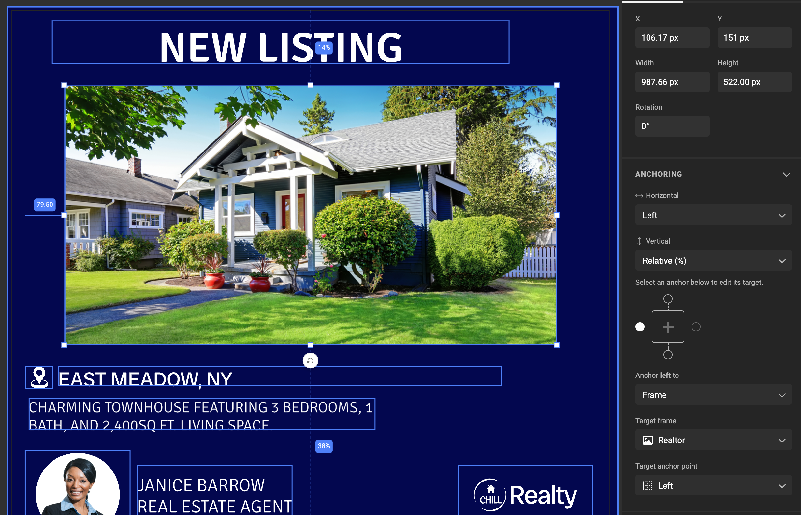

The solid anchor line on the left of the house image shows the offset (79.50) and stops at the left side of the "Realtor" frame.

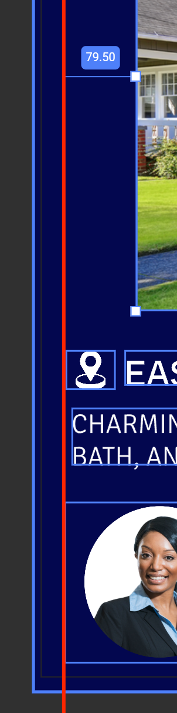