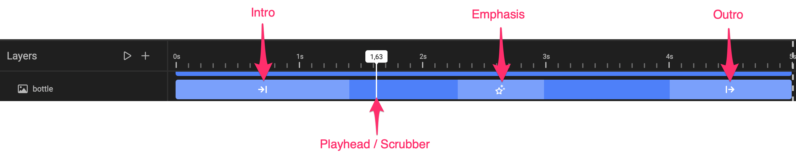
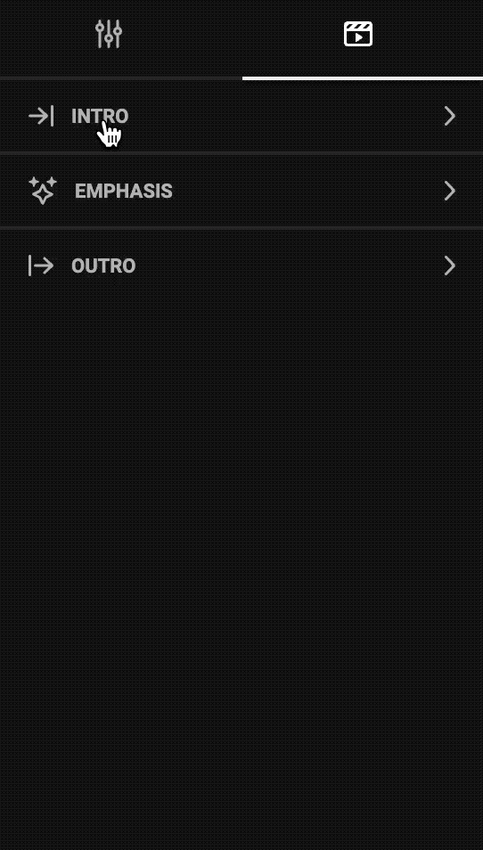
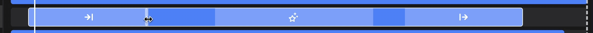

# How to animate a frame

## Introduction

Be sure to first read about the [concept of Animation](/GraFx-Studio/concepts/animation/)

We will also refer to [Animation panel](/GraFx-Studio/overview/animation/)

## Before you animate

**Show the timeline**

Click on the Layers icon in the [bottom quick tools panel](/GraFx-Studio/overview/bottom-quicktools/).

**Select the frame**

Select the frame in the page, or in the list of layers.

If the frame is not visible on the canvas, make sure to click the **eye** symbol

**Animation tab**

Open the animation tab, in the properties panel.

## Animate the intro

Expand the **intro** section of the animation panel.

Select 1 or more of the behaviours you want to apply to the intro of the animation. Then select the properties linked to the behaviour.

Adjust the length of the animation in the timeline.

!!! Tip
	If you are distracted by other frames animating through your current frame, you can hide the other frame by clicking the **eye** next to these frames.

## Test the Animation

Click the **play** button in the timeline panel to preview the animation. Adjust if needed and repeat until happy.

## Animate the emphasis

The **emphasis** allows you to hi-light the middle section of the animation.

Expand the Emphasis section in the animation panel, and choose a type of animation.

Adjust the start- and endpoint in the timeline, and test the animation.

## Animate the Outro

Expand the Outro section in the animation panel.

Set the properties for one of the behaviours for the outro action, and test the animation untill you're happy.