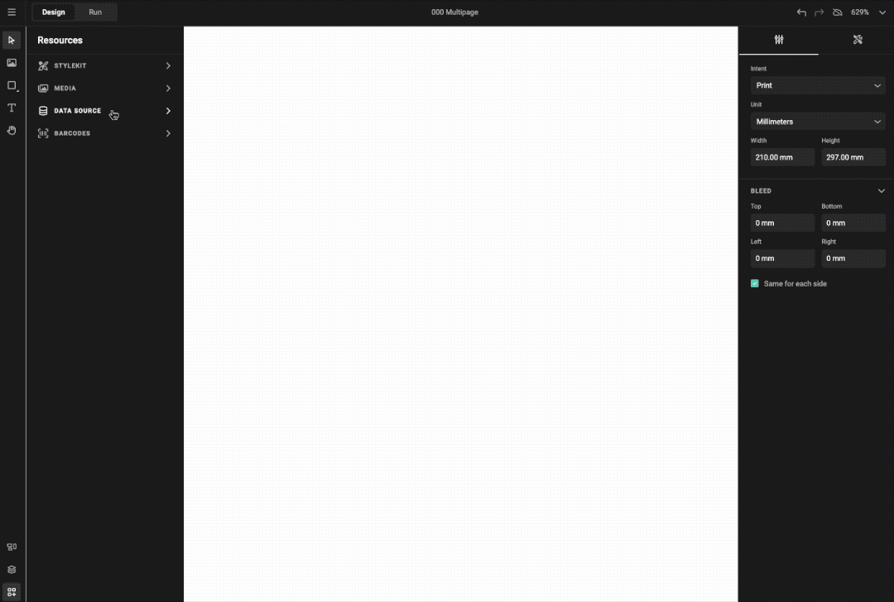
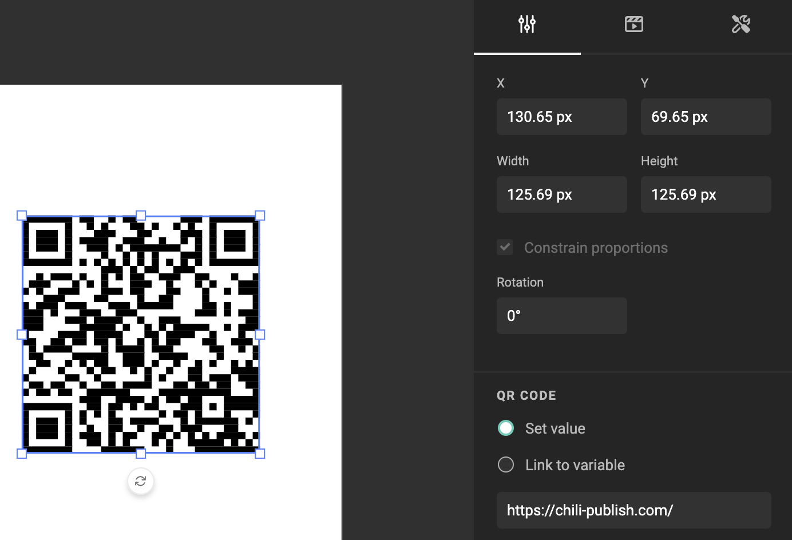
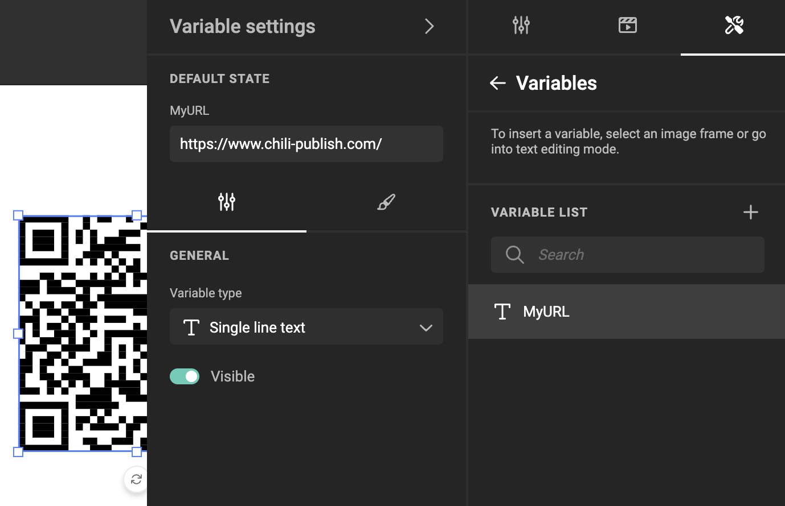
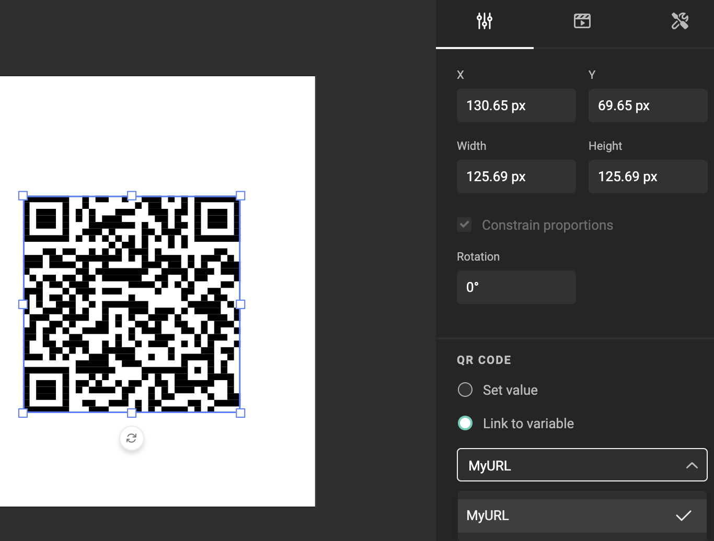

# Add a barcode

## Feature Channel

### Adding a QR Code

<iframe width="690" height="388" src="https://www.youtube.com/embed/0l2g2SuEB3U?si=cnHnRL9KeAZZ5mMU&controls=1&mute=1&showinfo=0&rel=0&autoplay=1&loop=1" title="YouTube video player" frameborder="0" allow="accelerometer; autoplay; clipboard-write; encrypted-media; gyroscope; picture-in-picture; web-share" referrerpolicy="strict-origin-when-cross-origin" allowfullscreen></iframe>

### Adding a Barcode

<iframe width="690" height="388" src="https://www.youtube.com/embed/JtN3saILmqY?si=JlZWD1jV5ivr9yNh&controls=1&mute=1&showinfo=0&rel=0&autoplay=1&loop=1" title="YouTube video player" frameborder="0" allow="accelerometer; autoplay; clipboard-write; encrypted-media; gyroscope; picture-in-picture; web-share" referrerpolicy="strict-origin-when-cross-origin" allowfullscreen></iframe>

### Adding a Variable to a Barcode

<iframe width="690" height="388" src="https://www.youtube.com/embed/00duWSHzdVo?si=H1vO5EEBvjPr7Fkh&controls=1&mute=1&showinfo=0&rel=0&autoplay=1&loop=1" title="YouTube video player" frameborder="0" allow="accelerometer; autoplay; clipboard-write; encrypted-media; gyroscope; picture-in-picture; web-share" referrerpolicy="strict-origin-when-cross-origin" allowfullscreen></iframe>

[All feature videos](https://www.youtube.com/playlist?list=PLLHtQ1R6R-B_m7XAVySM9OjbbUscsgBOH)

## How to?

Open the barcode menu, and select the type you need.

The barcode is added to the document, and will be selected.
Because it's selected, the properties for this barcode will be visible.

Set the properties for your barcodes.

Some properties will not be visible, because the definition of this barcode don't allow changes for this specific property.

Some properties can be found under the "..." (three dots) menu

{.screenshot-full}

## Values in barcodes

### Static value

By default, you can enter a static value in the barcode properties. (Set value)

{.screenshot-full}

### Variable value

To unleash the power of real Creative Automation, you can link a value to a variable.

Start by defining your variable. [See Variables](/GraFx-Studio/guides/template-variables/define/)

{.screenshot-full}

Link the variable to your Bar- or QR code.

{.screenshot-full}

## Overprint

On a layout with a **Print** intent, the properties panel offers two overprint toggles for the selected barcode frame:

- **Overprint on fill** — the bars print on top of the inks underneath instead of knocking them out.
- **Overprint for background** — the same, for the barcode background.

A barcode has no stroke, so there is no stroke toggle. Both options are off by default, and each one is only selectable when the matching color is active.

<!-- TODO screenshot (REL-69): the Overprint section in the barcode frame properties panel. Save as barcode-overprint.png next to this page and uncomment:
{.screenshot}
-->

Printing a barcode over a colored panel is the classic case for overprint: without it, a slight plate shift leaves a white halo around the bars that can hurt scannability. Overprint applies to CMYK and spot colors only, and the toggles are hidden on digital layouts. See [Overprint](/GraFx-Studio/concepts/overprint/).

## Personalize QR Code

<iframe width="690" height="388" src="https://www.youtube.com/embed/XCFzT2arycI?si=H13NfUda7_LdFPj8&controls=1&mute=1&showinfo=0&rel=0&autoplay=1&loop=1" title="YouTube video player" frameborder="0" allow="accelerometer; autoplay; clipboard-write; encrypted-media; gyroscope; picture-in-picture; web-share" referrerpolicy="strict-origin-when-cross-origin" allowfullscreen></iframe>

[All feature videos](https://www.youtube.com/playlist?list=PLLHtQ1R6R-B_m7XAVySM9OjbbUscsgBOH)
