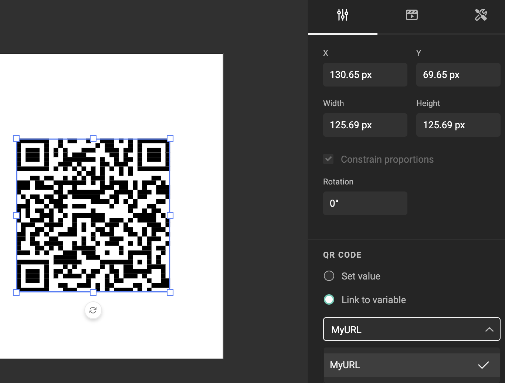

# Add a barcode

Open the barcode menu, and select the type you need.

The barcode is added to the document, and will be selected.
Because it's selected, the properties for this barcode will be visible.

Set the properties for your barcodes.

Some properties will not be visible, because the definition of this barcode don't allow changes for this specific property.

Some properties can be found under the "..." (three dots) menu

## Values in barcodes

### Static value

By default, you can enter a static value in the barcode properties. (Set value)

### Variable value

To unleash the power of real Creative Automation, you can link a value to a variable.

Start by defining your variable. [See Variables](/GraFx-Studio/guides/template-variables/define/)

Link the variable to your Bar- or QR code.

