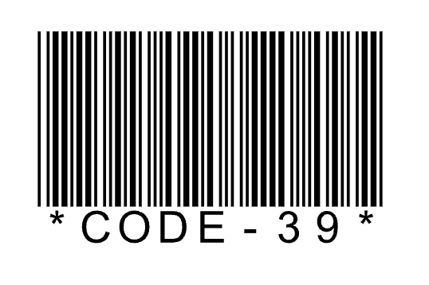
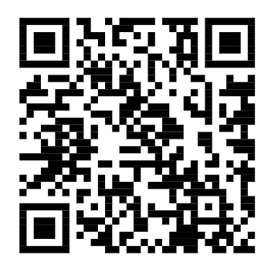
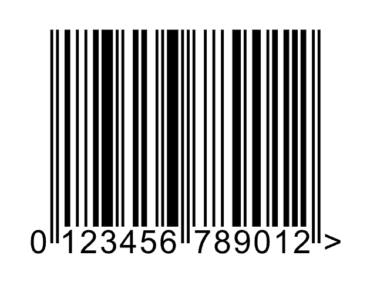
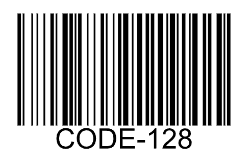
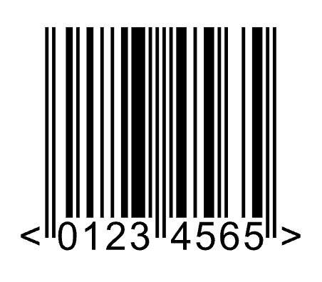
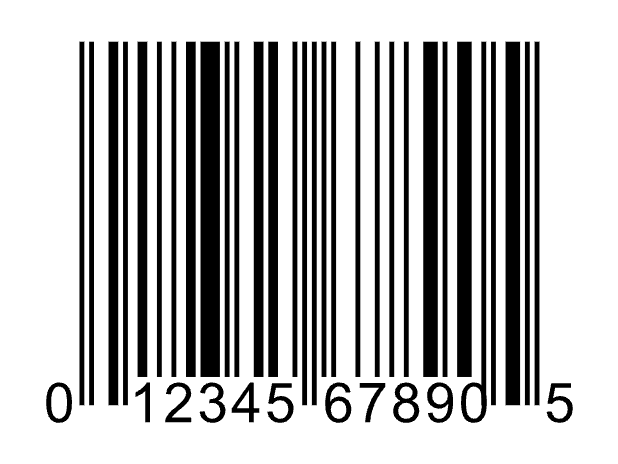
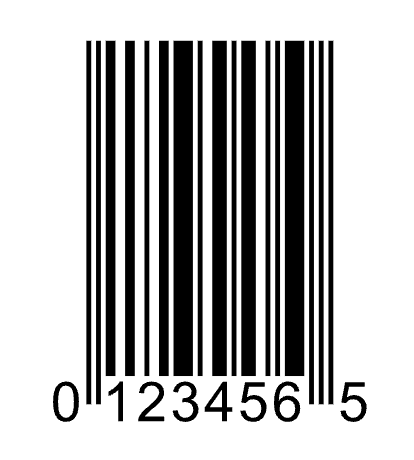
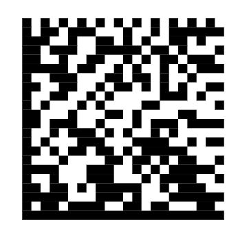

# Overview of Barcodes

## Code 39

### Settings

| Setting      | Description | Default |
| ----------- | ----------- | ----------- |
| Bar height     | | 15mm       |
| Magnification  | | 100%        |
| Show value   | Show barcode value in the frame| Yes |
| Quiet zone   | This is the size of the whitespace around the barcode| left: 0,1 in (2,54 mm) right: 0,1 in (2,54 mm) top: 0 bottom: 0 |

### Things to know

When the value is shown, it is always placed below, not embedded

Width of the narrow bar (X-dimension) = 0,01 in (0,254 mm)

The frame width depends on the barcode value, left/right quiet zones, and magnification.  
Default: depends on the default value + left/right quiet zones

The frame height depends on the bar height, value visibility, top/bottom quiet zones, and magnification.  
Default: default bar height + text height

## QR Code

### Settings

| Setting      | Description | Default |
| ----------- | ----------- | ----------- |
| Error correction | Low (L), Medium (M), Quartile (Q), High (H) | High (H)  |
| Add center whitespace  | On / Off | Off |
| Character set | → ISO 8859-1 / UTF-8 | ISO 8859-1 |
| Quiet zone   | Size of the whitespace around the barcode| 0|

### Things to know

**Add center whitespace**

When "Add center whitespace" is turned on, GraFx Studio leaves a square whitespace at the center of the QR code where an image can be placed (this requires a separate image frame).

The size of the square should be sufficiently small so that the QR code is still readable

When turned on, the error correction setting is disabled and set to High

**Extra**

- The value is never shown
- The frame width and height can be set with the general frame properties. (default: width = 20 mm; height = 20 mm)
- Proportions are always constrained
- There are no bar height and magnification settings
- The quiet zone is always the same in all directions

## EAN-13

### Settings

| Setting      | Description | Default |
| ----------- | ----------- | ----------- |
| Bar height | Height of the bars | 22,85 mm |
| Magnification  |  Frame scaling| 100% |
| Quiet zone   | This is the size of the whitespace around the barcode| left: 3,63 mm) right: 2,31 mm top: 0 bottom: 0 |

### Things to know

- The value is always shown and placed below embedded
- The frame width depends on the left/right quiet zones and magnification
(default: 37,29 mm, including left/right quiet zones)
- The frame height depends on the bar height, top/bottom quiet zones, and magnification
(default: 25,93 mm)

## Code 128

### Settings

| Setting      | Description | Default |
| ----------- | ----------- | ----------- |
| Character set | 128A, 128B, 128C | 128A |
| Bar height | Height of the bars | 15 mm |
| Magnification  |  Frame scaling| 100% |
| Show value  | Also show barcode value in the frame | Yes |
| Quiet zone   | This is the size of the whitespace around the barcode| left: 0,1 in (2,54 mm) right: 0,1 in (2,54 mm) top: 0 bottom: 0 |

### Things to know

- When the value is shown, it is always placed below, not embedded
- Width of the narrow bar (X-dimension) = 0,01 in (0,254 mm)
- The frame width depends on the barcode value, left/right quiet zones, and magnification
(default: depends on the default value + left/right quiet zones)
- The frame height depends on the bar height, value visibility, top/bottom quiet zones, and magnification  
(default: default bar height + text height)

## EAN 8

### Settings

| Setting      | Description | Default |
| ----------- | ----------- | ----------- |
| Bar height | Height of the bars | 18,23 mm |
| Magnification  |  Frame scaling| 100% |
| Quiet zone   | This is the size of the whitespace around the barcode| left: 2,31 mm) right: 2,31 mm top: 0 bottom: 0 |

### Things to know

- The value is always shown and placed below embedded
- The frame width depends on the left/right quiet zones and magnification  
(default: 26,73 mm, including left/right quiet zones)
- The frame height depends on the bar height, top/bottom quiet zones, and magnification  
(default: 21,31 mm)

## UPC-A

### Settings

| Setting      | Description | Default |
| ----------- | ----------- | ----------- |
| Bar height | Height of the bars | 22,85 mm |
| Magnification  |  Frame scaling| 100% |
| Quiet zone   | This is the size of the whitespace around the barcode| left: 2,97 mm right: 2,97 mm top: 0 bottom: 0 |

### Things to know

- The value is always shown and placed below embedded
- The frame width depends on the left/right quiet zones and magnification  
(default: 37,29 mm, including left/right quiet zones)
- The frame height depends on the bar height, top/bottom quiet zones, and magnification  
(default: 25,93 mm)

## UPC-E

### Settings

| Setting      | Description | Default |
| ----------- | ----------- | ----------- |
| Bar height | Height of the bars | 22,85 mm |
| Magnification  |  Frame scaling| 100% |
| Quiet zone   | This is the size of the whitespace around the barcode| left: 2,97 mm right: 2,31 mm top: 0 bottom: 0 |

### Things to know

- The value is always shown and placed below embedded
- The frame width depends on the left/right quiet zones and magnification  
(default: 22,11 mm, including left/right quiet zones)
- The frame height depends on the bar height, top/bottom quiet zones, and magnification  
(default: 25,93 mm)

## DataMatrix

### Settings

| Setting      | Description | Default |
| ----------- | ----------- | ----------- |
| Quiet zone   | This is the size of the whitespace around the barcode| 0 |

### Things to know

- The value is never shown
- The frame width and height can be set with the general frame properties  
(default: width = 20 mm; height = 20 mm)
- Proportions are always constrained
- There are no bar height and magnification settings
- The quiet zone is always the same in all directions