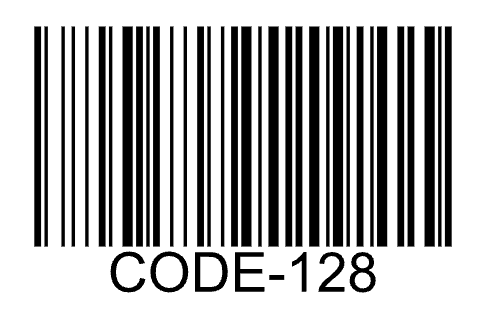
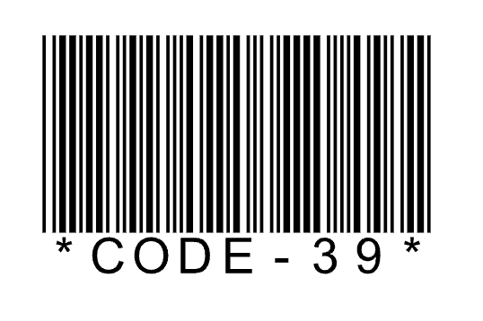
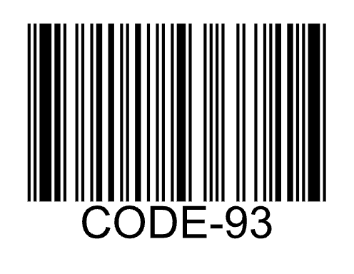
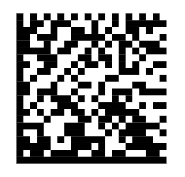
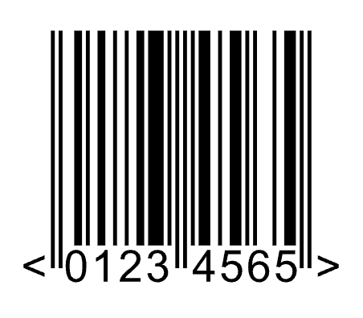
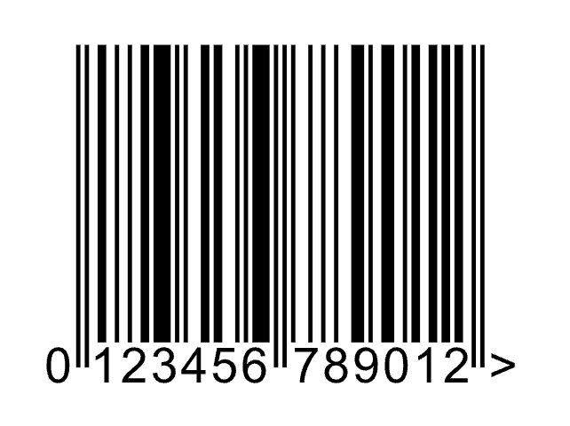
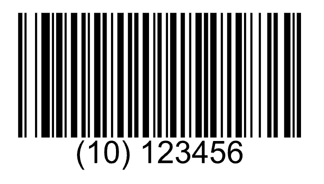
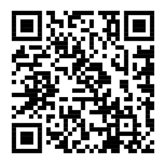
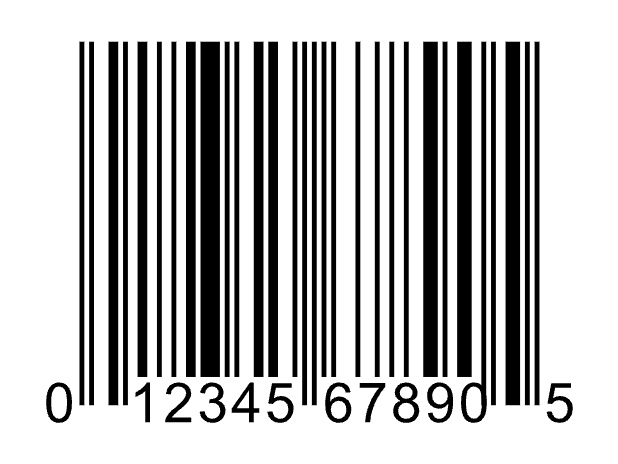
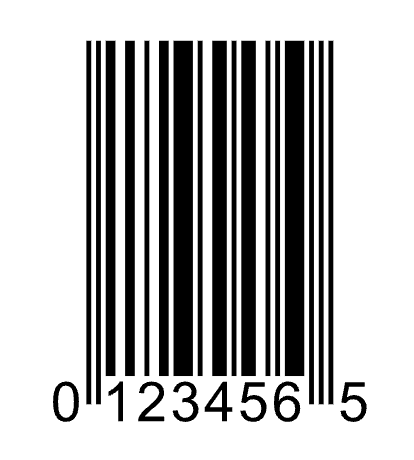

# Overview of Barcodes

## Code 128

{.screenshot}

### Settings

| Setting      | Description | Default |
| ----------- | ----------- | ----------- |
| Character set | 128A, 128B, 128C | 128A |
| Bar height | Height of the bars | 15 mm |
| Magnification  |  Frame scaling| 100% |
| Show value  | Also show barcode value in the frame | Yes |
| Quiet zone   | This is the size of the whitespace around the barcode| left: 0,1 in (2,54 mm) right: 0,1 in (2,54 mm) top: 0 bottom: 0 |

### Things to know

- When the value is shown, it is always placed below, not embedded
- Width of the narrow bar (X-dimension) = 0,01 in (0,254 mm)
- The frame width depends on the barcode value, left/right quiet zones, and magnification
(default: depends on the default value + left/right quiet zones)
- The frame height depends on the bar height, value visibility, top/bottom quiet zones, and magnification  
(default: default bar height + text height)

## Code 39

{.screenshot}

### Settings

| Setting      | Description | Default |
| ----------- | ----------- | ----------- |
| Bar height     | Height of the bars | 15mm       |
| Magnification  | Frame scaling | 100%        |
| Show value   | Show barcode value in the frame| Yes |
| Quiet zone   | This is the size of the whitespace around the barcode| left: 0,1 in (2,54 mm) right: 0,1 in (2,54 mm) top: 0 bottom: 0 |

### Things to know

- When the value is shown, it is always placed below, not embedded
- Width of the narrow bar (X-dimension) = 0,01 in (0,254 mm)
- The frame width depends on the barcode value, left/right quiet zones, and magnification.    
Default: depends on the default value + left/right quiet zones
- The frame height depends on the bar height, value visibility, top/bottom quiet zones, and magnification.  
Default: default bar height + text height

## Code 93

{.screenshot}

### Settings

| Setting      | Description | Default |
| ----------- | ----------- | ----------- |
| Bar height     | Height of the bars | 15mm       |
| Magnification  | | 100%        |
| Show value   | Show barcode value in the frame| Yes |
| Quiet zone   | This is the size of the whitespace around the barcode| left: 0,1 in (2,54 mm) right: 0,1 in (2,54 mm) top: 0 bottom: 0 |

### Things to know

- When the value is shown, it is always placed below, not embedded
- Width of the narrow bar (X-dimension) = 0,01 in (0,254 mm)
- The frame width depends on the barcode value, left/right quiet zones, and magnification  
(default: depends on the default value + left/right quiet zones)
- The frame height depends on the bar height, value visibility, top/bottom quiet zones, and magnification  
(default: default bar height + text height)

## DataMatrix

{.screenshot}

### Settings

| Setting      | Description | Default |
| ----------- | ----------- | ----------- |
| Quiet zone   | This is the size of the whitespace around the barcode| 0 |

### Things to know

- The value is never shown
- The frame width and height can be set with the general frame properties  
(default: width = 20 mm; height = 20 mm)
- Proportions are always constrained
- There are no bar height and magnification settings
- The quiet zone is always the same in all directions

## EAN-8

{.screenshot}

### Settings

| Setting      | Description | Default |
| ----------- | ----------- | ----------- |
| Bar height | Height of the bars | 18,23 mm |
| Magnification  |  Frame scaling| 100% |
| Quiet zone   | This is the size of the whitespace around the barcode| left: 2,31 mm) right: 2,31 mm top: 0 bottom: 0 |

### Things to know

- The value is always shown and placed below embedded
- The frame width depends on the left/right quiet zones and magnification  
(default: 26,73 mm, including left/right quiet zones)
- The frame height depends on the bar height, top/bottom quiet zones, and magnification  
(default: 21,31 mm)

## EAN-13

{.screenshot}

### Settings

| Setting      | Description | Default |
| ----------- | ----------- | ----------- |
| Bar height | Height of the bars | 22,85 mm |
| Magnification  |  Frame scaling| 100% |
| Quiet zone   | This is the size of the whitespace around the barcode| left: 3,63 mm) right: 2,31 mm top: 0 bottom: 0 |

### Things to know

- The value is always shown and placed below embedded
- The frame width depends on the left/right quiet zones and magnification
(default: 37,29 mm, including left/right quiet zones)
- The frame height depends on the bar height, top/bottom quiet zones, and magnification
(default: 25,93 mm)

## GS1-128

{.screenshot}

### Settings

| Setting      | Description | Default |
| ----------- | ----------- | ----------- |
| Character set | 128A, 128B, 128C | 128A |
| Bar height | Height of the bars | 15 mm |
| Magnification  |  Frame scaling| 100% |
| Show value  | Also show barcode value in the frame | Yes |
| Quiet zone   | This is the size of the whitespace around the barcode| left: 0,1 in (2,54 mm) right: 0,1 in (2,54 mm) top: 0 bottom: 0 |

### Things to know

- When the value is shown, it is always placed below, not embedded
- Width of the narrow bar (X-dimension) = 0,01 in (0,254 mm)
- The frame width depends on the barcode value, left/right quiet zones, and magnification  
(default: depends on the default value + left/right quiet zones)
- The frame height depends on the bar height, value visibility, top/bottom quiet zones, and magnification  
(default: default bar height + text height)

## QR Code

{.screenshot}

### Settings

| Setting      | Description | Default |
| ----------- | ----------- | ----------- |
| Error correction | Low (L), Medium (M), Quartile (Q), High (H) | High (H)  |
| Character set | → ISO 8859-1 / UTF-8 | ISO 8859-1 |
| Quiet zone   | Size of the whitespace around the barcode| 0|

### Things to know

**Extra**

- The value is never shown
- The frame width and height can be set with the general frame properties. (default: width = 20 mm; height = 20 mm)
- Proportions are always constrained
- There are no bar height and magnification settings
- The quiet zone is always the same in all directions

## UPC-A

{.screenshot}

### Settings

| Setting      | Description | Default |
| ----------- | ----------- | ----------- |
| Bar height | Height of the bars | 22,85 mm |
| Magnification  |  Frame scaling| 100% |
| Quiet zone   | This is the size of the whitespace around the barcode| left: 2,97 mm right: 2,97 mm top: 0 bottom: 0 |

### Things to know

- The value is always shown and placed below embedded
- The frame width depends on the left/right quiet zones and magnification  
(default: 37,29 mm, including left/right quiet zones)
- The frame height depends on the bar height, top/bottom quiet zones, and magnification  
(default: 25,93 mm)

## UPC-E

{.screenshot}

### Settings

| Setting      | Description | Default |
| ----------- | ----------- | ----------- |
| Bar height | Height of the bars | 22,85 mm |
| Magnification  |  Frame scaling| 100% |
| Quiet zone   | This is the size of the whitespace around the barcode| left: 2,97 mm right: 2,31 mm top: 0 bottom: 0 |

### Things to know

- The value is always shown and placed below embedded
- The frame width depends on the left/right quiet zones and magnification  
(default: 22,11 mm, including left/right quiet zones)
- The frame height depends on the bar height, top/bottom quiet zones, and magnification  
(default: 25,93 mm)

