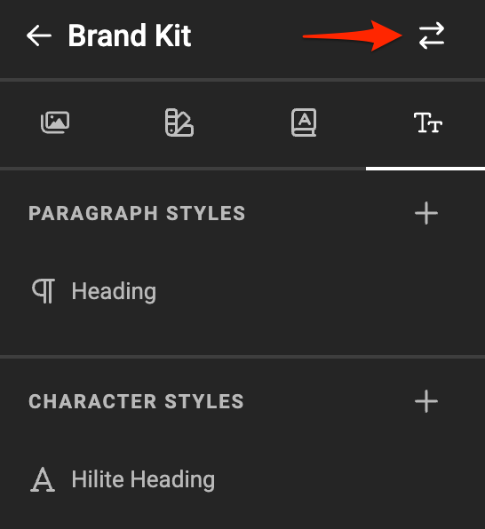
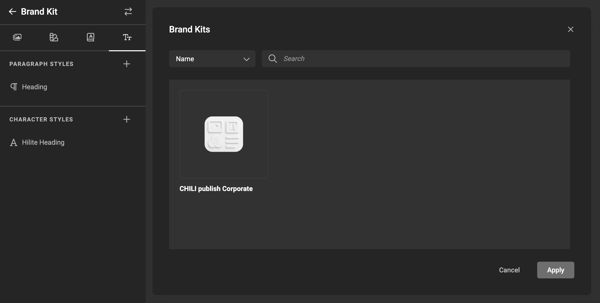
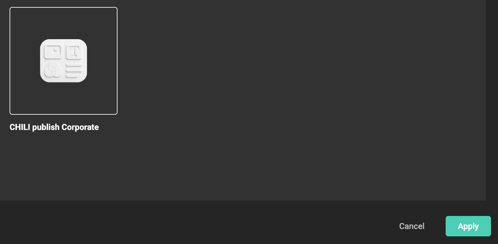
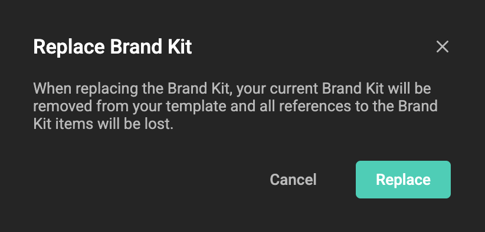

# How to use Brand Kits in a template

- Create your Brand Kit in the [GraFx Brand Kit](/GraFx-Brand-Kits/guides/create/) application
- Import a Brand Kit in your GraFx Studio Document
- Use the Media, Fonts and Styles in your document

## Import a Brand Kit

In the Brand Kit panel, click the Import Icon

Choose the Brand Kit you created

Click Apply

Confirm, since your Brand Kit elements will replace the current definitions in the document.

You are now ready to use your Brand Kit elements in your Document.