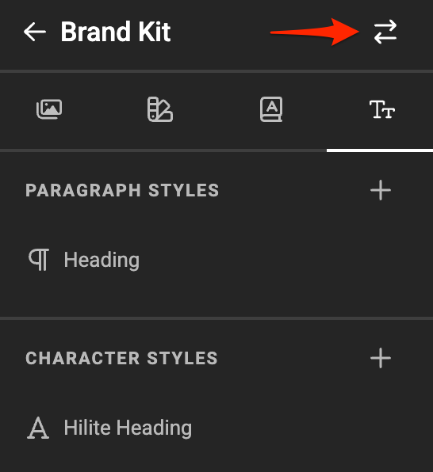
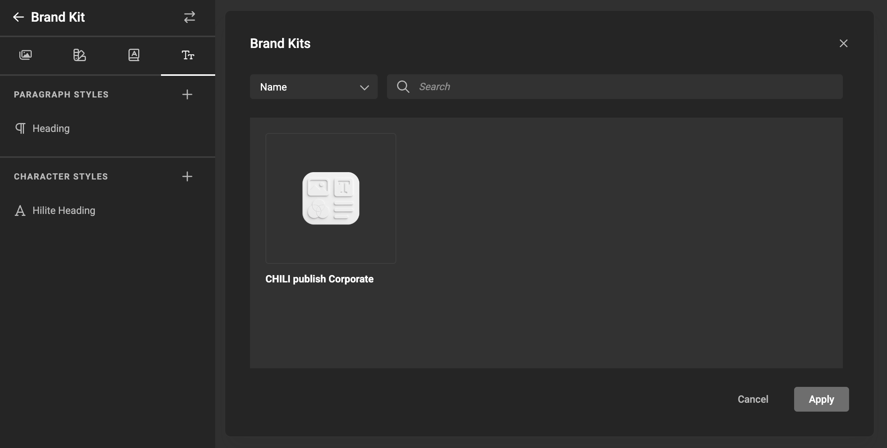
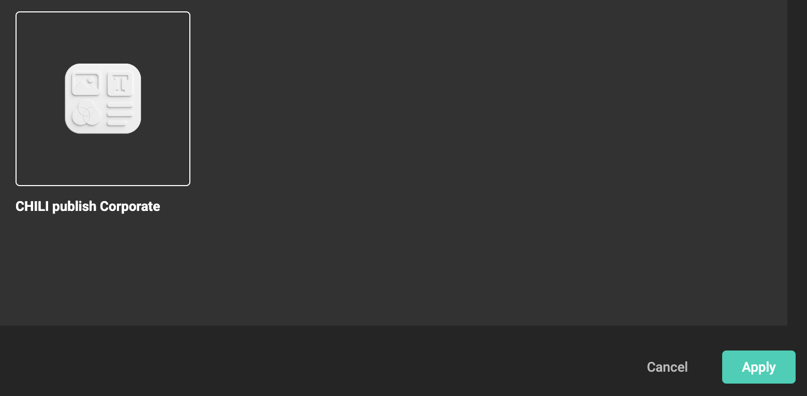
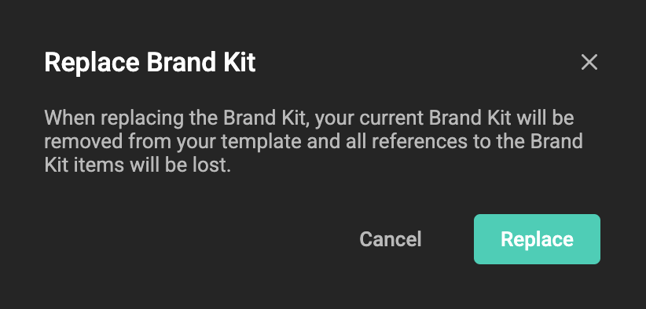
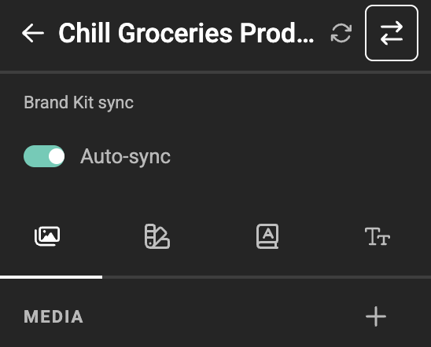
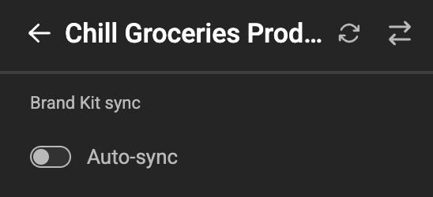
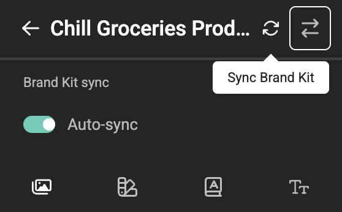

# How to use Brand Kits in a template

- Create your Brand Kit in the [GraFx Brand Kit](/GraFx-Brand-Kits/guides/create/) application
- Import a Brand Kit in your GraFx Studio Document
- Use the Media, Fonts and Styles in your document

## Import a Brand Kit

In the Brand Kit panel, click the Import Icon



Choose the Brand Kit you created



Click Apply



Confirm, since your Brand Kit elements will replace the current definitions in the document.



You are now ready to use your Brand Kit elements in your Document.

## Switch themes

If the Brand Kit has [themes](/GraFx-Brand-Kits/concepts/themes/), the Brand Kit panel shows a **theme selector**. When you open a template, the default theme is selected.

Switching to another theme updates every brand-bound value in the template — colors, text styles, and media — on the canvas and in the property panels. A color swatch bound to "Primary" shows the value of the active theme; text styles and image bindings follow along.

!!! info "Structure is managed on the default theme"
    Adding, renaming, removing, or duplicating Brand Kit elements is only possible on the default theme. On a non-default theme these controls are disabled or hidden, and an info icon in the panel explains this. To add an element to a theme, add it to the default theme first — the theme inherits it, and you can then override its value.

The Brand Kit's font list is shared across all themes — by design, a theme does not add or remove fonts. To use a different font in a theme, override a paragraph or character style: styles can use a different font from the shared list per theme.

### Switch themes with Actions or the SDK

Themes can also be switched programmatically — for example, switching to a Print theme when the layout changes. Two [Actions](/GraFx-Studio/concepts/actions/) helper functions are available:

```
getActiveThemeName(): string
```

```
switchTheme(name: string): void
```

Integrations can use the equivalent Studio SDK brand kit theme methods.

## Keep a Brand Kit in sync

Once a Brand Kit is imported, the template can stay aligned with the source Brand Kit in **GraFx Brand Kits**. When an element is updated centrally (for example a new brand color, or a revised paragraph style), those changes can be pulled into the template without re-importing.

Sync is controlled from the Brand Kit panel header, which now surfaces three controls next to the Brand Kit name: the Brand Kit selector, the manual sync button, and the auto-sync toggle.



The **Brand Kit selector** (the swap icon) lets you switch the template to a different imported Brand Kit.

### Auto-sync

The **Auto-sync toggle** controls whether the template stays aligned automatically:



- When **auto-sync is on**, Studio compares the template's Brand Kit against the source every time the template is opened, and applies any changes in a single step. A toast message confirms when a sync has been applied.
- When **auto-sync is off**, the template keeps its current Brand Kit values until you sync manually.

Newly imported Brand Kits have auto-sync enabled by default.

### Manual sync

The circular-arrows button next to the Brand Kit selector pulls the latest version of the source Brand Kit on demand. Hover shows the *Sync Brand Kit* tooltip. Useful when auto-sync is off, or to force an update in-session after a Brand Kit change.



!!! info "What a sync changes"
    Sync applies only the differences between the template and the source:

    - New elements in the source are added to the template.
    - Updated elements are replaced with their latest values.
    - Removed elements in the source are **not** deleted from the template — existing user content is preserved.
    - A renamed element is added as a new element (names act as identifiers).

    A sync is a single undoable step — use undo/redo to revert it.

    Sync is theme-aware: it applies to the selected theme and restores its settings to the source Brand Kit's state.