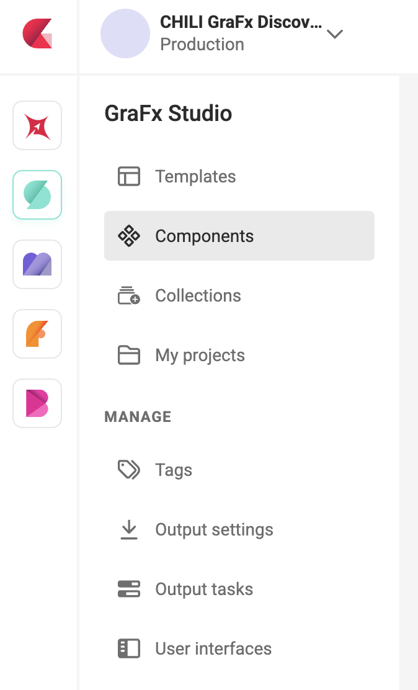

# Build a component

This guide walks you through creating a component in GraFx Studio. A component is built in its own workspace, which is similar to the Template Designer Workspace but with a focused set of features for reusable design elements.

!!! info "Components are designed for print and PDF output"
    Components do not support digital animated intent. If your template targets digital or animated output, build that content directly in the template rather than in a component.

See [Components](/GraFx-Studio/concepts/components/) for an introduction to what components are and when to use them. New to components? Start with the [tutorial](/GraFx-Studio/guides/components-tutorial/) for a full end-to-end walkthrough.

## Create a component

In GraFx Studio, select **Components** from the left navigation.

The Components overview shows all components in your environment, with the same grid and list view options as the Templates overview.

To create a new component, click **+ Create component** in the top right.

You can also import an existing component from a `.ZIP` file using the **Import .ZIP** button.

## The component workspace

The component workspace opens after you create or open a component. It looks similar to the Template Designer Workspace — the same canvas, the same left toolbar, the same properties panel on the right.

The key difference is what is **not** there, by design:

| Feature | Not available in components | Reason |
|---|---|---|
| Digital animated intent | ❌ | Components focus on print and PDF output |
| Multi-page | ❌ | A component is a single reusable element, not a document |
| Output / Export button | ❌ | Output is produced by the parent template, not the component |
| User Interface settings | ❌ | UI settings belong at the template level |
| Bleed & slug | ❌ | Print production settings live on the template |
| Private data | ❌ | Not supported in components |
| Add component as a frame | ❌ | Not supported in V1 |
| Change page size via actions | ❌ | The template determines the frame size — the component adapts to the space it's given |

Everything else works as expected: you can add frames, apply Brand Kit styles, create layouts, define variables, and use actions.

> **Actions and page size:** If an action inside a component attempts to change the page size, it will fail with an "Action failed" error at output time. This is by design — a component renders within the frame the template provides. To adapt a component's appearance to different frame sizes, use [multiple layouts](/GraFx-Studio/guides/build-component/#layouts-in-a-component) and [Resize Mode](/GraFx-Studio/guides/use-components/#resize-mode) instead.

## Layouts in a component

A component can have multiple layouts, just like a template. Each layout can have its own design — for example a square, a horizontal, and a vertical version of the same pricing element.

These layouts are what makes [Resize mode](/GraFx-Studio/guides/use-components/#resize-mode) powerful: when the component is placed on a template, GraFx Studio can automatically pick the best-matching layout based on the frame size.

## Variables in a component

Variables work the same way as in templates, with one difference: **the List variable type is not available** in components.

List variables present a dropdown of predefined options to the end user. Since variable mapping flows one-way from template into the component, a list variable on the component side would create a conflict — the template variable driving the value wouldn't know which options to respect. For this reason, only mappable variable types are supported in V1.

Supported variable types in components:

- Single-line text
- Multi-line text
- Number
- Image
- Boolean (toggle)
- Date

Variables defined in a component are the values that template designers can connect to template variables through [variable mapping](/GraFx-Studio/guides/use-components/#variable-mapping). Keep your variable names clear and descriptive — they appear by name in the mapping modal.

## Brand Kit

A component has its own Brand Kit, separate from the template's Brand Kit. This means a component can carry its own colors, fonts, and paragraph styles that are managed independently from the templates that use it.

If you want the template to be able to change a color or style inside a component, that value needs to be exposed as a variable and mapped from the template.

## Component Canvas

In template designs, elements can extend beyond the canvas boundary. This is commonly used to hide part of an image — when templates render for end users, any elements outside the canvas are not visible.

However, with components, elements outside the canvas **will** be rendered when the component is used in a template. This can lead to unwanted results.

To avoid this, you should either [crop the image in Studio](GraFx-Studio/guides/cropping) or crop the underlying asset before importing it into Studio, so that it fits entirely within the component canvas.

## Design & Run Mode

Both Design Mode and Run Mode are available in the component workspace. Use Run Mode to test how variables and actions behave inside the component before placing it in a template.

When a component is placed inside a template, it always runs as a project — both in the template's Design Mode and Run Mode.

## Next step

Once your component is built, place it in a template:

[Use components in a template →](/GraFx-Studio/guides/use-components/)
