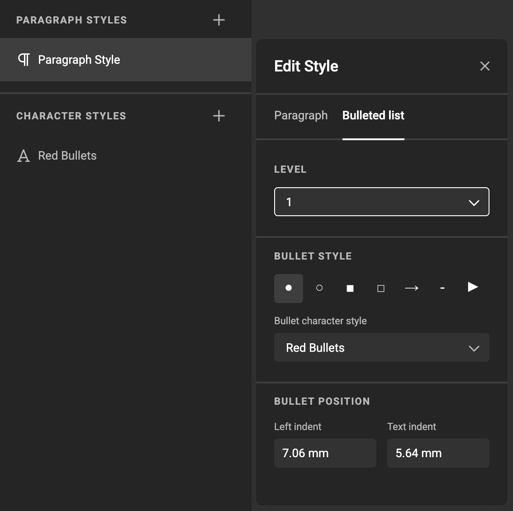
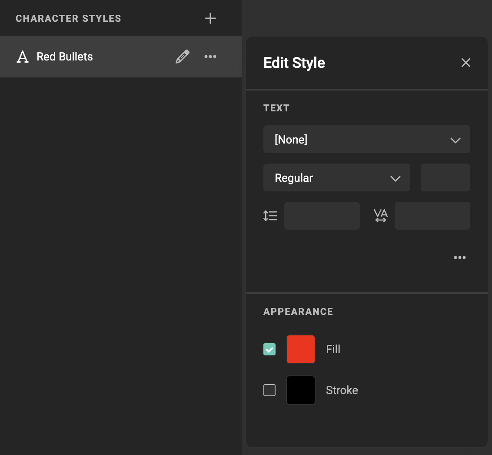
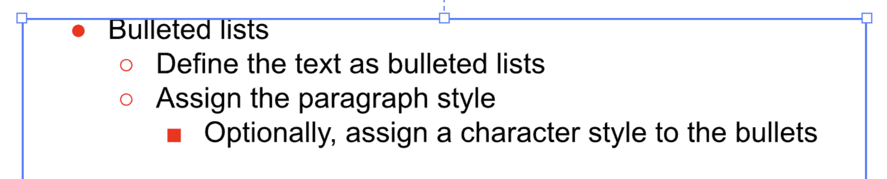
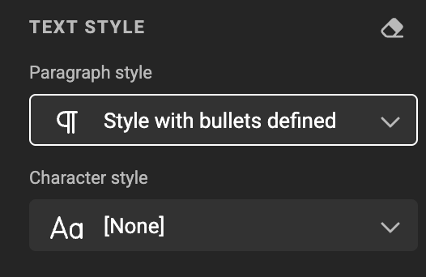
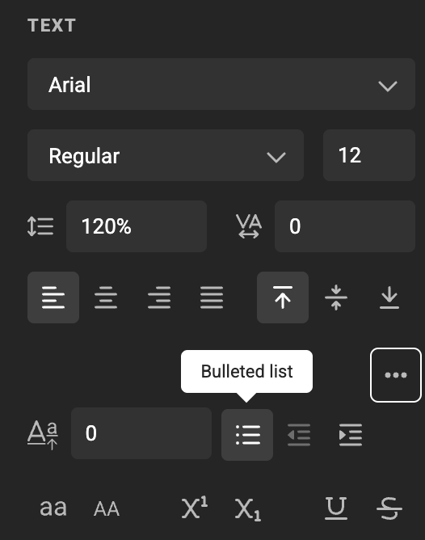
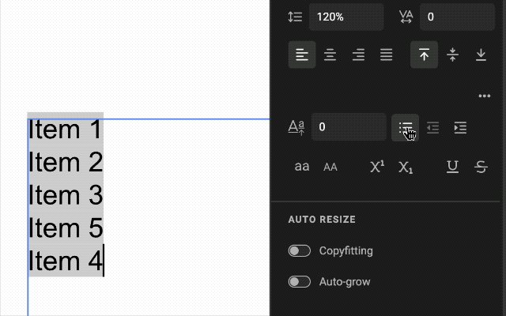

# How to use Bullets in your text

## Overview

Bulleted lists are unordered lists that use simple icons to mark each item. They’re part of the paragraph style system.

Bulleted lists support up to five levels, each with its own icon and indent. Paragraph styles include default bullet styles, and you can convert any text into a bulleted list or back to plain text.

## Define bullet styles in Paragraph Styles

1. Open your Brand Kit inside GraFx Studio and select **Text** → **Paragraph Styles**.  
2. Pick a paragraph style or create one. In the *Edit Style* dialog, switch the **Paragraph** field to **Bulleted list**.  
    {.screenshot}
3. Choose the desired level (1–5), pick an icon from the gallery, and set the left indent and text indent. Repeat for each level you need.  
4. Optionally, you can assign a character style to the bullets.  
    {.screenshot}  
    {.screenshot}

Changes take effect in all text that use that paragraph style.

## Apply bulleted lists in GraFx Studio

1. Select a text frame and select the text inside.  
2. Pick a paragraph style that has a bulleted list defined.  
    {.screenshot}
3. Click the **Bulleted list** button to convert selected text. Click again to revert to plain text.  
    {.screenshot}
4. Use the indent controls to increase or decrease list level. Decreasing from level 1 removes the bullet.  
   {.screenshot-full}

## Notes

- Bullet icons use the paragraph style’s font. Unsupported glyphs fall back to a replacement character.