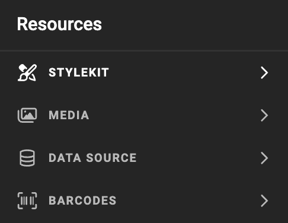
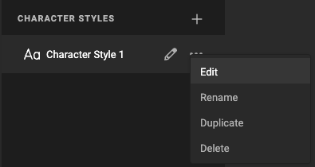

# How to work with character styles

## Define a character style

Open the **Resource Panel** > **Stylekit panel**.

Select the first tab to view paragraph- and character styles

Click on the "+" sign to ad a new character style (bottom section is for character styles).
Each click on the "+" sign will add another (empty) character style.

Click on the "..." menu next to the newly created style and choose edit or click the pencil to edit the style.

You can rename the style by clicking "Rename" in the "..." menu.

Set all properties you want for this character. Saving happens automatically.

## Apply a character style

Select the text you want to apply the character style to.

DIfferent than with paragraph styles, with character styles you need to select the character or words you want to apply the style to.

In the properties panel on the right, select the character style from the dropdown list.

Your selected text now has the character style applied.

