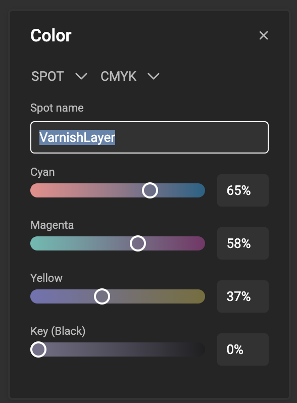

# How to work with colors

<iframe width="690" height="388" src="https://www.youtube.com/embed/HCcoRGKJo10?si=qHeN6xOFVeldM1C5&controls=1&mute=1&showinfo=0&rel=0&autoplay=1&loop=1" title="YouTube video player" frameborder="0" allow="accelerometer; autoplay; clipboard-write; encrypted-media; gyroscope; picture-in-picture; web-share" referrerpolicy="strict-origin-when-cross-origin" allowfullscreen></iframe>

[Go to Youtube to see all feature videos](https://www.youtube.com/playlist?list=PLLHtQ1R6R-B_m7XAVySM9OjbbUscsgBOH)

## Define a color

Open the **Resource Panel** > **Brand Kit panel**.

Select the second tab to view colors

Click on the "+" sign to add a new color.
Each click on the "+" sign will add another (white) color.

Click on the "..." menu next to the newly created color and choose edit or click the color to edit.

You can rename by clicking "Rename" in the "..." menu.

### Color picker

Define the color. Choose your type and set the values for the chosen color space.

#### Hex

The value is a hexadecimal representation of an RGB value.

Ranging from 00 (black) to FF (white).

[See how you can define your Hex color value](https://www.w3schools.com/colors/colors_hexadecimal.asp)

#### RGB

The 3 values represent a decimal value for each of the 3 RGB channels.

[See how to calculate RGB color values](https://www.w3schools.com/colors/colors_rgb.asp)

#### CMYK

Mostly used in print, but also available in CSS4, CMYK is a subtractive color system.

A subtractive color mixing model predicts the resultant spectral power distribution of light filtered through overlaid partially absorbing materials on a reflecting or transparent surface.[^1]

[^1]: Source: [Wikipedia](https://en.wikipedia.org/wiki/Subtractive_color#Process)

#### SPOT

A spot color is a pre-mixed, standardized ink used in printing to achieve precise and consistent colors that cannot be easily reproduced with traditional CMYK printing. 

Unlike process colors, which are created by blending CMYK inks during printing, spot colors are applied as a single ink, ensuring exact color matching, especially for brand logos or designs that require specific hues. Commonly used in branding and packaging, spot colors are defined by color systems like Pantone, and they provide greater accuracy and vibrancy, especially for special finishes like metallics or fluorescents.

In addition to being a pre-mixed ink for precise color matching, spot colors are also used to define specific finishing steps in the printing process, such as cold foil, varnish, embossing, or die-cutting. These special spot colors act as placeholders in the design to indicate where these finishes should be applied during production. By assigning a unique spot color to these areas, printers can ensure that the finishing effects are accurately positioned and consistently executed, adding visual or tactile enhancements to the final product.

You can define a SPOT color with a name. This color will appear in the PDF output as a separate "ink". The secondary color defines how the color is shown in your design.

## Apply a color

Where you can choose a color (character style or paragraph style), you'll be able to click the color and choose the color.

Select "custom" to define a color ad-hoc.
