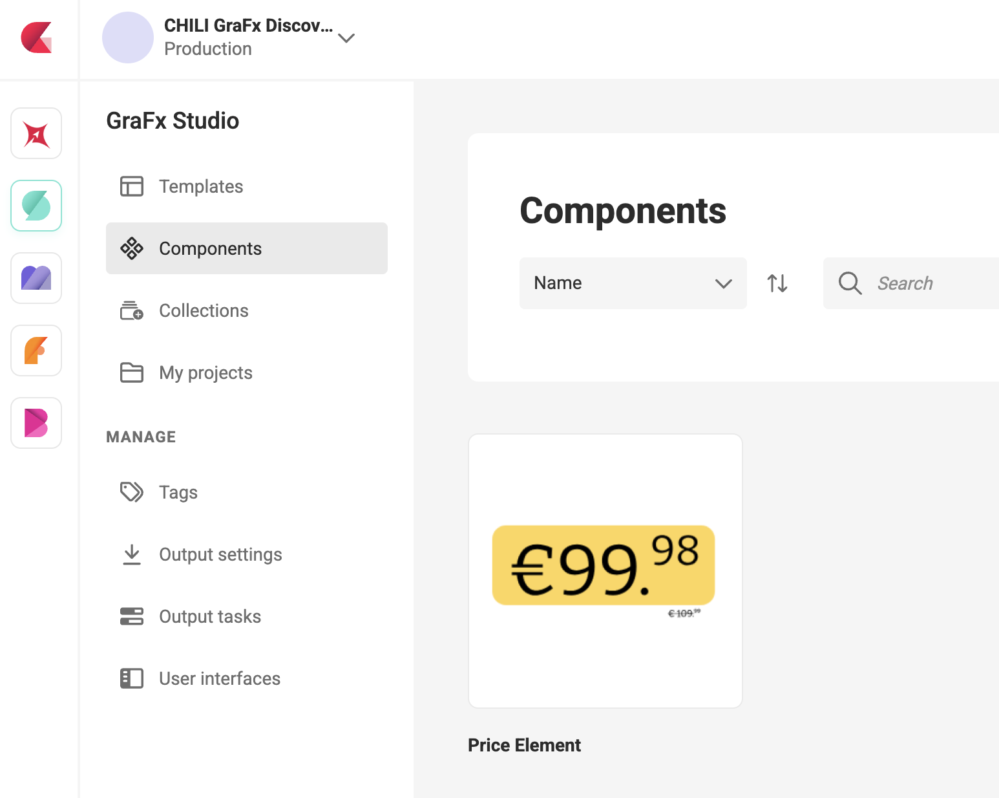
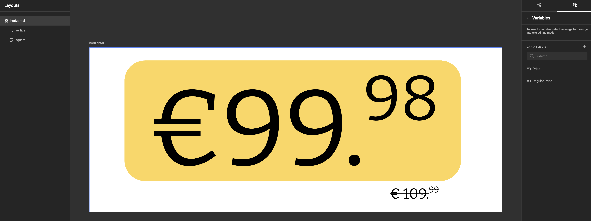
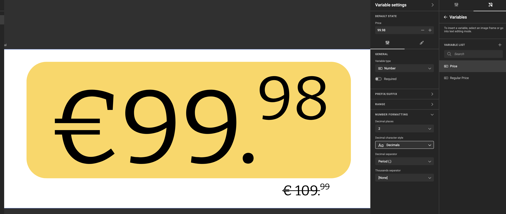
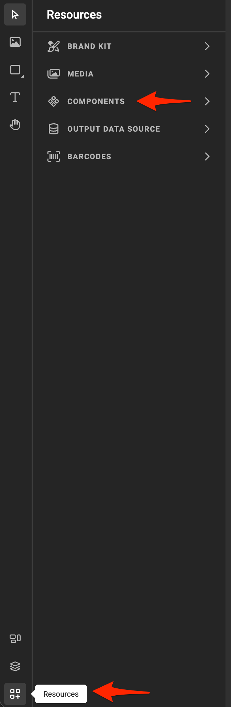
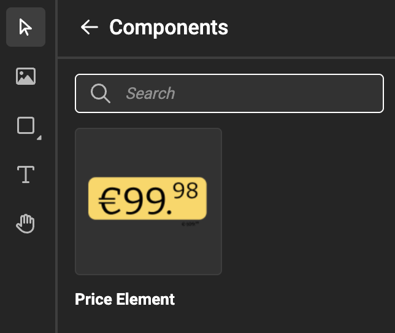

# Tutorial: Build and use a pricing component

This tutorial walks through the complete journey of creating a component and using it in a template — from a blank workspace to a finished two-coupon sheet where each coupon shows different product data.

**What you'll build:** A `Pricing element` component with three variables, placed twice on a coupon sheet template, with independent variable mapping per instance.

**Time:** approximately 20–30 minutes.

**Before you start:** You should be familiar with the Template Designer Workspace and know how to create variables in a template. If not, review [Variables](/GraFx-Studio/concepts/variables/) first.

---

## Step 1 — Plan before you build

Before opening the workspace, take a moment to decide what the component needs. This saves time later.

For a pricing element, you need to display three things per coupon:

- A **product image**
- A **product name** (short text)
- A **price** (text, e.g. "€ 2.99")

These become the component's variables. Everything else — background color, typography, layout, brand rules — is part of the design and will be fixed inside the component.

> **Naming tip:** Give your variables clear, descriptive names now. They appear by name in the mapping modal when template designers connect them to template variables. `product_image`, `product_name`, and `price` are immediately understandable. `var_1`, `var_2`, `var_3` are not.

---

## Step 2 — Create the component

In GraFx Studio, click **Components** in the left navigation.

The Components overview opens. Click **+ Create component** in the top right.

Give the component a clear name: `Pricing element`. Click **Create**.

The component workspace opens — it looks like the Template Designer Workspace, with the same canvas, toolbar, and properties panel.

---

## Step 3 — Set the component size

The component has one page and one layout. Set the canvas size to match the coupon dimensions you'll use on the template — for example 90mm × 55mm (a standard coupon size).

This is the component's default size. When the component is placed on a template, the template designer can resize the frame, and Resize Mode controls how the component responds.

---

## Step 4 — Design the layout

Add three frames to the canvas:

1. An **image frame** for the product image — place it on the left side
2. A **text frame** for the product name — place it on the right, upper half
3. A **text frame** for the price — place it on the right, lower half

Apply your Brand Kit colors, fonts, and any background shapes. Keep the design clean — this element will be repeated across many templates.

---

## Step 5 — Add variables and connect them to the frames

Open the **Variables** panel. Add three variables:

| Variable name | Type |
|---|---|
| `product_image` | Image |
| `product_name` | Single-line text |
| `price` | Single-line text |

Now connect each variable to its frame:

- Select the **image frame** → in the properties panel, link the image source to `product_image`
- Select the **product name text frame** → link the text content to `product_name`
- Select the **price text frame** → link the text content to `price`

The frames now display whatever values come in through those variables.

---

## Step 6 — Test in Run Mode

Switch to **Run Mode** to check that the variables work correctly before placing the component in a template.

Enter test values — any product name, price, and a placeholder image. Confirm the layout looks right, text fits as expected, and the image displays correctly.

Switch back to **Design Mode** and make any adjustments needed.

---

## Step 7 — Save the component

The component is ready. Save it. It is now available in the Components library for any template designer – including yourself – in the environment to use.

---

## Step 8 — Create the coupon sheet template

Switch to **Templates** in the left navigation and create a new template. Name it `Coupon sheet — 2up`.

Set the page size to accommodate two coupons side by side — for example 200mm × 75mm for a two-up landscape layout with a small margin between coupons.

---

## Step 9 — Place the first component instance

In the Template Designer Workspace, click the **Resources** icon in the bottom left toolbar.

Select **Components**. The component browser opens. Search for `Pricing` and click `Pricing element`.

The component is placed as a frame on the canvas. Move and resize it to sit in the left half of the template — this will be coupon 1.

---

## Step 10 — Place the second component instance

Click **Pricing element** in the component browser again. A second independent instance is placed on the canvas.

Move and resize it to sit in the right half of the template — this will be coupon 2.

---

## Step 11 — Map variables for instance 1

Select the **first component frame** (coupon 1). In the right properties panel, find the **Component Variables** section and click **Manage mapping**.

The mapping modal opens. All three component variables appear under the **Not mapped** tab.

For each variable, leave **Map to** set to **New variable** and click **Apply**. GraFx Studio creates three new template variables:

| Component variable | New template variable |
|---|---|
| `product_image` | `product_image` |
| `product_name` | `product_name` |
| `price` | `price` |

---

## Step 12 — Map variables for instance 2

Select the **second component frame** (coupon 2). Click **Manage mapping** again.

This time, you already have template variables from instance 1. You want coupon 2 to show **different** data, so map each variable to a **New variable** again. GraFx Studio creates a second set:

| Component variable | New template variable |
|---|---|
| `product_image` | `product_image_2` |
| `product_name` | `product_name_2` |
| `price` | `price_2` |

> **Why are these named `_2`?** GraFx Studio automatically avoids duplicate names. The first instance created `product_image`, so the second set gets `product_image_2`. You can rename them in the Variables panel to anything that makes sense — `product_image_coupon_1` and `product_image_coupon_2`, for example.

---

## Step 13 — Check the variable list

Open the **Variables** panel. You'll see all six template variables, grouped by component instance.

These variables work like any other template variable — they can be filled in manually in Run Mode, driven by a data connector, or used in actions.

---

## Step 14 — Test the complete template

Switch to **Run Mode**. Enter values for all six variables — two different products, two different prices, two different images.

Both coupons display their own product independently, using the same pricing component design.

---

## What you've built

- A `Pricing element` component with three variables, reusable across any template
- A `Coupon sheet — 2up` template with two independent instances of that component
- Six template variables connecting the template to the component

If the pricing component design ever needs to change — a new font, an updated color, a revised layout — you edit the component once. The coupon sheet template (and every other template using the component) updates automatically.

---

## Next steps

- [Component variable mapping](/GraFx-Studio/concepts/component-mapping/) — understand all mapping patterns including multi-page and shared mappings
- [Resize Mode](/GraFx-Studio/guides/use-components/#resize-mode) — add multiple layouts to your component so it adapts to different frame sizes
- [Build a component](/GraFx-Studio/guides/build-component/) — full reference for the component workspace
