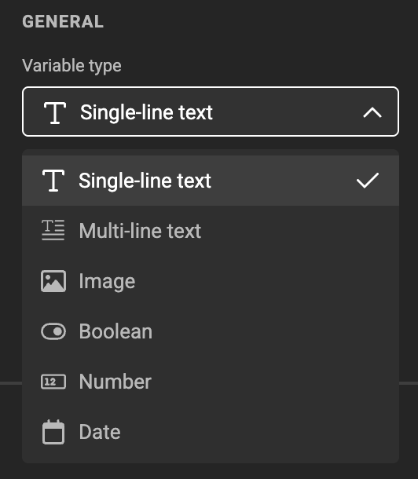
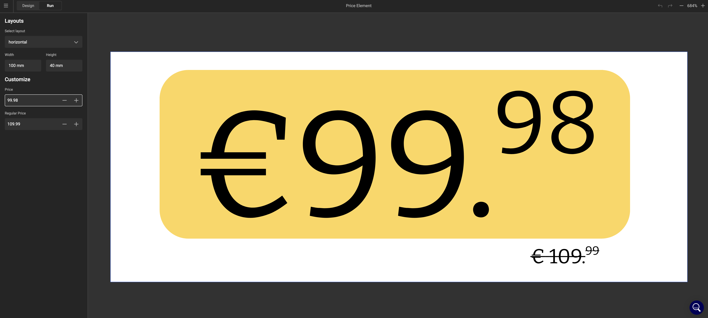
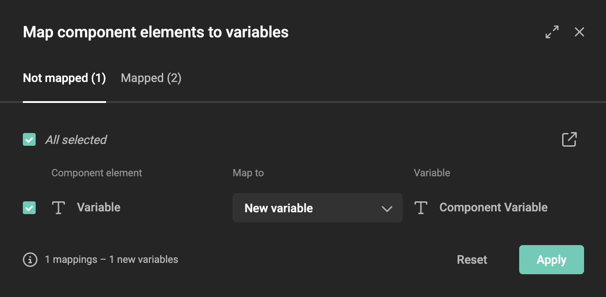
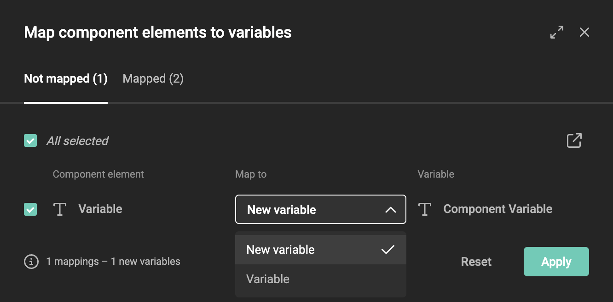
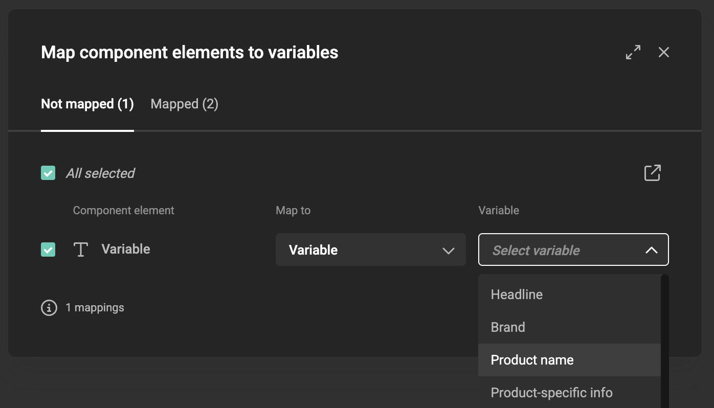
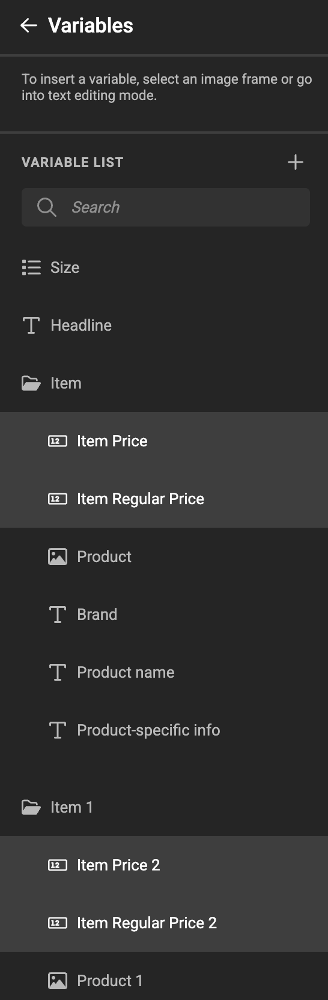
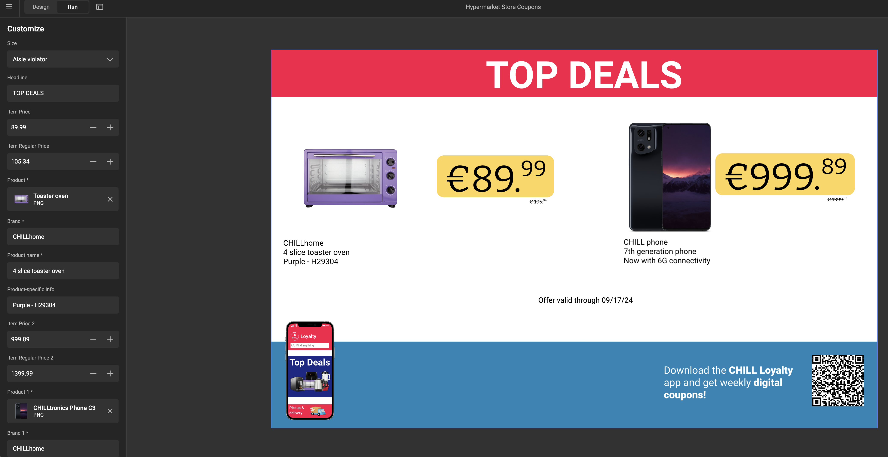

# Tutorial: Build and use a pricing component

This tutorial walks through the complete journey of creating a component and using it in a template — from a blank workspace to a finished two-coupon sheet where each coupon shows a different price.

**What you'll build:** A `Price Element` component with two variables — `Price` and `Regular Price` — placed twice on a template, with independent variable mapping per instance.

**Time:** approximately 15–20 minutes.

**Before you start:** You should be familiar with the Template Designer Workspace and know how to create variables in a template. If not, review [Variables](/GraFx-Studio/concepts/variables/) first.

---

## Step 1 — Plan before you build

Before opening the workspace, decide what the component needs to display and expose as variables. This saves time later.

For a pricing element, you need to show two values per coupon:

- A **price** (e.g. €89.99)
- A **regular price** (e.g. €109.99) — shown as a strikethrough to indicate the discount

These become the component's two variables. Everything else — the yellow badge design, typography, layout, brand rules — is part of the fixed design inside the component.

> **Naming tip:** Give variables clear, descriptive names. They appear by name in the mapping modal when template designers connect them to template variables. `Price` and `Regular Price` are immediately understandable.

---

## Step 2 — Create the component

In GraFx Studio, click **Components** in the left navigation.

{.screenshot}

The Components overview opens, showing all available components. Click **+ Create component** in the top right.

{.screenshot}

Give the component a clear name: `Price Element`. Click **Create**.

The component workspace opens — it looks similar to the Template Designer Workspace, with the same canvas, toolbar, and properties panel.

---

## Step 3 — Design the layout

Design the pricing badge on the canvas. For this tutorial, the Price Element is a yellow rounded badge that shows the price prominently, with the regular price below it in a smaller strikethrough style.

You can add multiple layouts to handle different frame orientations — for example a horizontal, vertical, and square version of the same badge.

{.screenshot-full}

Keep the design self-contained. Everything a template designer should not be able to change — colors, fonts, the badge shape — lives inside the component and is not exposed as a variable.

---

## Step 4 — Add variables

Open the **Variables** panel. Add two variables:

| Variable name | Type |
|---|---|
| `Price` | Number |
| `Regular Price` | Number |

{.screenshot-full}

Use the **Variable type** dropdown to set each variable to **Number**. Number variables support formatting options — decimal separator, currency symbol, and number of decimal places — which you configure in the variable settings.

{.screenshot}

Connect each variable to the appropriate text frame on the canvas:

- Select the **price text frame** → in the properties panel, link the text content to `Price`
- Select the **regular price text frame** → link the text content to `Regular Price`

The frames now display whatever values are passed in through those variables.

---

## Step 5 — Test in Run Mode

Switch to **Run Mode** to check that the variables work correctly before placing the component in a template.

{.screenshot-full}

Enter test values — for example `89.99` for Price and `109.99` for Regular Price. Confirm the layout looks right and the numbers format as expected.

Switch back to **Design Mode** and adjust as needed.

---

## Step 6 — Save the component

The component is ready. Save it. It is now available in the Components library for any template designer in the environment to use.

---

## Step 7 — Create the template

Switch to **Templates** in the left navigation and create a new template. Name it something like `Store Display`.

Set up your template canvas — for example a landscape banner layout that has room for two component instances side by side.

---

## Step 8 — Place the first component instance

In the Template Designer Workspace, click the **Resources** icon in the bottom left toolbar. Select **Components**.

{.screenshot}

The component browser opens. Search for `Price` and click `Price Element` to place it on the canvas.

{.screenshot}

Move and resize the component frame to position it on the template.

---

## Step 9 — Place the second instance

Click `Price Element` in the component browser again. A second independent instance is placed on the canvas.

Move and resize it to sit alongside the first instance — each one will show a different product price.

{.screenshot-full}

---

## Step 10 — Map variables for instance 1

Select the **first component frame**. In the right properties panel, find the **Component Variables** section and click **Manage mapping**.

The **Map component elements to variables** modal opens.

{.screenshot-full}

Both component variables appear under the **Not mapped** tab.

{.screenshot}

Leave **Map to** set to **New variable** for both and click **Apply**. GraFx Studio creates two new template variables:

| Component variable | New template variable |
|---|---|
| `Price` | `Item Price` |
| `Regular Price` | `Item Regular Price` |

{.screenshot}

---

## Step 11 — Map variables for instance 2

Select the **second component frame**. Click **Manage mapping** again.

In this tutorial, instance 2 is mapped to the **same** template variables as instance 1 — `Item Price` and `Item Regular Price`. Set **Map to** to **Variable** and choose the existing variables from the dropdown.

{.screenshot}

Both component instances now share the same two template variables. Change `Item Price` once, and both instances update.

> **Want each instance to show different data?** Set **Map to** to **New variable** instead. GraFx Studio creates a second set of template variables — for example `Item Price 2` and `Item Regular Price 2` — giving each instance its own independent values.

---

## Step 12 — Check the variable list

Open the **Variables** panel. You'll see `Item Price` and `Item Regular Price` listed as regular template variables — not in a component group. Because instance 2 was mapped to existing variables, no new variables were created and no new group was added.

{.screenshot}

If you had mapped instance 2 to new variables, a second component group would appear with its own set. In this tutorial there is one group — from instance 1 — and the existing variables are shared.

These variables work like any other template variable — they can be filled in manually in Run Mode, driven by a data connector, or used in actions.

---

## Step 13 — Test the complete template

Switch to **Run Mode**. Enter values for each instance — two different prices, two different regular prices.

{.screenshot-full}

Both component instances display their own price independently, using the same component design.

---

## What you've built

- A `Price Element` component with two Number variables, reusable across any template
- A template with two instances of that component, both connected to the same two template variables
- An understanding of when to map to new variables (independent data per instance) vs existing variables (shared data across instances)

If the pricing component design ever needs to change — a new font, an updated color, a different badge shape — you edit the component once. Every template using it updates automatically.

---

## Next steps

- [Component variable mapping](/GraFx-Studio/concepts/component-mapping/) — understand all mapping patterns including multi-page and shared mappings
- [Resize Mode](/GraFx-Studio/guides/use-components/#resize-mode) — add multiple layouts so the component adapts to different frame sizes
- [Build a component](/GraFx-Studio/guides/build-component/) — full reference for the component workspace
