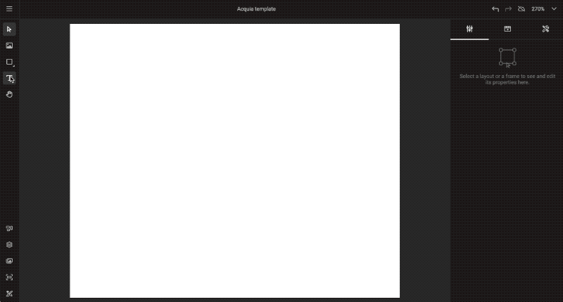
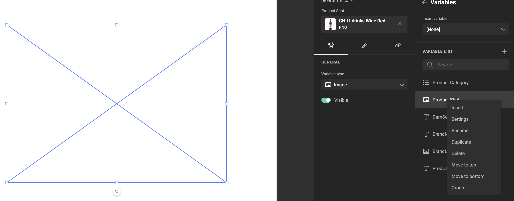
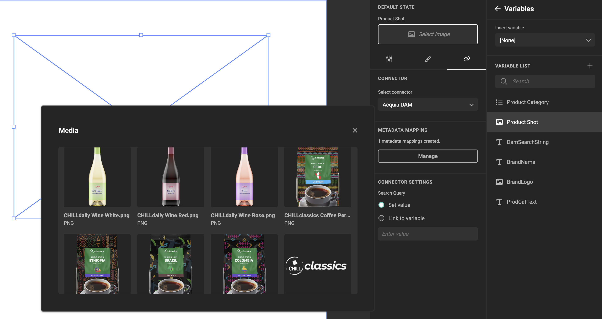
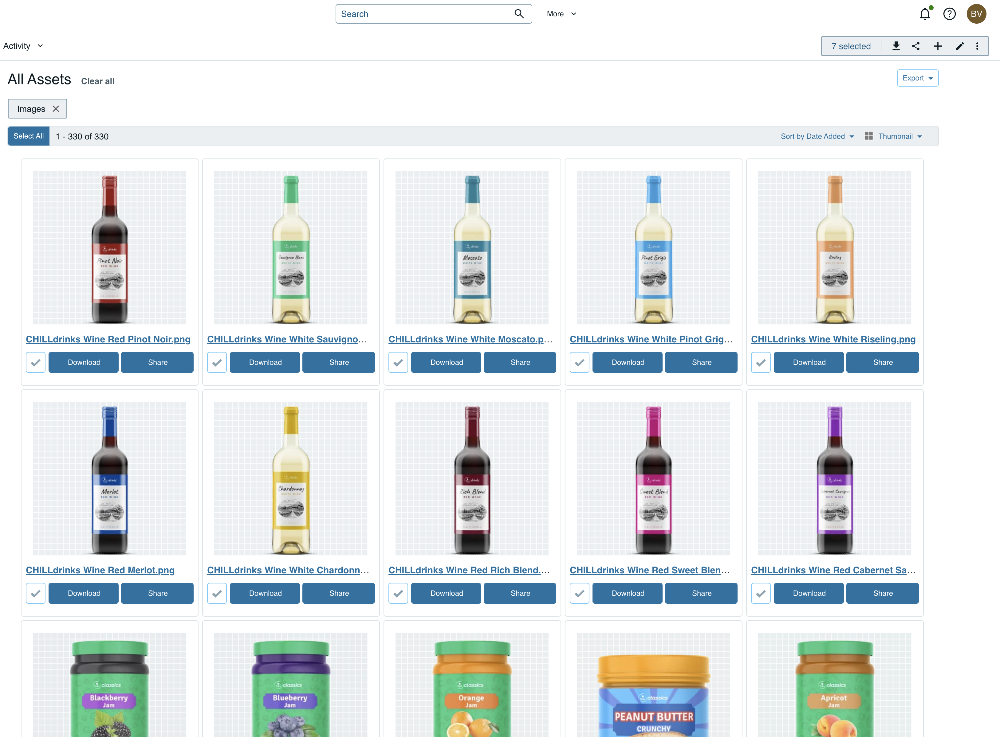
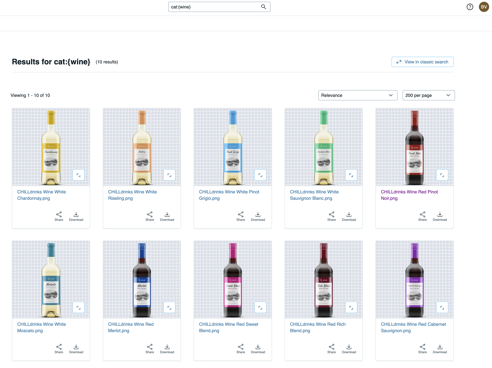
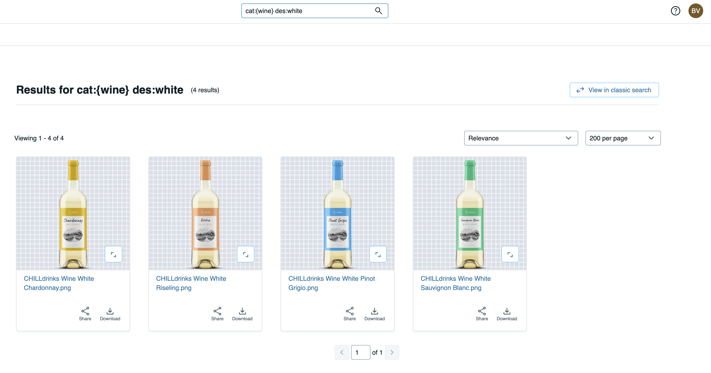
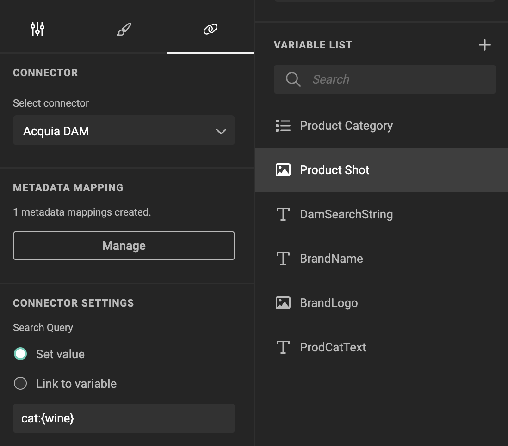
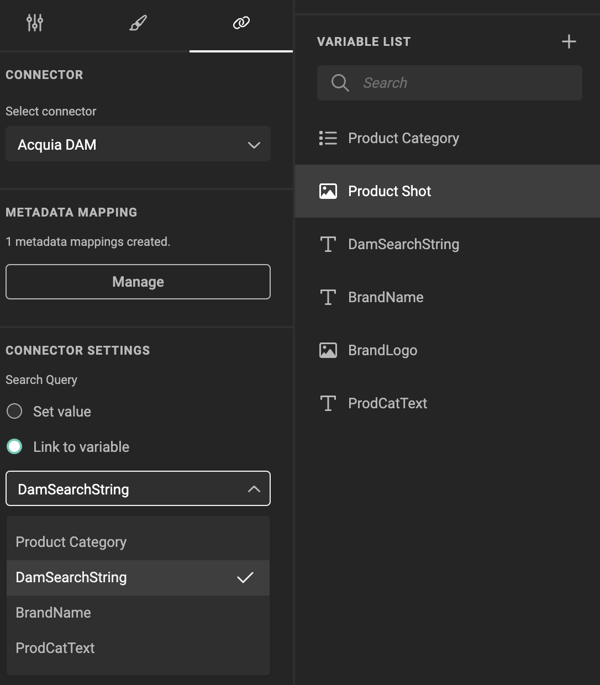
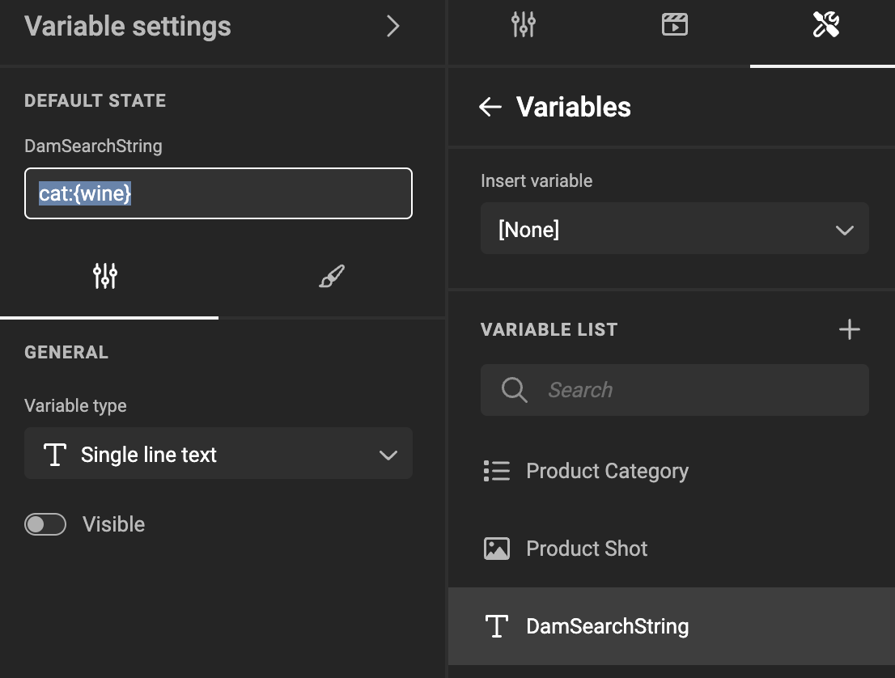
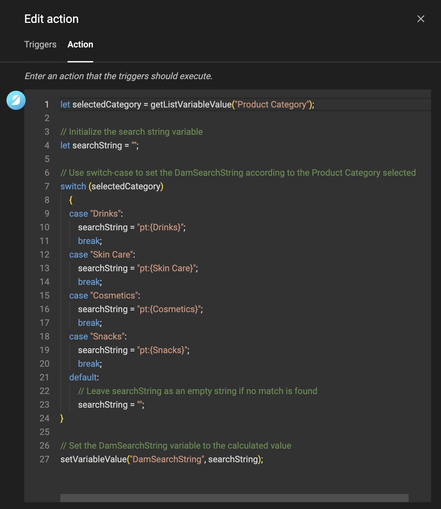

# Media Connector for Acquia DAM

|  | Connector type |
| --- | --- |
|  | Built-in |
| :fontawesome-regular-square-check: | Built by CHILI publish |
|  | Third party |

## Activation

Once a connector is available in the GraFx Marketplace, you can activate it on your environment.

Ask CHILI publish to activate on your environment

## Configuration

Your instance of the Connector needs to know to what Acquia DAM instance it needs to speak, and how it would then authenticate.

- Endpoint configuration
- Authentication for impersonation
- Authentication for machine-machine

Ask CHILI publish to setup configuration

## Governance

An important part of Digital Assets, is the governance. When and where can the assets be used, and who can use them.
The Connector to Acquia Dam respects the governance set up in the DAM system.

### Impersonation

GraFx Studio is a consumer of the assets available in the DAM. Therefore, the user that is used to impersonate the access to the DAM system, will dictate what assets are available in the template.

### Machine to machine

The credentials used to setup machine 2 machine, will dictate the governance on the assets in the automation setup. 

This means if the credentials only allow access to part of the assets, only these assets will be available when batch processing requests access to place assets in the output.

## Place assets in your template

- Select the right Connector
- Doubleclick the asset to assign to image frame

## Image variables

When using [image variables](/GraFx-Studio/guides/template-variables/assign/#assign-template-variable-to-image-frame), you will get the same list of assets, when you "select image".

## DAM Queries & Variables

### Intro

You want to filter down the assets suggested to the template user, using categories, keywords, etc. ...

In the Acquia Dam solution, you can use a query language.

By using the query language, you can filter down to the right selection of assets.

!!! tip "Category"

	Use "cat:{wine}" to filter down to only wines

!!! tip "Description"

	Add "cat:{wine} des:{white}" to further filter to only wines with the word "white" in the description.
	

### How to

DAM queries happen on the level of the connector, for a specific frame.

Set the value of the query in the connector settings.

If a fixed Query is not sufficient, you can use a variable.

To further automate, you can use [Actions](/GraFx-Studio/guides/actions/create/) to influence and set the Query, according to other variables of input the Smart Template gets.

In the image above, the action will set the "DamSearchString" to have different DAM Queries, depending on a chosen category. That text variable is then used in the image variable. (see image above here)