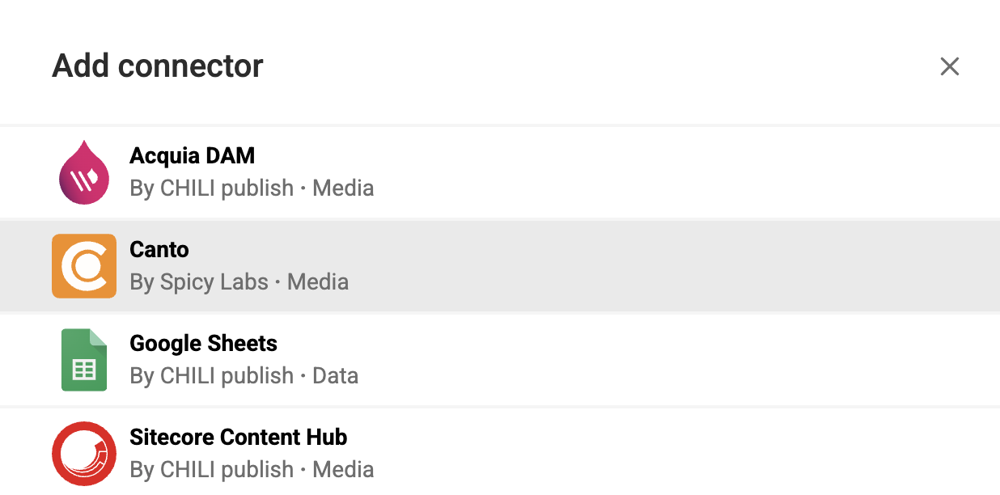

# Connector Hub

## Introduction

The Connector Hub is the central repository where you can find connectors to install into your environment.

## Overview of Installed Connectors

As an Environment Admin, navigate to:

My Environments > [Your Environment] > Settings > Connectors

Select the tab **Connectors**.

Here, you will see an overview of the installed connectors.

## Add a Connector

Navigate to the list of installed connectors (see above) and click **+ Add connector**.

A pop-up window will display.

Choose **Connector Hub**. A list of available connectors will be shown.

Select the connector you want to deploy or install in your environment.

Each connector in the list displays who built it—either **CHILI publish** or a **third-party partner**. 

This is indicated by the "By" field. For more details, see the [Types of Connectors](../../../GraFx-Studio/concepts/connectors/#types-of-connectors).

### Connector Categories

- **Media Connectors**: These allow you to integrate external DAM systems or other media repositories (e.g. Dynamic Asset Providers), directly into your template.
- **Data Connectors**: These connectors allow access to external Data sources (e.g. Google Sheets, SalesForce).

Select the connector you want to deploy or install in your environment.

For detailed configuration parameters, continue on the relevant connector page in the documentation (see left navigation).

GraFx Studio > Connectors > **Select connector**

## Activate / Deactivate a Connector

To activate or deactivate an installed connector, click the slider in the overview.

- **Available**: The connector is available in the **Template Designer Workspace (TD Workspace)**.
- **Not Available**: The connector is in the 'not available' state, which is the default status.

### Connector Availability Details

If a connector was available in the past but has been set to 'not available' again:

- The connector remains functionally active in both the **Workspace (WRS)** and the **End User Interface (EU Interface)**. This means that existing templates using the connector will not break.
- However, you cannot add a new variable with the connector when it is set to 'not available'.
- You can still update existing variables that use the connector.

## Create a Custom Connector

See the Developer Documentation for detailed instructions on how to [build your custom connector](../../../GraFx-Developers/connectors/media-connector/build-a-simple-media-connector/).

## List of Available Connectors

See **Connectors** in the left navigation menu.