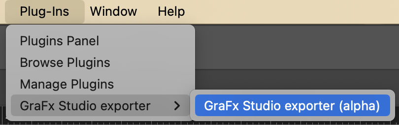

# How to Convert an Adobe InDesign file

## Get the plugin

Where to find the plugin

### Compatibility

The latest version of the plugin is compatible with 

- OSX (specify architecture and windows version)
- Windows (specify architecture and windows version)

### How to install

- Double-click on the .ccx file
- This will open the 'CreativeCloud' app and will do the rest for you
- Agree with a 'non-marketplace plugin' warning
- Open the InDesign App
- GoTo: Plug-Ins → GraFx Studio exporter → GraFx Studio exporter (alpha)

## Export

Open the plugin

- Choose a (local) folder to export the Intermediate package to
- Click the export button

## Import

Go to [CHILI GraFx](https://chiligrafx.com/) and navigate to your Environment en go to GraFx Studio.

Import the zip you just created.

## Supported features

### Supported Features

- Text
- Shape
- Complex shapes (except rectangle/triangle) exported as image ( = Studio limitation)
- Image
- Collect properties from text, shape, image & object
- Limited (not tested) support for complex text
	- Bullet list
	- Uncommon line breaks
	- Tabs
	- Groups
- Select specific page that needs to be imported

### Unsupported Features

- Tables :warning: Not supported in Studio :warning:  
- Variables
- Expected issues with precise frame positioning
- Preflight
- Clipping path for Images
- Convert gradient to pdf
- Include hidden layer
- Use high resolution for locked layer
- Import selection only
- Select page (Studio = single page)
- (un)lock layers