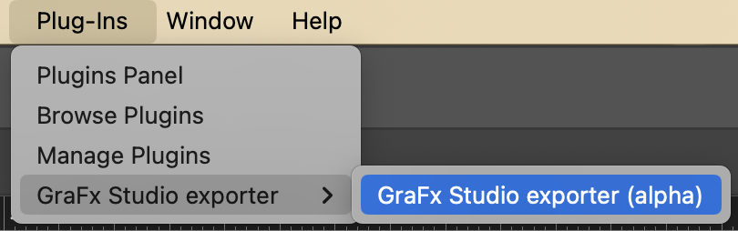
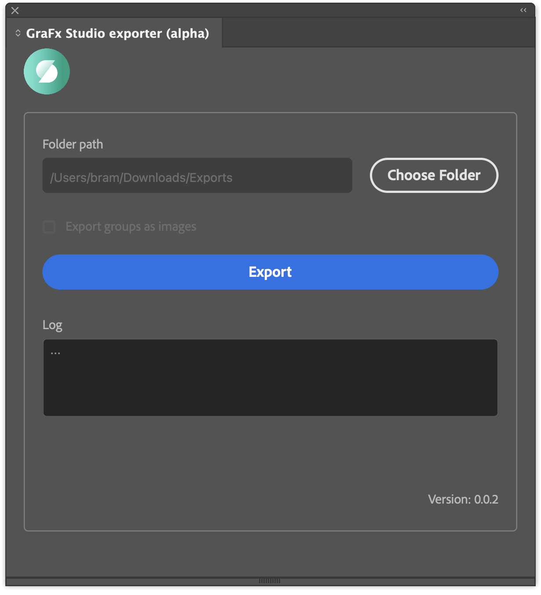
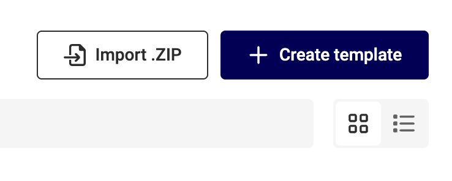

# How to Convert an Adobe InDesign file

## Get the plugin

Where to find the plugin

### Compatibility

The latest version of the plugin is compatible with 

- OSX (specify architecture and windows version)
- Windows (specify architecture and windows version)

### How to install

- Double-click on the .ccx file
- This will open the 'CreativeCloud' app and will do the rest for you
- Agree with a 'non-marketplace plugin' warning
- Open the InDesign App
- GoTo: Plug-Ins → GraFx Studio exporter → GraFx Studio exporter (alpha)

## Export

Open the plugin

- Choose a (local) folder to export the Intermediate package to
- Click the export button

## Import

Go to [CHILI GraFx](https://chiligrafx.com/) and navigate to your Environment en go to GraFx Studio.

Import the zip you just created.

## Supported features

### Supported Features

- Text
- Basic Shape
- Complex shapes (except rectangle/triangle) exported as PDF
- Image & Clipped Image
- RGB and CMYK support
- Collect properties from text, shape, image & object
- Limited support for complex text
	- Bullet list
- Select specific page that needs to be imported [^1]
- Preflight [^2]
    - It is a separate Panel
    - Preflight always runs before Exporting (but does not prevent exporting)
    - Preflight can be run separately without Exporting
    - By clicking the Preflight result item, you will see the detailed description of the issue.  
    It's also possible to select the item itself with the ‘action’ icon.
    
[^1]: Page changes in InDesign do not appear in real-time. The list of available pages is updated when the user switches between opened documents or clicks on a dropdown element. If a selected page is not available (removed) and the dropdown is not updated, the first page in the document will be exported to a .zip file.

[^2]: To ensure proper functionality (due to bug in Adobe® InDesign®), first open Studio Exporter then open Studio Preflight.