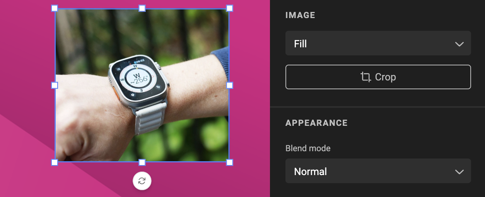
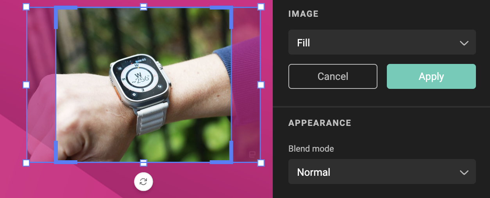
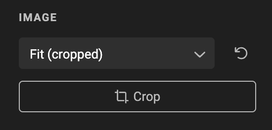
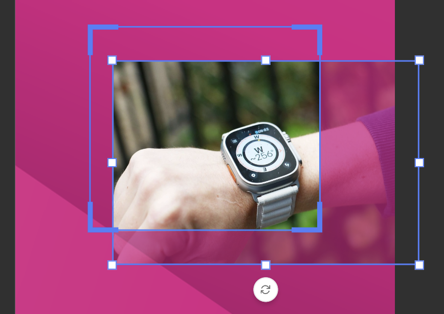
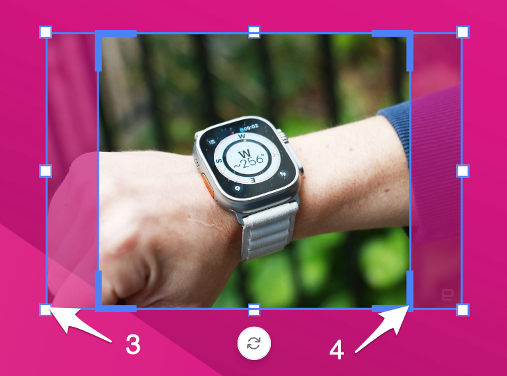
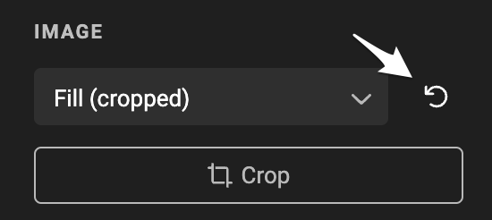

# Cropping an image

## Placing an image

When creating an image frame, and assigning an asset to the frame, a default "Fill" will be selected.

This will ensure the image is placed in the frame, and fills the image frame.

Entering crop mode, shows the actual borders of the placed image.

## Cropping an image

### Entering crop mode

Select the image (frame) and enter crop mode in the properties panel.

You can also enter crop mode by double clicking on the image. (with the Arrow tool selected)

### Arrow

Use the arrow-tool to manually position the image in the crop frame.

### Handles

Use the frame handles (3) or crop handles (4) to resize the respective frames

### Apply crop

Click the "Apply" button to apply. You can also hit the enter-key.

### Cancel or exit crop

Hit the Escape key, or click "Cancel"

## Reset crop

After applying an image crop, the fit remains present but “(cropped)” is added.

The “Crop” button is still present to trigger image crop mode again. 

You can reset the crop to again apply the selected fit mode.

When the current layout is a "Sub-layout", resetting the crop will fall back to the Master layout settings.

## Undo / Redo

Explained on the [concept page](/GraFx-Studio/concepts/crop/#undo)
