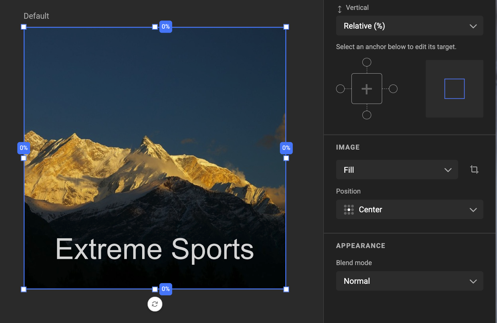
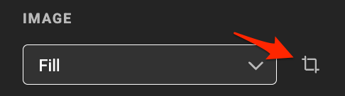
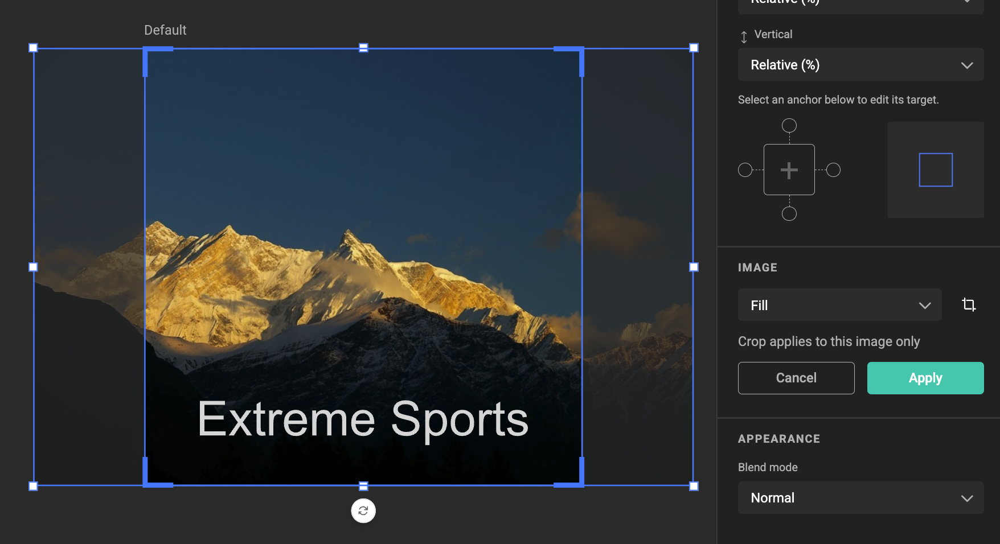
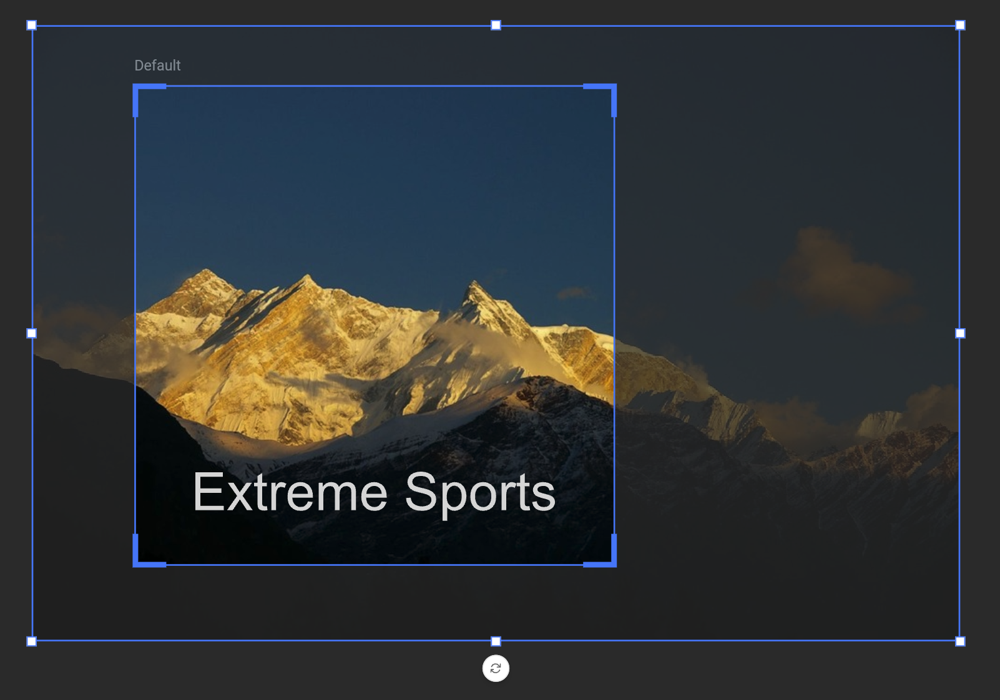
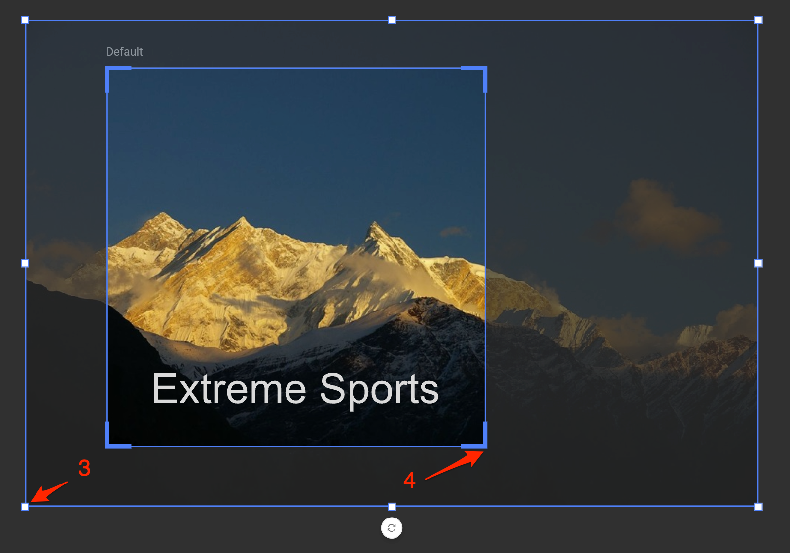
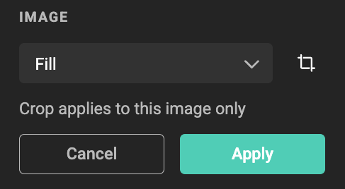
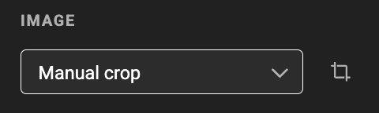
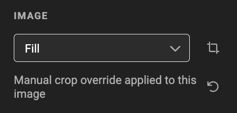

# Cropping an Image

## Placing an Image

When you create an image frame and assign an asset to it, the default **Fill** mode is applied. This ensures the image fills the entire frame.

{.screenshot-full}

## Cropping Options

There are two ways to crop an image:

- Use **Manual Crop**
- Use **Manual Crop Override** (while in Fill, Fit, or Smart Crop mode)

### Manual Crop

Choose **Manual Crop** as the fit mode to freely adjust the image's position and scale in the frame. This setting applies to the image frame and is shared across all images placed in that frame.

See below: [Cropping an Image](#cropping-an-image_1)

### Manual Crop Override

This feature lets you override the automated crop (Fill, Fit, or Smart Crop) for a specific image in a specific frame and layout.

When you manually override a crop while using Fill, Fit, or Smart Crop, **GraFx Studio stores the override for the combination:

**AssetID + FrameID + LayoutID**

This means that:  

- The crop override applies only when this specific image is used in this specific frame and layout.
- For all other images, the frame will use its default crop mode (Fill, Fit, or Smart Crop).
- Overrides do **not** inherit from the parent layout.

This is especially useful for lifestyle images, where a designer may want to fine-tune the framing manually instead of relying on automatic cropping.

## Cropping an Image

### Entering Crop Mode

You can enter crop mode in two ways:

Select the image frame and use the crop tool in the properties panel  

{.screenshot}

Or, double-click the image (while the arrow tool is selected)  

{.screenshot-full}

### Adjusting the Crop

**Use the arrow tool** to reposition the image inside the frame  

{.screenshot-full}

**Use the crop handles (4)** to change the crop boundaries  

**Use the frame handles (3)** to resize the frame  

{.screenshot-full}

### Apply or Cancel

**Apply** the crop by clicking the "Apply" button or pressing **Enter**  

{.screenshot}

**Cancel** the crop by clicking "Cancel" or pressing **Escape**

## Resetting Crop

### Reset Manual Crop

To remove a manual crop and return to automated behavior, switch the fit mode to **Fill**, **Fit**, or **Smart Crop**.

{.screenshot}

This resets the manual crop and reverts to any inherited crop settings from the master layout.

### Reset Manual Crop Override

When a crop override is active, you'll see a message under the crop mode selector:

{.screenshot}

Click **Reset Override** to remove the crop override for that specific:

- Image (`AssetID`)
- Frame (`FrameID`)
- Layout (`LayoutID`)

Note: Manual Crop Overrides do **not** inherit from its parent layout.

## Undo / Redo

You can undo and redo crop changes. See the [Concept of Crop](/GraFx-Studio/concepts/crop/#undo) page for more details.