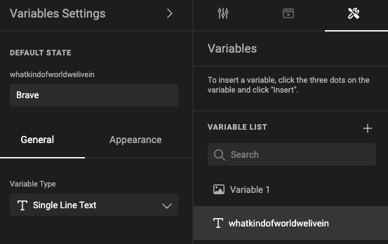
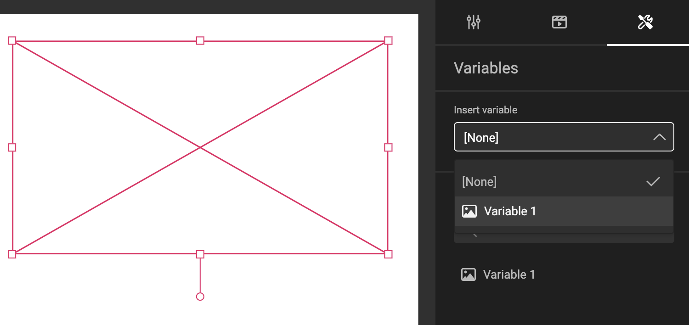

# How to work with document variables

Be sure to also check the [concept page](/GraFx-Studio/concepts/document-variables/)

## Insert document variable in a text frame

Choose "Insert" from the variable "..." menu to insert it into a text frame

In edit mode, the document variable name is shown in a gray box in the text.

If the frame is not wide enough to show the full name, the name will be truncated to avoid overflow.

## Assign document variable to image frame

Select the image frame you want to assign the document variable to.

In the variable tab, choose the image variable from the "Insert variable" drop-down menu.

## Un-assign a document variable from an image frame

To remove the document variable from the image frame, select the frame and choose "None" from the "Insert variable" drop-down menu.

