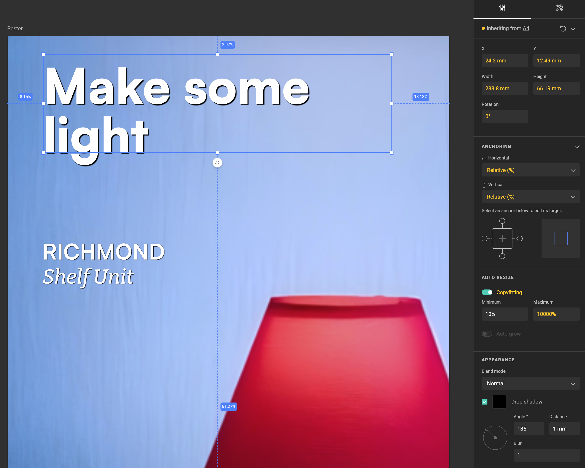
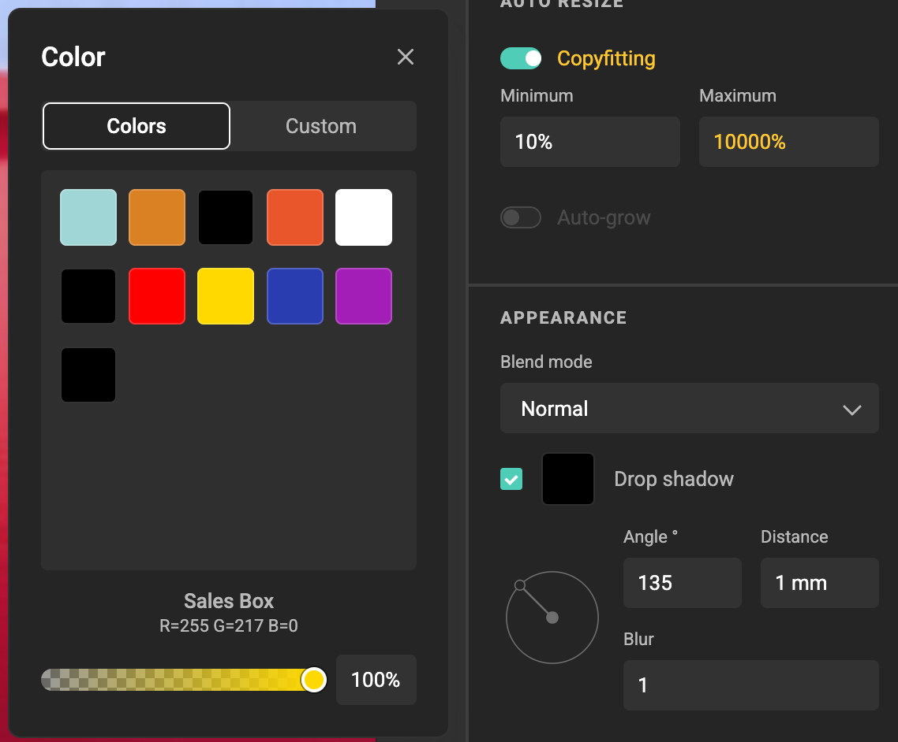

# How to apply a drop shadow

## Steps

**Select the frame**

Click the text frame, image, or shape you want to apply the shadow to.

**Open the Appearance panel**

In the right sidebar, scroll to the **Appearance** section.

{.screenshot-full}

**Enable Drop shadow**

- Check the **Drop shadow** box.
- A default shadow will appear behind the object.

**Customize the shadow**  
   
- **Color**: Click the color box to choose a custom color or a saved color. Adjust opacity as needed.  
{.screenshot}
- **Blend mode**: Open the dropdown and select how the frame (including shadow) interacts with the background.
- **Angle**: Enter a degree value or drag the angle dial to position the shadow.
- **Distance**: Set how far the shadow is offset. The unit (px, mm, in, …) follows the layout’s intent (units).
- **Blur**: Adjust between **1–500**. Lower values = sharp shadow, higher values = soft shadow.

**Preview the result**

Watch the changes live on the canvas. Refine settings until the shadow matches your design intent.

## Related concepts

- [Blend modes](/GraFx-Studio/concepts/blendmodes/)
- [Concept of Drop Shadow](/GraFx-Studio/concepts/drop-shadow/).
