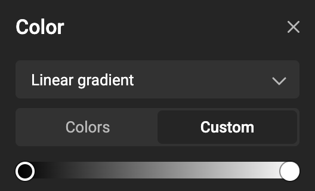
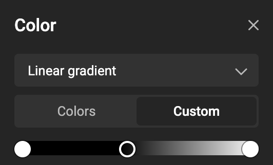
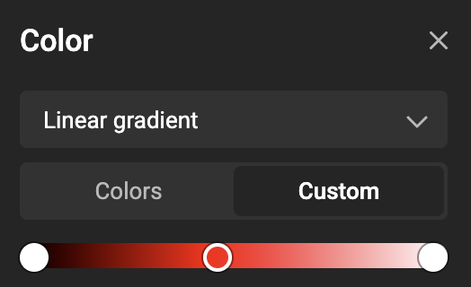

# Apply a linear gradient

<iframe width="690" height="388" src="https://www.youtube.com/embed/KYLe9bVUon8?si=dTmCRGVZgOECZs0V&controls=1&mute=1&showinfo=0&rel=0&autoplay=0&loop=1" title="YouTube video player" frameborder="0" allow="accelerometer; autoplay; clipboard-write; encrypted-media; gyroscope; picture-in-picture; web-share" referrerpolicy="strict-origin-when-cross-origin" allowfullscreen></iframe>

[All feature videos](https://www.youtube.com/playlist?list=PLLHtQ1R6R-B_m7XAVySM9OjbbUscsgBOH)

## How to apply a (linear) gradient

### Select an object  
Click the shape frame you want to apply the gradient fill to.

### Open the Color panel → choose Linear gradient  
From the fill control, switch from Solid color to Linear gradient.

{.screenshot-full}

### Adjust stops  

A new gradient starts with 2 stops. Select a stop to set its color:

- Choose Custom or Colors (Brand Kit definition) as the source.  
- Pick a color space: RGB, CMYK, HEX.  
- When a color is defined using Brand Kits, you can also use a Spot color.  

{.screenshot}

Click in the gradient in the color panel to add a stop.

{.screenshot}

With the stop selected, you can change the color (type)

{.screenshot}

To delete: select a stop in the gradient (in the color panel) and hit the backspace / delete button.

<video width="690" height="690" autoplay="true" loop="true" muted="true">
  <source src="add-remove-gradientstop.mov" type="video/mp4">
  Your browser does not support the video tag.
</video>

### Set direction on canvas  

Drag the on-canvas gradient handles to define the angle and extent of the transition.

- Select the frame  
- Select the fill color / gradient to see the handles

<video width="690" height="690" autoplay="true" loop="true" muted="true">
  <source src="gradient-angle.mov" type="video/mp4">
   Your browser does not support the video tag.
</video>

### Tip: Blend an gradient over an image

Place the gradient above other content and experiment with blend modes to tone imagery or create subtle vignettes.

<video width="690" autoplay="true" loop="true" muted="true">
  <source src="gradient-blend.mov" type="video/mp4">
   Your browser does not support the video tag.
</video>

## Result

Your object is filled with a linear gradient that follows your chosen direction and uses colors from Custom picks or Brand Kits. When exporting to PDF, Spot stops remain spot for print separations.

Learn more: [Concept of Gradients](/GraFx-Studio/concepts/gradients/)

!!! note "PDF output for mixed color types in stops"
    
    In the template designer workspace, each gradient stop can use a different color type. The exported PDF behaves as follows:
    
    - If all stops use the same color type, the gradient stays in that color space.  
    - If the gradient mixes color types, it is converted to RGB in the PDF.  

    Examples:  
    - RGB -> RGB -> RGB spot → RGB  
    - CMYK -> CMYK -> CMYK spot → CMYK  
    - CMYK -> RGB -> CMYK → RGB