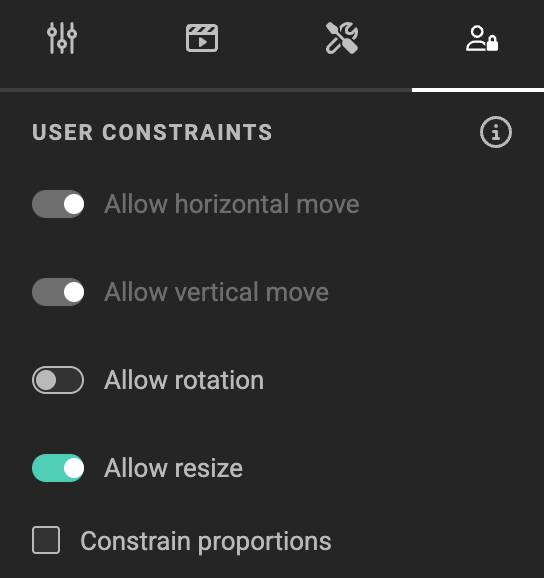
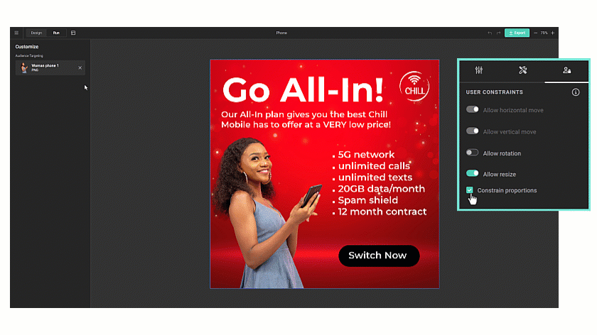
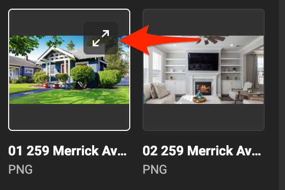
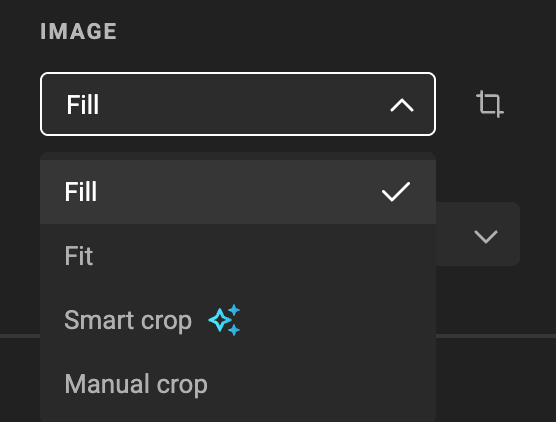
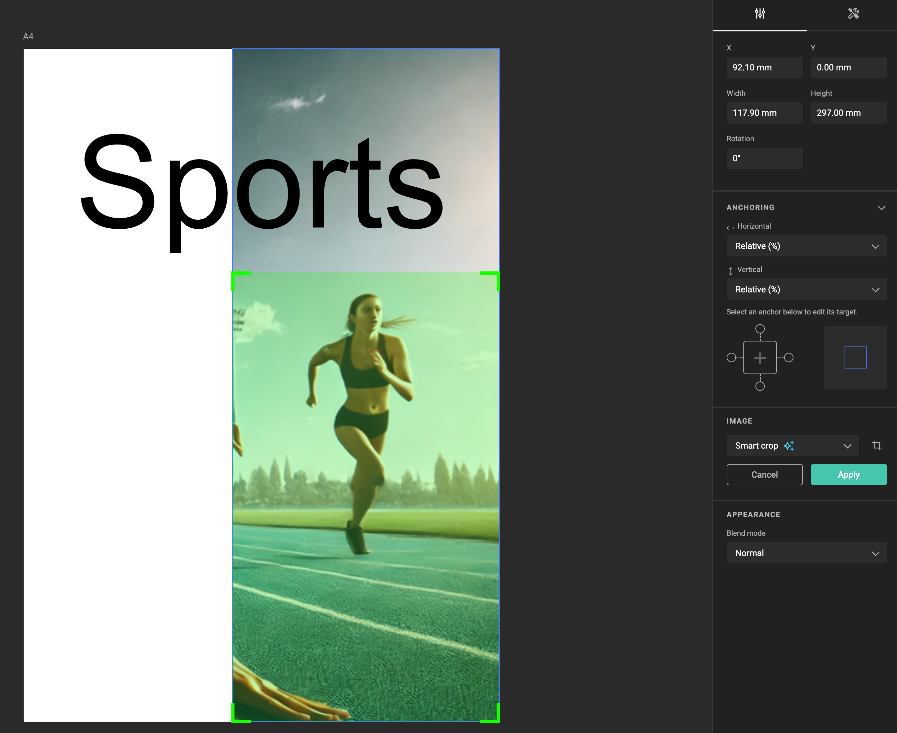
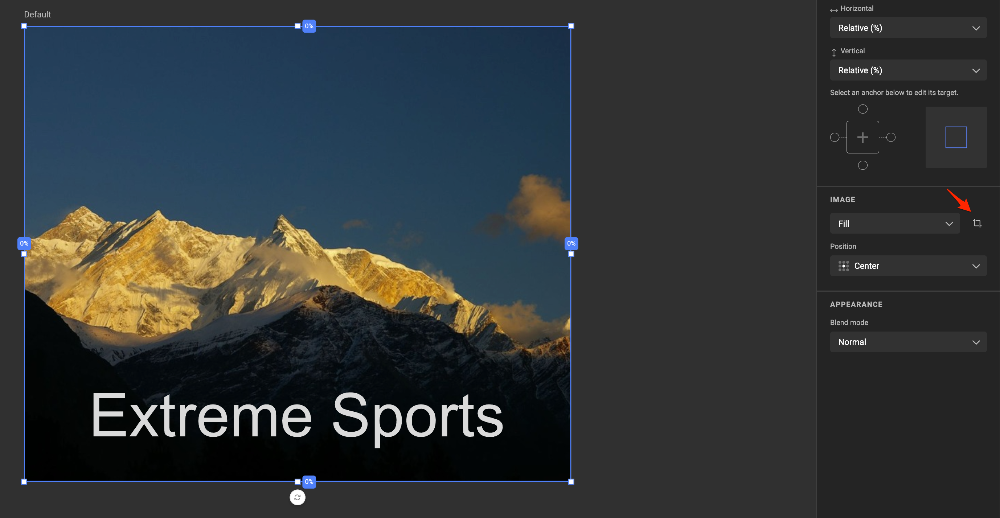
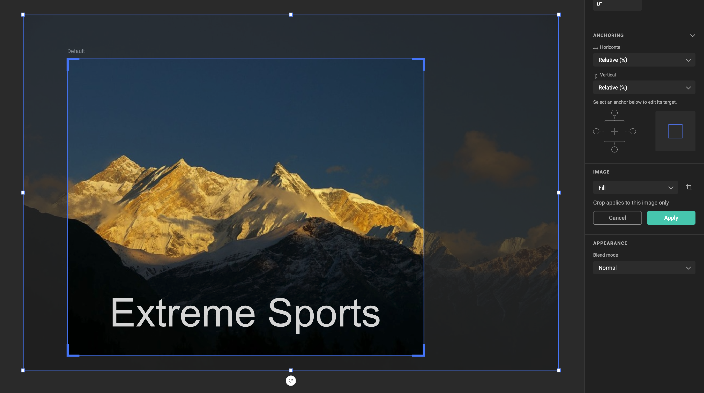
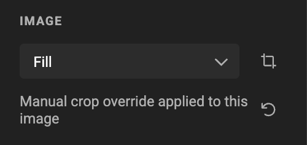

# Frame: Image

See concept [Image frames](/GraFx-Studio/concepts/frames/#image-frame)

## Create image frame

Select the image tool in the sidebar. You can also use the shortcut for the shape you wish to draw.

Drag a rectangle on the canvas. The frame will initially look like a crossed rectangle.

## User Constraints for Image Frames

Image frames support **user constraints** that control how end users can interact with the frame in Studio UI. These constraints are defined by the template designer and determine which actions are allowed.

All constraint options are **disabled by default**. You explicitly enable only the interactions you want to allow.

{.screenshot}

### Available Constraint Options

You can control the following interactions:

- **Allow horizontal move**  
  Enables movement along the X-axis.

- **Allow vertical move**  
  Enables movement along the Y-axis.

- **Allow rotation**  
  Allows the image frame to be rotated by the end user.

- **Allow resize**  
  Allows the image frame to be resized.

- **Constrain proportions**  
  Locks the aspect ratio during resize.

### Constraint Dependencies

Some constraints depend on others and cannot be enabled in isolation:

- **Resize requires movement**  
  When *Allow resize* is enabled, horizontal and vertical movement are enabled automatically.  
  You can move a frame without resizing it, but you cannot resize a frame without allowing movement.

- **Rotate requires movement**  
  When *Allow rotation* is enabled, horizontal and vertical movement are enabled automatically.  

- **Movement can be enabled independently**  
  Horizontal and vertical movement can be enabled without allowing resize.

- **Proportions only apply to resize**  
  *Constrain proportions* is only relevant when resize is enabled.

These dependencies ensure predictable behavior and prevent interaction states that would break layout logic.

### What End Users Experience

In Studio UI, end users only see the controls that are allowed by these constraints:
- Disabled interactions are hidden or inactive.
- Allowed interactions behave consistently and stay within the defined boundaries.

This lets you open up flexibility where it makes sense, while keeping full control over layout integrity and brand consistency.

{.screenshot-full}

## Feature Channel

<iframe width="690" height="388" src="https://www.youtube.com/embed/KgVcr821tII?si=D-p32N58ssZSoD90&controls=1&mute=1&showinfo=0&rel=0&autoplay=0&loop=1" title="YouTube video player" frameborder="0" allow="accelerometer; autoplay; clipboard-write; encrypted-media; gyroscope; picture-in-picture; web-share" referrerpolicy="strict-origin-when-cross-origin" allowfullscreen></iframe>

[All feature videos](https://www.youtube.com/playlist?list=PLLHtQ1R6R-B_m7XAVySM9OjbbUscsgBOH)

## Choose media

With the frame selected, open the **resource panel** > **media panel**, and select an asset.

The initial fit of the asset in the frame is to fill the frame. (see Fill properties below)

## Smart Crop

Similar to setting Subject Area and POI in GraFx Media, you can do this in GraFx Studio Workspace.

This also allows the Template Designer to overrule the POI and Subject area sent by an external Asset Provider (user Media Connectors).

Click on the diagonal arrows to see the details of the asset.

The information about the asset is displayed, and the option to define the subject area and POI.

Click the "Subject Area" button, and you'll be able to set the Subject Area and POI.

See also [Concept of Smart Crop](/concepts/genie-smart-crop/) and [Set Subject Area in GraFx Media](/GraFx-Media/guides/smart-crop-subject-area/)

!!! warning "Watch out!"
    If you set the Subject Area here, it will impact all templates where this asset is used, as the Subject Area and POI are stored alongside the media.

!!! warning "Known issue"
    If you made changes, reselect the Smart Crop Fit, to see the effect.

## Properties

Similar properties as with all frames. See [Basic properties](/GraFx-Studio/concepts/frames/#basic-properties).

### Fill properties

#### Fit

Choose the Fit property, to fit the full image inside the frame. Whitespace is created if needed, to fit the full image.

#### Fill

Choose the Fill property, to fill the full frame with the image. No whitespace is left inside the frame. Part of the image is hidden.

#### Smart Crop

Choose the Smart Crop property, to let GraFx Genie assist to position the subject area and POI in the frame.

See [Concept of Smart Crop](../../concepts/genie-smart-crop/) for more details

See [How to use Smart Crop](../smart-crop/) for more details

#### Manual Crop Override

See also [Concept of Manual Crop Override](../../concepts/manual-crop-override/) for details.

Select one of the automated crop modes

- Fill
- Fit
- Smart Crop

When the images is positioned (automatically), click the crop icon next to the fit mode.

Position the image how you prefer it, and click apply.

When a particular image has a manual crop override, it will display below the fit modes.

The left round arrow resets the override, for that images, in that frame, in that layout.

#### Aspect radio

If the image and the frame have the exact aspect ratio, there will be no difference between fitt and fill.

#### Manual Crop

See [Cropping an Image](/GraFx-Studio/guides/cropping/)

### Appearance

See [Blend modes](/GraFx-Studio/guides/blendmodes/)