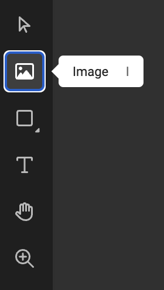
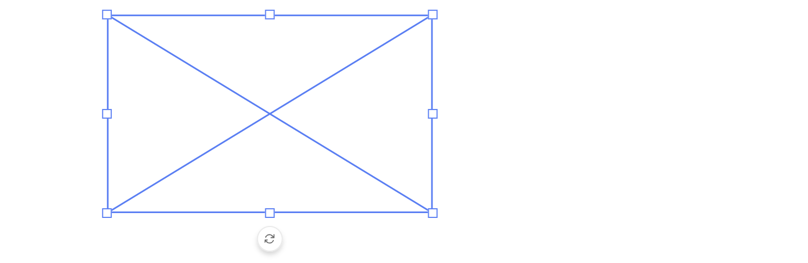
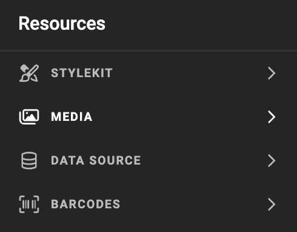
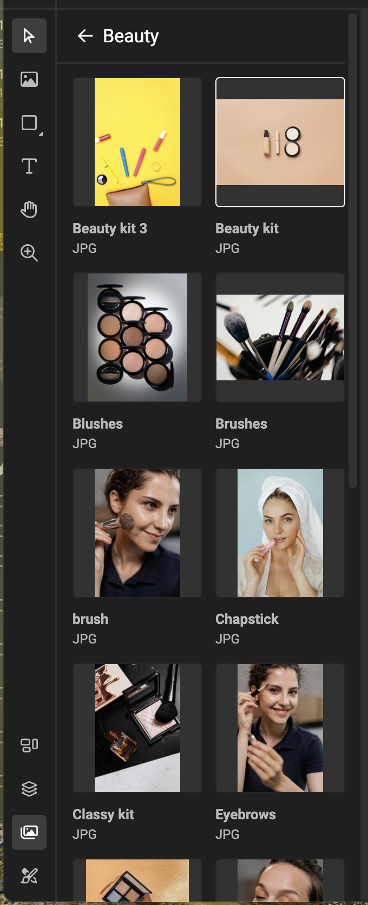
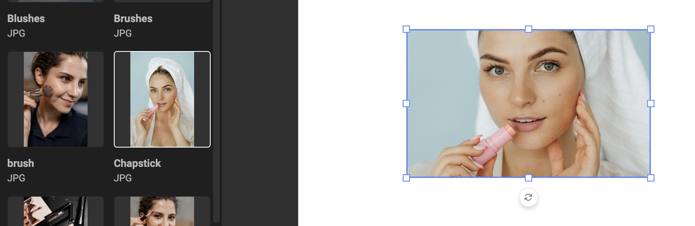
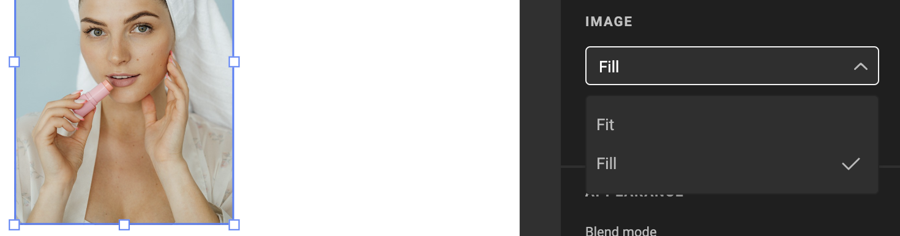
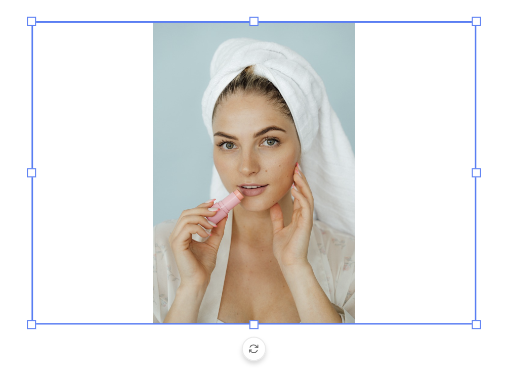
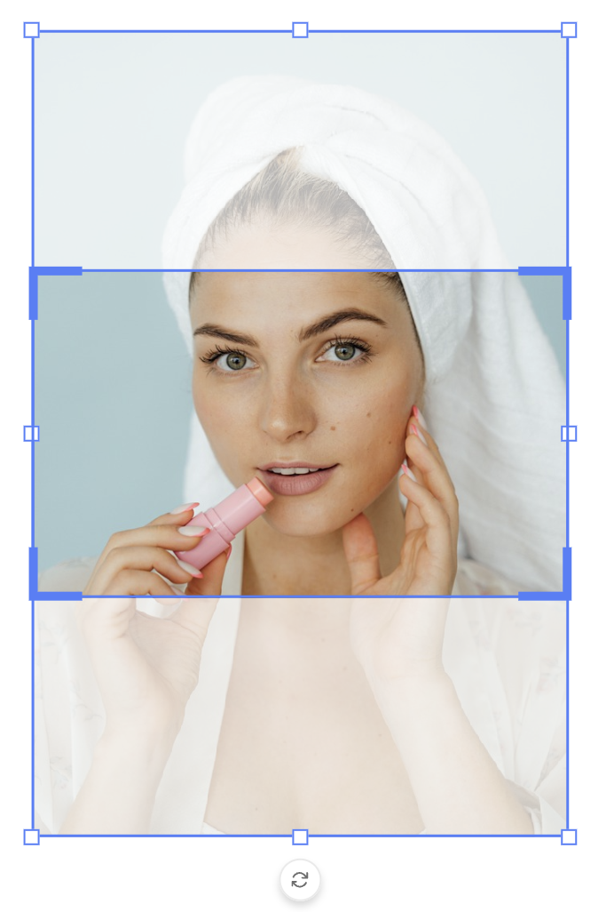
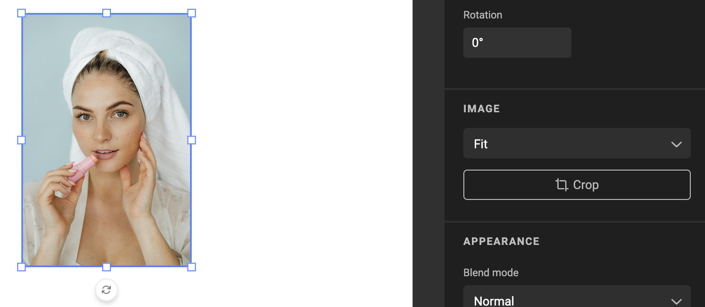

# Frame: Image

See concept [Image frames](/GraFx-Studio/concepts/frames/#image-frame)

## Create image frame

Select the image tool in the sidebar. You can also use the shortcut for the shape you wish to draw.

Drag a rectangle on the canvas. The frame will initially look like a crossed rectangle.

## Choose media

With the frame selected, open the **resource panel** > **media panel**, and select an asset.

The initial fit of the asset in the frame is to fill the frame. (see Fill properties below)

## Properties

Similar properties as with all frames. See [Basic properties](/GraFx-Studio/concepts/frames/#basic-properties).

### Fill properties

#### Fit

Choose the Fit property, to fit the full imge inside the frame. Whitespace is created if needed, to fit the full image.

#### Fill

Choose the Fill property, to fill the full frame with the image. No whitespace is left inside the frame. Part of the image is hidden.

#### Aspect radio

If the image and the frame have the exact aspect ratio, there will be no difference between fitt and fill.

#### Crop

See [Cropping an Image](/GraFx-Studio/guides/cropping/)

### Appearance

See [Blend modes](/GraFx-Studio/guides/blendmodes/)